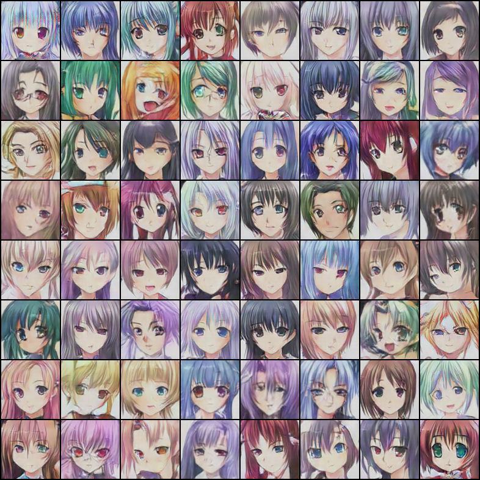

这是本书第十章生成对抗网络GAN的对应代码。

## 环境准备

- 本程序需要安装PyTorch；

- 还需要通过`pip install -r requirements.txt` 安装其它依赖；

## 数据准备

对于质量越高的图像，GAN生成的样本也会更好。关于数据的准备，读者可参考以下两种方法：

- 通过爬虫爬取您想对抗生成的样本;

- 下载已有的公开数据集。本章使用AnimeFace动漫数据集，读者可以通过XX进行下载，并把所有图像存储在data/目录下，形如：

  ```bash
  data/
  └── faces/
      ├── 0000fdee4208b8b7e12074c920bc6166-0.jpg
      ├── 0001a0fca4e9d2193afea712421693be-0.jpg
      ├── 0001d9ed32d932d298e1ff9cc5b7a2ab-0.jpg
      ├── 0001d9ed32d932d298e1ff9cc5b7a2ab-1.jpg
      ├── 00028d3882ec183e0f55ff29827527d3-0.jpg
      ├── 00028d3882ec183e0f55ff29827527d3-1.jpg
      ├── 000333906d04217408bb0d501f298448-0.jpg
      ├── 0005027ac1dcc32835a37be806f226cb-0.jpg
  ```
  即：data目录下仅有一个文件夹，该文件夹中有所有的图像。

## 用法

如果想要使用Visdom进行可视化，请先运行`python -m visidom.server`启动Visdom服务。

- 训练

  ```bash
  python main.py train --gpu
  ```

- 生成图像

  ```bash
  python main.py generate --nogpu --vis=False \
              --netd-path=checkpoints/netd_200.pth \
              --netg-path=checkpoints/netg_200.pth \
              --gen-img=result.png \
              --gen-num=64
  ```

- 完整的选项及默认值

  ```python
  data_path = 'data/'  # 数据集存放路径
  num_workers = 4  # 多进程加载数据所用的进程数
  image_size = 96  # 图片尺寸
  batch_size = 256
  max_epoch = 200
  lr1 = 2e-3  # 生成器的学习率
  lr2 = 2e-4  # 判别器的学习率
  beta1 = 0.5  # Adam优化器的beta1参数
  gpu = True  # 是否使用GPU
  nz = 100  # 噪声维度
  ngf = 64  # 生成器feature map数
  ndf = 64  # 判别器feature map数
  
  save_path = 'imgs/'  # 生成图片保存路径
  
  vis = True  # 是否使用visdom可视化
  env = 'GAN'  # visdom的env
  plot_every = 20  # 每间隔20 batch，visdom画图一次
  
  debug_file = '/tmp/debuggan'  # 存在该文件则进入debug模式
  d_every = 1  # 每1个batch训练一次判别器
  g_every = 2  # 每2个batch训练一次生成器
  save_every = 10  # 每10个epoch保存一次模型
  netd_path = None  # 'checkpoints/netd_.pth' #预训练模型
  netg_path = None  # 'checkpoints/netg_211.pth'
  
  # 只测试不训练
  gen_img = 'result.png'
  # 从512张生成的图片中保存最好的64张
  gen_num = 64
  gen_search_num = 512
  gen_mean = 0  # 噪声的均值
  gen_std = 1  # 噪声的方差
  ```

- 生成的部分图像：

  


