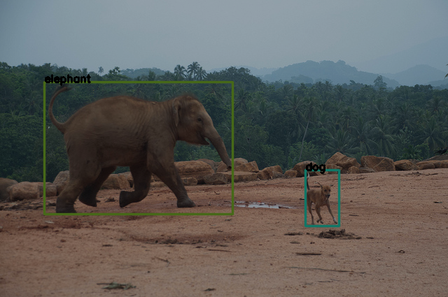

# CenterNet：目标检测

这是本书第十三章目标检测的配套代码。

## 1 环境准备

- 本程序需要安装[PyTorch](https://pytorch.org/)
- 还需要通过`pip install -r requirements.txt` 安装其它依赖

## 2 数据准备

本实验使用的内容图片数据集来自[COCO](http://cocodataset.org/#download)，点[此](http://images.cocodataset.org/zips/train2017.zip)下载训练集，点[此](http://images.cocodataset.org/zips/val2017.zip)下载验证集，点[此]下载对应的标注信息(http://images.cocodataset.org/annotations/annotations_trainval2017.zip)。

数据的组织形式如下：
```bash
    ├── data/ 			# 无代码，用来保存数据集
    │  ├──train2017/ 	# 训练数据集图像
    │  ├──val2017/ 		# 验证数据集图像
    │  └──annotations/ 	# 标注信息
```

## 用法
如果想要使用visdom可视化，请先运行`python -m visdom.server`启动visdom服务

- 训练
```bash
# 训练，使用GPU
python main.py train \
		--gpu \ 
        --batch-size=32
```

- 测试
```bash
# 训练，使用GPU
python main.py test \ 
		--gpu=False \
		--model-path='checkpoints/centernet_final.pth' \
		--test-img-path='test_img/' \ 
		--test-save-path='test_result/'
```

考虑到训练一个目标检测模型需要相对较多的资源，本代码保存了训练好的模型，点[此](https://pan.baidu.com/s/1qWXqTaV5PAPLoUtMa54lOg?pwd=rzdv)下载。该训练好的模型以ResNet18为backbone，效果有限，读者可以自行更换为DLA等backbone。读者可以使用其他图片查看目标检测的效果。

部分目标检测的结果：
