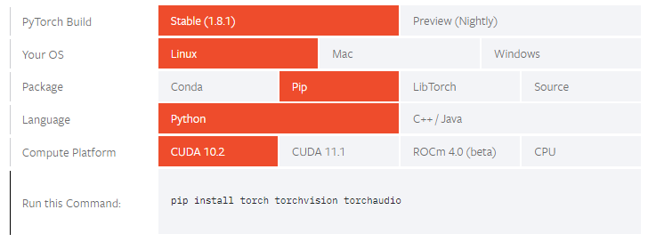
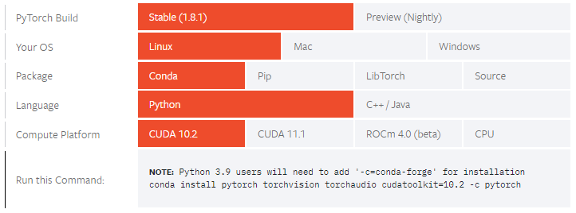
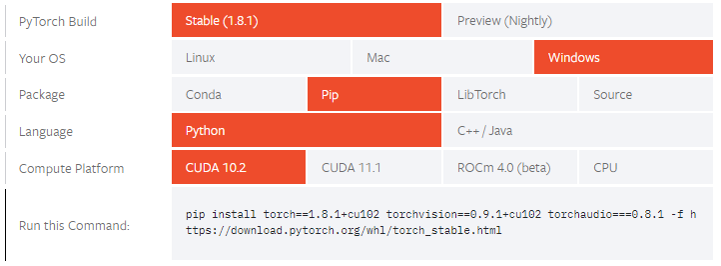
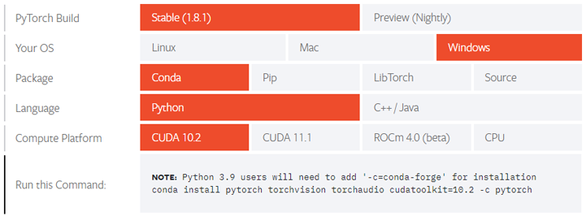
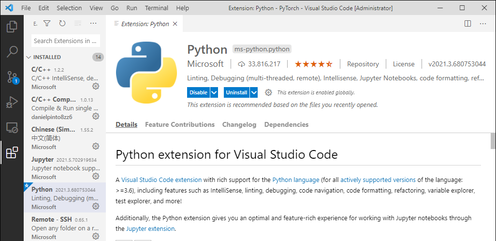
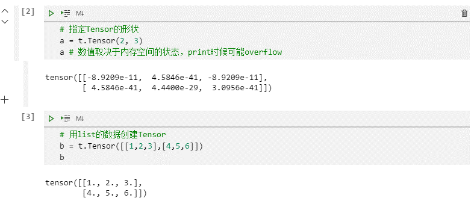
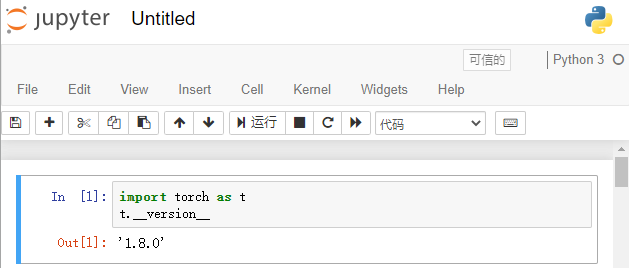

# 第2章 快速入门

本章共有两节，2.1节介绍如何安装PyTorch，以及如何配置学习环境；2.2节带领读者快速浏览PyTorch中的主要内容，帮助读者初步了解PyTorch。

## 2.1 安装与配置

PyTorch是一款以C语言为主导开发的轻量级深度学习框架，它提供了丰富的Python接口以便用户使用。在使用PyTorch之前，读者需要安装Python环境以及pip包管理工具，笔者推荐使用Anaconda配置相关虚拟环境。本书中的所有代码均使用PyTorch 1.8版本，在Python3环境中运行得到最终结果。此外，本书默认使用Linux作为开发环境。

为了方便用户安装使用，PyTorch官方提供了多种安装方法。本节将介绍几种常用的安装方式，读者可以根据自己的需求选用。

### 2.1.1 在Linux系统下安装PyTorch

#### 使用pip安装

目前，使用pip安装PyTorch二进制包是最简单、最不容易出错，同时也是最适合新手的安装方式。读者可以从PyTorch官网选择操作系统、包管理器、编程语言及CUDA版本，从而得到对应的安装命令，如图2-1所示。



以Linux平台、pip包管理器、PyTorch 1.8及CUDA 10.2为例，安装命令如下：

```bash
pip install torch==1.8.0 torchvision==0.9.0 torchaudio==0.8.0
```
待全部安装完成后，打开Python，运行如下命令：
```python
import torch as t
```
如果上述命令没有报错，那么表示PyTorch安装成功。在安装PyTorch时，读者需要注意以下两点。

- PyTorch对应的Python包名是torch，而非pytorch。

- 如果需要使用GPU版本的PyTorch，那么需要先安装英伟达显卡驱动，再安装PyTorch。

#### 使用conda安装
conda是Anaconda自带的包管理器，如果读者使用Anaconda作为Python环境，那么除了使用pip安装PyTorch，还可以使用conda进行安装。同样，读者可以从PyTorch官网选择对应的操作系统、包管理器、编程语言及CUDA版本，从而得到对应的安装命令，如图2-2所示。



以Linux平台、conda包管理器、PyTorch 1.8及CUDA 10.2为例，安装命令如下：

```bash
conda install pytorch==1.8.0 torchvision==0.9.0 torchaudio==0.8.0 cudatoolkit=10.2 -c pytorch
```
其中，`-c pytorch`表示从官网下载安装，速度可能较慢。因此，可以将conda源更换为清华镜像源，读者可自行搜索更换方法。在配置完清华镜像源后就可以去掉`-c pytorch`命令，从而较快地通过conda完成PyTorch的安装。

**注意：PyTorch在安装包中已经集成了CUDA相关的二进制文件，因此CUDA版本可以和系统的CUDA版本不一致，具体可以参考8.2节。另外，读者也可以选择只支持CPU的版本，或者还处在测试阶段的AMD GPU版本（ROCm）。**

### 2.1.2 在Windows系统下安装PyTorch

#### 使用pip安装

对于PyTorch 1.8，官网提供了基于包管理器pip的安装方法。同样，选择操作系统、包管理器pip，编程语言以及CUDA版本，就可以得到对应的安装命令，如图2-3所示。



#### 使用conda安装

与在Linux系统下的安装类似，进行相应选择后，官网提供的命令界面如图2-4所示。



为了加快安装的速度，用户可以配置清华镜像源，读者可自行搜索配置方法。在配置完清华镜像源后就可以去掉`-c pytorch`，从而较快地通过conda完成PyTorch的安装。

### 2.1.3 学习工具介绍

工欲善其事，必先利其器。在从事科学计算相关工作时，IPython和Jupyter Notebook是两个重要的工具，笔者推荐使用IPython或者Jupyter Notebook来学习本书的示例代码。类似的开发工具还有PyCharm以及Visual Studio Code（VS Code）。笔者认为，Jupyter Notebook中聚合了网页与可视化的功能，十分便捷易用；PyCharm更全面但也更复杂，更适合一些大规模项目的开发，它的较多功能需要使用付费的专业版；VS Code的生态环境已经十分成熟，它提供了许多易用的插件以提升用户的体验感。因此，本节将向读者介绍VS Code、IPython以及Jupyter Notebook的安装与使用方法。

#### Visual Studio Code

VS Code是一款由微软开发的免费且开源的编辑器，它支持所有主流的开发语言。VS Code适合用户进行远程开发，它支持SSH传输协议，可用于连接远程服务器。同时，VS Code提供了十分丰富的插件，来提高用户的开发效率，例如Python（用于代码调试、变量检测等）、Remote-SSH（用于连接远程服务器）、Jupyter（用于加载Jupyter Notebook）等。

VS Code可在其官网上直接下载，目前支持Windows、Linux以及macOS系统。在成功安装VS Code后，读者可以通过左侧菜单栏中的扩展页面（快捷键"Ctrl+Shift+X"）下载相关插件，如图2-5所示。



安装Python插件以及Jupyter插件后，读者可以直接使用VS Code打开`.py`和`.ipynb`文件，在VS Code中使用Jupyter Notebook的界面如图2-6所示。VS Code提供了自动补全、悬停提示等多种实用的功能，十分适合Python入门者进行后续学习。



#### IPython

IPython是一个交互式计算系统，可以认为是增强版的Python Shell，它提供了强大的REPL（交互式解析器）功能。对于从事科学计算的用户来说，IPython提供了方便的可交互式学习以及调试功能。

安装IPython十分简单，读者可以通过以下命令安装IPython：
```bash
pip install ipython
```
安装完成后，在命令行输入`ipython`即可启动IPython，启动界面如下：
```python
Python 3.6.13 | packaged by conda-forge | (default, Feb 19 2021, 05:36:01) 
Type 'copyright', 'credits' or 'license' for more information
IPython 7.16.1 -- An enhanced Interactive Python. Type '?' for help.

In [1]: import torch as t
```

输入`exit`命令或者按下“Ctrl+D”快捷键即可退出IPython。IPython有许多强大的功能，其中最常用的功能如下。

**自动补全**    IPython最方便的功能之一是自动补全，输入一个函数或者变量的前几个字母，按下“Tab”键，就能实现自动补全，如图2-7所示。


**内省**    内省是指在程序运行时获得一个对象的全部类型信息，这对实际学习有很大帮助。例如，在某个函数或者模块之后，接着输入`?`可以查看它对应的帮助文档。有些帮助文档比较长，可能跨页，这时可按空格键翻页，输入`q`退出，示例如下：

```python
In [1]: import torch as t

In [2]: t.abs?
Docstring:
abs(input, out=None) -> Tensor

Computes the element-wise absolute value of the given :attr:`input` tensor.

.. math::
    \text{out}_{i} = |\text{input}_{i}|

Args:
    input (Tensor): the input tensor.
    out (Tensor, optional): the output tensor.

Example::

    >>> torch.abs(torch.tensor([-1, -2, 3]))
    tensor([ 1,  2,  3])
Type:      builtin_function_or_method
```
在函数或模块名之后输入两个问号，例如，`torch.nn.L1Loss??`可以查看这个对象的源码。**注意，此处的源码是Python对应的源码，无法查看C/C++的源码。**

**快捷键**    IPython提供了很多快捷键。例如，按上箭头可以重新输入上一条代码；一直按上箭头，可以追溯到之前输入的代码。按"Ctrl+C"快捷键可以清空当前输入，或者停止正在运行的程序。常用的快捷键如表2-1所示。

:IPython常用快捷键

|     快捷键     |                      功能                      |
| :------------: | :--------------------------------------------: |
| Ctrl+P或上箭头 | 搜索之**前**命令历史中以当前输入文本开头的命令 |
| Ctrl+N或下箭头 | 搜索之**后**命令历史中以当前输入文本开头的命令 |
|  Ctrl+Shift+V  |                粘贴代码或代码块                |
|     Ctrl+A     |                   跳转到行头                   |
|     Ctrl+E     |                   跳转到行尾                   |
|     Ctrl+R     |     搜索命令历史中包含当前输入关键词的命令     |

**魔术方法**    IPython中还提供了一些特殊的命令，这些命令以`%`开头，称为魔术方法。例如，可以通过`%hist`查看当前IPython下的输入历史等，示例如下：

```python
In [1]: import torch as t

In [2]: a = t.Tensor(2,3)

In [3]: %timeit a.sum() # 检测某条语句的执行时间
7.34 µs ± 18.3 ns per loop (mean ± std. dev. of 7 runs, 100000 loops each)
```

```python
In [4]: %hist # 查看输入历史
import torch as t
a = t.Tensor(2, 3)
%timeit a.sum()
%hist

In [5]: %paste # 执行粘贴板中的代码，如果只需粘贴但不执行，那么使用“Ctrl+Shift+V”
def add(x, y, z):
     return x + y + z
## -- End pasted text --

In [6]: %cat a.py # 查看某一个文件的内容，这个文件只有两行代码
b = a + 1
print(b.size())

In [7]: %run -i a.py # 执行文件，-i选项代表在当前命名空间中执行
                     # 此时会使用当前命名空间中的变量，结果也会返回至当前命名空间
torch.Size([2, 3])

In [8]: b 
Out[8]: 

tensor([[1., 1., 1.],
        [1., 1., 1.]])
```

和普通Python对象一样，魔术方法也支持自省，可以在命令后面加`?`或`??`查看对应的帮助文档或源代码。例如，通过`%run?`可以查看它的使用说明。其他常用魔术方法如表2-2所示。

:IPython的常用魔术方法

|   命令    |                 说明                  |
| :-------: | :-----------------------------------: |
|  %debug   |  最重要的命令，进入调试模式(按q退出)  |
| %quickref |             显示快速参考              |
|   %who    |       显示当前命名空间中的变量        |
|  %magic   |           查看所有魔术命令            |
|   %env    |           查看系统环境变量            |
|   %xdel   | 删除变量并删除其在IPython上的一切引用 |

**粘贴**    IPython支持多种格式的粘贴，除了使用`%paste`魔术方法，还可以直接粘贴多行代码、doctest代码和IPython的代码（下面的代码都是使用“Ctrl+V”直接粘贴的，如果是Linux终端，那么应该使用“Ctrl+Shift+V”直接粘贴，或者单击鼠标右键，选择"粘贴"选项）。

```python
In [1]: In [1]: import torch as t
   ...: 
   ...: In [2]: a = t.rand(2, 3)
   ...: 
   ...: In [3]: a
Out[1]: 
tensor([[0.9308, 0.3277, 0.4836],
        [0.8710, 0.8060, 0.7158]])

In [2]: >>> import torch as t
   ...: >>> a = t.rand(2, 3)
   ...: >>> a
   ...: 
Out[2]: 
tensor([[0.3637, 0.3146, 0.8401],
        [0.2032, 0.7698, 0.3965]])

In [3]: import torch as t
   ...: a = t.rand(2, 3)
   ...: a
Out[3]: 
tensor([[0.6753, 0.6220, 0.3510],
        [0.9146, 0.5749, 0.4940]])
```

**使用IPython进行调试**    IPython最主要、最好用的功能就是调试。IPython的调试器ipdb增强了pdb，提供了很多实用的功能，例如“Tab”键自动补全、语法高亮等。当通过`%run main.py` 运行程序报错时，IPython并不会退出，此时用户可以使用魔术命令`%debug`进入调试模式，直接跳转到报错的代码处，这样可以降低复现程序错误导致的开销。在调试模式下，可通过u、d实现堆栈中的上下移动，常用的调试命令如表2-3所示。

:ipdb常用的调试命令

|  命令   |                       功能                       |
| :-----: | :----------------------------------------------: |
| h(elp)  | 显示帮助信息，help command显示这条命令的帮助信息 |
|  u(p)   |              在函数调用栈中向上移动              |
| d(own)  |              在函数调用栈中向下移动              |
| n(ext)  |               单步执行，执行下一步               |
| s(tep)  |               单步进入当前函数调用               |
| a(rgs)  |              查看当前调用函数的参数              |
| l(ist)  |            查看当前行的上下文参考代码            |
| b(reak) |               在指定位置上设置断点               |
| q(uit)  |                       退出                       |

调试是一个重要功能，不仅在学习PyTorch时需要用到，而且在平时学习Python或者使用IPython时也会经常使用。更多的调试功能，可以通过`h <命令>`查看该命令的使用方法。关于调试的更多技巧将在本书第9章进行介绍。

如果想在IPython之外使用调试功能，那么首先需要使用命令`pip install ipdb`安装ipdb，然后在需要调试的地方加上以下代码：

```python
import ipdb
ipdb.set_trace()
```

当程序运行到这一步时，会自动进入调试模式。

#### Jupyter Notebook

Jupyter Notebook是一个交互式笔记本，前身是IPython Notebook，后来它从IPython中独立出来，目前支持运行40多种编程语言。对希望编写漂亮的交互式文档和从事科学计算的用户来说，Jupyter Notebook是一个不错的选择。

Jupyter Notebook的使用方法与IPython非常类似，Jupyter Notebook有以下三个优势。

- 更美观的界面：相比在终端下使用IPython，Jupyter Notebook提供图形化操作界面，对新手而言更加美观简洁。

- 更好的可视化支持：Jupyter Notebook与Web技术深度融合，支持直接在Jupyter Notebook中可视化，这对于需要经常绘图的科学运算实验来说十分便利。

- 方便远程访问：在服务器端开启Jupyter Notebook服务后，客户端电脑只需有浏览器且能访问服务器，就可以使用远程服务器上的Jupyter Notebook。这对于使用Linux服务器，而办公电脑使用Windows的用户来说十分方便，避免了在本地配置环境的复杂流程。

安装Jupyter Notebook只需要一条pip命令：

```bash
pip install jupyter   
```

安装完成后，用户在命令行输入`jupyter notebook`命令即可启动Jupyter，此时浏览器会自动弹出，并打开Jupyter主界面。用户也可以手动打开浏览器，输入`http://127.0.0.1:8888`（Jupyter Notebook的默认端口是8888，用户可以在启动时指定不同的端口）访问Jupyter，界面如图2-8所示。


点击右上角的“New”选项，选择相应的Notebook类型（如Python3、Python2等），就可以新建一个Notebook。读者可以在In[ ]后面的编辑区输入代码，按“Ctrl+Enter”键运行代码，如图2-9所示。



如果用户需要访问远程服务器的Jupyter Notebook，那么需要在服务器中搭建Jupyter Notebook服务，然后通过浏览器访问，设置流程如下。

（1）生成Jupyter的配置文件：

```bash
jupyter notebook --generate-config
```
执行上述命令，会在当前用户的`.jupyter`目录下生成名为`jupyter_notebook_config.py`的配置文件。

（2）设置密码，并获取加密后的密码：

```python
from notebook.auth import passwd

p = passwd()
# 输入密码
# 确认密码
print(p)
```

打印得到的结果`argon2:...` 即为加密后的密码。

（3）打开第一步生成的配置文件，修改以下内容：

```python
# 加密后的密码
c.NotebookApp.password = u'argon2:...' 

# 如果只想绑定某个ip，那么改成对应的ip即可
c.NotebookApp.ip = '*'

# 绑定的端口号，如果该端口已经被占用，
# 会自动使用下一个端口号10000
c.NotebookApp.port = 9999 
```

（4）启动Jupyter Notebook：

```bash
jupyter notebook
```

（5）在客户端打开浏览器，访问url：`http://[服务器ip]:9999`，输入密码，即可访问Notebook。

如果客户端浏览器无法打开Jupyter Notebook，那么有可能是防火墙的缘故，用户可以输入以下命令开放对应的端口（若使用IPV6，请把命令`iptables`改成`ip6tables`）。

```bash
iptables -I INPUT -p tcp --dport 9999 -j ACCEPT
iptables save
```

Jupyter Notebook的使用和IPython极为类似，上文介绍的IPython使用技巧在Jupyter Notebook中都基本适用。它支持自动补全、内省、魔术方法、调试等功能，但它的快捷键与IPython有较大不同，读者可通过菜单栏的【Help】→【Keyboard Shortcuts】查看详细的快捷键。Jupyter Notebook还支持很多功能，如Markdown语法、HTML、各种可视化等。更多关于IPython和Jupyter Notebook的使用技巧，读者可以查看官方文档。

除了Jupyter Notebook，Jupyter还推出了最新的数据科学工具JupyterLab。JupyterLab包含了Jupyter Notebook的全部功能，并增强了交互式体验，如提供仪表盘用于灵活地更改参数、多视图预览同一文件等。二者的操作基本一致，读者可根据个人喜好进行选择。

### 2.1.4 服务器开发介绍

一般来说，用户的大规模计算资源（如GPU）都部署在远程服务器上，而用户通常是在本地进行代码编辑。因此，服务器开发是最常见的一种开发模式。下面对常用的几种服务器开发模式进行总结。

- 首先将服务器的文件夹通过SSHFS挂载到本地，然后通过VS Code打开，用本地的Python解释器运行、调试代码。在这种开发模式下，挂载的文件读写、运行较慢，而且无法使用服务器的GPU。 

- 在本地的VS Code中编写代码，通过Git上传到远程服务器，在服务器上使用IPython/Python运行代码。这种做法比较烦琐，不方便调试。

- 首先在远程服务器上启动Jupyter Notebook或JupyterLab，然后在本地使用浏览器或者VS Code连接远程的Jupyter编写代码。由于Jupyter自带的编辑功能比较简陋，这个方法也不推荐。

- 笔者最推荐的方法：首先利用VS Code的Remote SSH打开远程服务器上的文件夹，然后使用远程服务器的Python解释器运行、调试代码。在这种开发模式下，代码启动更快，读取远程数据也更方便。

## 2.2 PyTorch快速入门

PyTorch的简洁设计使得它易于入门，在深入介绍PyTorch之前，本节先介绍一些PyTorch的基础知识，以便读者能够对PyTorch有一个大致的了解，并能够用PyTorch搭建一个简单的神经网络。对于暂时不太理解的部分内容，读者可以先不予深究，本书的第3至第5章将对这些内容进行深入讲解。

本节内容参考了PyTorch的官方教程，并做了相应的增删，内容更加贴合新版本的PyTorch接口，同时也更适合新手快速入门。另外，本书需要读者掌握基础的NumPy概念，有关NumPy的基础知识可以参考CS231n等其他教程。


### 2.2.1 Tensor

Tensor是PyTorch中最重要的数据结构，它可以是一个数（标量）、一维数组（向量）、二维数组（如矩阵、黑白图片等）或者更高维的数组（如彩色图片、视频等）。Tensor与NumPy的ndarrays类似，但Tensor可以使用GPU加速。下面通过几个示例了解Tensor的基本使用方法：


```python
In: import torch as t
    t.__version__ # 查看pytorch的版本信息
```


```
Out:'1.8.0'
```


```python
In: # 构建一个2×3的矩阵，只分配了空间未初始化，其数值取决于内存空间的状态
    x = t.Tensor(2, 3) # 维度：2×3
    x
```


```
Out:tensor([[7.9668e-37, 4.5904e-41, 7.9668e-37],
        	[4.5904e-41, 0.0000e+00, 0.0000e+00]])
```

**注意：`torch.Tensor()`可以使用int类型的整数初始化矩阵的行、列数，`torch.tensor()`需要确切的数据值进行初始化。**

```python
In: y = t.Tensor(5)
    print(y.size())
    z = t.tensor([5]) # torch.tensor需要确切数值进行初始化
    print(z.size())
```

```
Out:torch.Size([5])
	torch.Size([1])
```


```python
In: # 使用正态分布初始化二维数组
    x = t.rand(2, 3)  
    x
```


```
Out:tensor([[0.1533, 0.9600, 0.5278],
        	[0.5453, 0.3827, 0.3212]])
```


```python
In: print(x.shape) # 查看x的形状
    x.size()[1], x.size(1) # 查看列的个数, 这两种写法等价
```

```
Out:torch.Size([2, 3])
	(3, 3)
```


```python
In: y = t.rand(2, 3)
    # 加法的第一种写法
    x + y
```


```
Out:tensor([[1.1202, 1.6476, 1.1220],
        	[1.0161, 1.1325, 0.3405]])
```


```python
In: # 加法的第二种写法
    t.add(x, y)
```


```
Out:tensor([[1.1202, 1.6476, 1.1220],
        	[1.0161, 1.1325, 0.3405]])
```


```python
In: # 加法的第三种写法：指定加法结果的输出目标为result
    result = t.Tensor(2, 3) # 预先分配空间
    t.add(x, y, out=result) # 输入到result
    result
```


```
Out:tensor([[1.1202, 1.6476, 1.1220],
        	[1.0161, 1.1325, 0.3405]])
```


```python
In: print('初始的y值')
    print(y)
    
    print('第一种加法，y的结果')
    y.add(x) # 普通加法，不改变y的值
    print(y)
    
    print('第二种加法，y的结果')
    y.add_(x) # inplace加法，y改变了
    print(y)
```

```
Out:初始的y值
    tensor([[0.9669, 0.6877, 0.5942],
            [0.4708, 0.7498, 0.0193]])
第一种加法，y的结果
    tensor([[0.9669, 0.6877, 0.5942],
            [0.4708, 0.7498, 0.0193]])
第二种加法，y的结果
    tensor([[1.1202, 1.6476, 1.1220],
            [1.0161, 1.1325, 0.3405]])
```

**注意：函数名后面带下划线`_`的函数称为inplace操作，会修改Tensor本身。例如，`x.add_(y)`和`x.t_()`会改变 `x`，`x.add(y)`和`x.t()`返回一个新的Tensor，`x`不变。**


```python
In: # Tensor的索引操作与NumPy类似
    x[:, 1]
```


```
Out:tensor([0.8969, 0.7502, 0.7583, 0.3251, 0.2864])
```

Tensor和NumPy数组之间的相互操作非常容易且快速。对于Tensor不支持的操作，可以先转为NumPy数组进行处理，之后再转回Tensor。


```python
In: a = t.ones(5) # 新建一个全1的Tensor
    a
```


```
Out:tensor([1., 1., 1., 1., 1.])
```


```python
In: b = a.numpy() # Tensor → NumPy
    b
```


```
Out:array([1., 1., 1., 1., 1.], dtype=float32)
```


```python
In: import numpy as np
    a = np.ones(5)
    b = t.from_numpy(a) # NumPy → Tensor
    print(a)
    print(b) 
```

```
Out:[1. 1. 1. 1. 1.]
	tensor([1., 1., 1., 1., 1.], dtype=torch.float64)
```

因为Tensor和NumPy对象大多数情况下共享内存，所以它们之间的转换很快，几乎不会消耗资源。这也意味着，其中一个发生了变化，另外一个会随之改变。


```python
In: b.add_(1) # 以下划线结尾的函数会修改自身
    print(b)
    print(a)  # Tensor和NumPy共享内存
```

```
Out:tensor([2., 2., 2., 2., 2.], dtype=torch.float64)
	[2. 2. 2. 2. 2.]
```

如果想获取Tensor中某一个元素的值，那么可以使用索引操作得到一个零维度的Tensor（一般称为scalar），再通过`scalar.item()`获取具体数值。


```python
In: scalar = b[0]
    scalar
```


```
Out:tensor(2., dtype=torch.float64)
```


```python
In: scalar.shape # 0-dim 
```


```
Out:torch.Size([])
```


```python
In: scalar.item() # 使用scalar.item()可以从中取出Python对象的数值
```


```
Out:2.0
```


```python
In: tensor = t.tensor([2]) # 注意和scalar的区别
    tensor, scalar
```


```
Out:(tensor([2]), tensor(2., dtype=torch.float64))
```


```python
In: tensor.size(), scalar.size()
```


```
Out:(torch.Size([1]), torch.Size([]))
```


```python
In: # 只有一个元素的tensor也可以调用tensor.item()
    tensor.item(), scalar.item()
```


```
Out:(2, 2.0)
```


```python
In: tensor = t.tensor([3,4]) # 新建一个包含3，4两个元素的Tensor
    old_tensor = tensor
    new_tensor = old_tensor.clone()
    new_tensor[0] = 1111
    old_tensor, new_tensor
```


```
Out:(tensor([3, 4]), tensor([1111,    4]))
```

**注意：**`t.tensor()`与`tensor.clone()`总是会进行数据拷贝，新的Tensor和原来的数据不再共享内存。如果需要共享内存，那么可以使用`torch.from_numpy()`或者`tensor.detach()`新建一个Tensor。

```python
In: new_tensor = old_tensor.detach()
    new_tensor[0] = 1111
    old_tensor, new_tensor
```


```
Out:(tensor([1111,    4]), tensor([1111,    4]))
```

在深度学习中，Tensor的维度特征十分重要。有时需要对Tensor的维度进行变换，针对该问题，PyTorch提供了许多快捷的变换方式，例如维度变换`view`、`reshape`，维度交换`permute`、`transpose`等。

在维度变换中，可以使用`view`操作与`reshape`操作来改变Tensor的维度，二者之间有以下区别。

- `view`只能用于内存中连续存储的Tensor。如果Tensor使用了`transpose`、`permute`等维度交换操作，那么Tensor在内存中会变得不连续。此时不能直接使用`view`操作，应该先将其连续化，即`tensor.contiguous.view()`。

- `reshape`操作不要求Tensor在内存中是连续的，直接使用即可。

下面举例说明几种维度变换操作：


```python
In: x = t.randn(4, 4)
    y = x.view(16)
    z = x.view(-1, 8) # -1表示由其他维度计算决定
    print(x.size(), y.size(), z.size())
```

```
Out:torch.Size([4, 4]) torch.Size([16]) torch.Size([2, 8])
```


```python
In: p = x.reshape(-1, 8)
    print(p.shape)
```

```
Out:torch.Size([2, 8])
```


```python
In: x1 = t.randn(2, 4, 6)
    o1 = x1.permute((2, 1, 0))
    o2 = x1.transpose(0, 2)
    print(f'o1 size {o1.size()}')
    print(f'o2 size {o2.size()}')
```

```
Out:o1 size torch.Size([6, 4, 2])
	o2 size torch.Size([6, 4, 2])
```


除了对Tensor进行维度变换，还可以针对Tensor的某些维度进行其他的操作。例如，`tensor.squeeze()`可以进行Tensor的维度压缩、`tensor.unsqueeze()`可以扩展Tensor的维度、`torch.cat()`可以在Tensor指定维度上进行拼接等。


```python
In: x = t.randn(3, 2, 1, 1)
    y = x.squeeze(-1)    # 将最后一维进行维度压缩
    z = x.unsqueeze(0)   # 在最前面增加一个维度
    w = t.cat((x, x), 0) # 在第一维度连接两个x
    print(f'y size {y.shape}')
    print(f'z size {z.shape}')
    print(f'w size {w.shape}')
```

```
Out:y size torch.Size([3, 2, 1])
	z size torch.Size([1, 3, 2, 1, 1])
	w size torch.Size([6, 2, 1, 1])
```

Tensor可以通过`.cuda()`方法或者`.to(device)`方法转为GPU的Tensor，从而享受GPU带来的加速运算。


```python
In: # 在不支持CUDA的机器下，下一步还是在CPU上运行
    device = t.device("cuda:0" if t.cuda.is_available() else "cpu")
    x = x.to(device)
    y = y.to(x.device)
    z = x + y
```

此时，读者可能会发现GPU运算的速度并未提升太多，这是因为x和y的规模太小、运算简单，而且将数据从内存转移到显存需要额外的开销。GPU的优势需要在大规模数据和复杂运算下才能体现出来。


### 2.2.2 autograd：自动微分

在深度学习中，反向传播算法被用来计算梯度，其主要流程为通过梯度下降法来最小化损失函数，以此更新网络参数。PyTorch中的autograd模块实现了自动反向传播的功能，optim模块实现了常见的梯度下降优化方法。几乎所有的Tensor操作，autograd都能为它们提供自动微分，避免手动计算导数的复杂过程。

如果想要使用autograd功能，那么需要对求导的Tensor设置`tensor.requries_grad=True`，下面举例说明autograd模块的用法：


```python
In: # 为Tensor设置requires_grad标识，代表着需要求导数
    # PyTorch会自动调用autograd对Tensor求导
    x = t.ones(2, 2, requires_grad=True)
    
    # 上一步等价于
    # x = t.ones(2,2)
    # x.requires_grad = True
    x
```


```
Out:tensor([[1., 1.],
        	[1., 1.]], requires_grad=True)
```


```python
In: y = x.sum()
    y
```


```
Out:tensor(4., grad_fn=<SumBackward0>)
```


```python
In: y.grad_fn
```


```
Out:<SumBackward0 at 0x7fca878c8748>
```


```python
In: y.backward() # 反向传播，计算梯度
```


```python
In: # y = x.sum() = (x[0][0] + x[0][1] + x[1][0] + x[1][1])
    # 每个值的梯度都为1
    x.grad 
```


```
Out:tensor([[1., 1.],
        	[1., 1.]])
```

**注意：`grad`在反向传播过程中是累加的（accumulated）。也就是说，反向传播得到的梯度会累加之前的梯度。因此，每次在进行反向传播之前需要把梯度清零。**


```python
In: y.backward()
    x.grad
```


```
Out:tensor([[2., 2.],
        	[2., 2.]])
```


```python
In: y.backward()
    x.grad
```


```
Out:tensor([[3., 3.],
        	[3., 3.]])
```


```python
In: # 以下划线结束的函数是inplace操作，会修改自身的值，如add_
    x.grad.data.zero_()
```


```
Out:tensor([[0., 0.],
        	[0., 0.]])
```


```python
In: y.backward()
    x.grad # 清零后计算得到正确的梯度值
```


```
Out:tensor([[1., 1.],
        	[1., 1.]])
```


```python
In: a = t.randn(2, 2)
    a = ((a * 3) / (a - 1))
    print(a.requires_grad)
    a.requires_grad_(True)
    print(a.requires_grad)
    b = (a * a).sum()
    print(b.grad_fn)
```

```
Out:False
	True
	<SumBackward0 object at 0x7fca87873128>
```

###  2.2.3 神经网络

虽然autograd实现了反向传播功能，但是直接用它来写深度学习的代码还是稍显复杂。`torch.nn`是专门为神经网络设计的模块化接口，它构建于autograd之上，可以用来定义和运行神经网络。`nn.Module`是`nn`中最重要的类，它可以看作是一个神经网络的封装，包含神经网络各层的定义以及前向传播（forward）方法，通过`forward(input)`可以返回前向传播的结果。下面以最早的卷积神经网络LeNet[^1]为例，来看看如何用`nn.Module`实现该网络结构，LeNet的网络结构如图2-10所示。

```
[^1]: 
@article{lecun1998gradient,
  title={Gradient-based learning applied to document recognition},
  author={LECUN Y, BOTTOU L, BENGIO Y, et al},
  journal={Proceedings of the IEEE},
  volume={86},
  number={11},
  pages={2278--2324},
  year={1998},
  publisher={Ieee}
}
```


LeNet共有7层，它的输入图像的大小为$32 \times 32$，共经过2个卷积层、2次下采样操作以及3个全连接层得到最终的10维输出。在实现该网络之前，这里先对神经网络的通用训练步骤进行说明。

（1）定义一个包含可学习参数的神经网络。

（2）加载用于训练该网络的数据集。

（3）进行前向传播得到网络的输出结果，计算损失（网络输出结果与正确结果的差距）。

（4）进行反向传播，更新网络参数。

（5）保存网络模型。

#### 定义网络

在定义网络时，模型需要继承`nn.Module`，并实现它的forward方法。其中，网络里含有可学习参数的层应该放在构造函数`__init__()`中，如果某一层（如ReLU）不含有可学习参数，那么它既可以放在构造函数中，又可以放在forward方法中。这里将这些不含有可学习参数的层放在forward方法中，并使用`nn.functional`实现：


```python
In: import torch.nn as nn
    import torch.nn.functional as F
    
    class Net(nn.Module):
        def __init__(self):
            # nn.Module子类的函数必须在构造函数中执行父类的构造函数
            # 下式等价于nn.Module.__init__(self)
            super().__init__()
            
            # 卷积层，'1'表示输入图片为单通道, '6'表示输出通道数，'5'表示卷积核为5×5
            self.conv1 = nn.Conv2d(1, 6, 5) 
            # 卷积层，'6'表示输入图片为单通道, '16'表示输出通道数，'5'表示卷积核为5×5
            self.conv2 = nn.Conv2d(6, 16, 5) 
            # 仿射层/全连接层，y = Wx + b
            self.fc1 = nn.Linear(16 * 5 * 5, 120) 
            self.fc2 = nn.Linear(120, 84)
            self.fc3 = nn.Linear(84, 10)
    
        def forward(self, x): 
            # 卷积 -> 激活 -> 池化 
            x = F.max_pool2d(F.relu(self.conv1(x)), (2, 2))
            x = F.max_pool2d(F.relu(self.conv2(x)), 2) 
            # 改变Tensor的形状，-1表示自适应
            x = x.view(x.size()[0], -1) 
            x = F.relu(self.fc1(x))
            x = F.relu(self.fc2(x))
            x = self.fc3(x)        
            return x
    
    net = Net()
    print(net)
```

```
Out:Net(
  		(conv1): Conv2d(1, 6, kernel_size=(5, 5), stride=(1, 1))
  		(conv2): Conv2d(6, 16, kernel_size=(5, 5), stride=(1, 1))
  		(fc1): Linear(in_features=400, out_features=120, bias=True)
  		(fc2): Linear(in_features=120, out_features=84, bias=True)
  		(fc3): Linear(in_features=84, out_features=10, bias=True)
	)
```

用户只需要在`nn.Module`的子类中定义了forward函数，backward函数就会自动实现（利用autograd）。在forward函数中不仅可以使用Tensor支持的任何函数，还可以使用if、for、print、log等Python语法，写法和标准的Python写法一致。

使用`net.parameters()`可以得到网络的可学习参数，使用`net.named_parameters()`可以同时得到网络的可学习参数及其名称，下面举例说明：


```python
In: params = list(net.parameters())
    print(len(params))
```

```
Out:10
```


```python
In: for name, parameters in net.named_parameters():
        print(name, ':', parameters.size())
```

```
Out:conv1.weight : torch.Size([6, 1, 5, 5])
	conv1.bias : torch.Size([6])
	conv2.weight : torch.Size([16, 6, 5, 5])
	conv2.bias : torch.Size([16])
	fc1.weight : torch.Size([120, 400])
	fc1.bias : torch.Size([120])
	fc2.weight : torch.Size([84, 120])
	fc2.bias : torch.Size([84])
	fc3.weight : torch.Size([10, 84])
	fc3.bias : torch.Size([10])
```


```python
In: input = t.randn(1, 1, 32, 32)
    out = net(input)
    out.size()
```


```
Out:torch.Size([1, 10])
```


```python
In: net.zero_grad() # 所有参数的梯度清零
    out.backward(t.ones(1, 10)) # 反向传播
```

**注意：`torch.nn`只支持输入mini-batch，不支持一次只输入一个样本。如果只输入一个样本，那么需要使用 `input.unsqueeze(0)`将batch_size设为1。**例如， `nn.Conv2d`的输入必须是4维，形如$\text{nSamples} \times \text{nChannels} \times \text{Height} \times \text{Width}$​。如果一次输入只有一个样本，那么可以将$\text{nSample}$​设置为1，即$1 \times \text{nChannels} \times \text{Height} \times \text{Width}$​。

#### 损失函数

`torch.nn`实现了神经网络中大多数的损失函数，例如`nn.MSELoss`用来计算均方误差，`nn.CrossEntropyLoss`用来计算交叉熵损失等，下面举例说明：


```python
In: output = net(input)
    target = t.arange(0, 10).view(1, 10).float() 
    criterion = nn.MSELoss()
    loss = criterion(output, target)
    loss 
```


```
Out:tensor(28.1249, grad_fn=<MseLossBackward>)
```

对loss进行反向传播溯源（使用`gradfn`属性），可以看到上文实现的LeNet的计算图如下：

```
input -> conv2d -> relu -> maxpool2d -> conv2d -> relu -> maxpool2d  
      -> view -> linear -> relu -> linear -> relu -> linear 
      -> MSELoss
      -> loss
```

当调用`loss.backward()`时，计算图会动态生成并自动微分，自动计算图中参数（parameters）的导数，示例如下：


```python
In: # 运行.backward，观察调用之前和调用之后的grad
    net.zero_grad() # 把net中所有可学习参数的梯度清零
    print('反向传播之前 conv1.bias的梯度')
    print(net.conv1.bias.grad)
    loss.backward()
    print('反向传播之后 conv1.bias的梯度')
    print(net.conv1.bias.grad)
```

```
Out:反向传播之前 conv1.bias的梯度
	tensor([0., 0., 0., 0., 0., 0.])
	反向传播之后 conv1.bias的梯度
	tensor([ 0.0020, -0.0619,  0.1077,  0.0197,  0.1027, -0.0060])
```

#### 优化器

在完成反向传播中所有参数的梯度计算后，需要使用优化方法来更新网络的权重和参数。常用的随机梯度下降法（SGD）的更新策略如下：
```python
weight = weight - learning_rate * gradient
```

用户可以手动实现这一更新策略：

```python
learning_rate = 0.01
for f in net.parameters():
    f.data.sub_(f.grad.data * learning_rate) # inplace减法
```

`torch.optim`中实现了深度学习中大多数优化方法，例如RMSProp、Adam、SGD等，因此，通常情况下用户不需要手动实现上述代码。下面举例说明如何使用`torch.optim`进行网络的参数更新：


```python
In: import torch.optim as optim
    #新建一个优化器，指定要调整的参数和学习率
    optimizer = optim.SGD(net.parameters(), lr = 0.01)
    
    # 在训练过程中
    # 先梯度清零(与net.zero_grad()效果一样)
    optimizer.zero_grad() 
    
    # 计算损失
    output = net(input)
    loss = criterion(output, target)
    
    #反向传播
    loss.backward()
    
    #更新参数
    optimizer.step()
```

####  数据加载与预处理

在深度学习中，数据加载及预处理是非常繁琐的过程。幸运的是，PyTorch提供了一些可以极大简化和加快数据处理流程的工具：`Dataset`与`DataLoader`。同时，对于常用的数据集，PyTorch提供了封装好的接口供用户快速调用，这些数据集主要保存在`torchvision`中。`torchvision`是一个视觉工具包，它提供了许多视觉图像处理的工具，主要包含以下三部分。

- datasets：提供了常用的数据集，如MNIST、CIFAR-10、ImageNet等。

- models：提供了深度学习中经典的网络结构与预训练模型，如ResNet、MobileNet等。

- transforms：提供了常用的数据预处理操作，主要包括对Tensor、PIL Image等的操作。

读者可以使用`torchvision`方便地加载数据，然后进行数据预处理，这部分内容会在本书第5章进行详细介绍。

### 2.2.4 小试牛刀：CIFAR-10分类

下面尝试从零搭建一个PyTorch模型来完成CIFAR-10数据集上的图像分类任务，步骤如下。

（1）使用`torchvision`加载并预处理CIFAR-10数据集。

（2）定义网络。

（3）定义损失函数和优化器。

（4）训练网络，并更新网络参数。

（5）测试网络。

####   CIFAR-10数据加载及预处理

CIFAR-10是一个常用的彩色图片数据集，它有10个类别：airplane、automobile、bird、cat、deer、dog、frog、horse、ship和truck。每张图片大小都是$3\times32\times32$，即3通道彩色图片，分辨率为$32\times32$。下面举例说明如何完成图像加载与预处理：


```python
In: import torch as t
    import torchvision as tv
    import torchvision.transforms as transforms
    from torchvision.transforms import ToPILImage
    show = ToPILImage() # 可以把Tensor转成Image，Jupyter可直接显示Image对象
```


```python
In: # 第一次运行程序torchvision会自动下载CIFAR-10数据集，
    # 数据集大小约为100M，需花费一些时间，
    # 如果已经下载好CIFAR-10数据集，那么可通过root参数指定
    
    # 定义对数据的预处理
    transform = transforms.Compose([
            transforms.ToTensor(), # 转为Tensor
            transforms.Normalize((0.5, 0.5, 0.5), (0.5, 0.5, 0.5)), # 归一化
                                 ])
    # 训练集
    trainset = tv.datasets.CIFAR10(
                        root='./pytorch-book-cifar10/', 
                        train=True, 
                        download=True,
                        transform=transform)
    
    trainloader = t.utils.data.DataLoader(
                        trainset, 
                        batch_size=4,
                        shuffle=True, 
                        num_workers=2)
    
    # 测试集
    testset = tv.datasets.CIFAR10(
                        './pytorch-book-cifar10/',
                        train=False, 
                        download=True, 
                        transform=transform)
    
    testloader = t.utils.data.DataLoader(
                        testset,
                        batch_size=4, 
                        shuffle=False,
                        num_workers=2)
    
    classes = ('plane', 'car', 'bird', 'cat', 'deer', 
               'dog', 'frog', 'horse', 'ship', 'truck')
```

```
Out:Files already downloaded and verified
	Files already downloaded and verified
```

`Dataset`对象是一个数据集，可以按下标访问，返回形如(data, label)的数据，举例说明如下：

```python
In: (data, label) = trainset[100]
    print(classes[label])
    
    # (data + 1) / 2目的是还原被归一化的数据
    show((data + 1) / 2).resize((100, 100))
```

```
Out:ship
```


`Dataloader`是一个可迭代对象，它将`Dataset`返回的每一条数据样本拼接成一个batch，同时提供多线程加速优化和数据打乱等操作。当程序对`Dataset`的所有数据遍历完一遍后，对`Dataloader`也完成了一次迭代：


```python
In: dataiter = iter(trainloader) 	 # 生成迭代器
    images, labels = dataiter.next() # 返回4张图片及标签
    print(' '.join('%11s'%classes[labels[j]] for j in range(4))) 
    show(tv.utils.make_grid((images + 1) / 2)).resize((400,100))
```

```
Out:  horse        frog       plane        bird
```


####   定义网络

拷贝上面的LeNet网络，因为CIFAR-10数据集中的数据是3通道的彩色图像，所以将`self.conv1`中第一个通道参数修改为3：


```python
In: import torch.nn as nn
    import torch.nn.functional as F
    
    class Net(nn.Module):
        def __init__(self):
            super(Net, self).__init__()
            self.conv1 = nn.Conv2d(3, 6, 5) # 将第一个通道参数修改为3
            self.conv2 = nn.Conv2d(6, 16, 5)  
            self.fc1   = nn.Linear(16 * 5 * 5, 120)  
            self.fc2   = nn.Linear(120, 84)
            self.fc3   = nn.Linear(84, 10) # 类别数为10
    
        def forward(self, x): 
            x = F.max_pool2d(F.relu(self.conv1(x)), (2, 2)) 
            x = F.max_pool2d(F.relu(self.conv2(x)), 2) 
            x = x.view(x.size()[0], -1) 
            x = F.relu(self.fc1(x))
            x = F.relu(self.fc2(x))
            x = self.fc3(x)        
            return x

    net = Net()
    print(net)
```

```
Out:Net(
  		(conv1): Conv2d(3, 6, kernel_size=(5, 5), stride=(1, 1))
  		(conv2): Conv2d(6, 16, kernel_size=(5, 5), stride=(1, 1))
  		(fc1): Linear(in_features=400, out_features=120, bias=True)
  		(fc2): Linear(in_features=120, out_features=84, bias=True)
  		(fc3): Linear(in_features=84, out_features=10, bias=True)
	)
```

####  定义损失函数和优化器

这里使用交叉熵`nn.CrossEntropyLoss`作为损失函数，随机梯度下降法作为优化器：


```python
In: from torch import optim
    criterion = nn.CrossEntropyLoss() # 交叉熵损失函数
    optimizer = optim.SGD(net.parameters(), lr=0.001, momentum=0.9)
```

####   训练网络

所有网络的训练流程都是类似的，也就是不断地执行如下流程。

（1）输入数据。

（2）前向传播、反向传播。

（3）更新参数。


```python
In: for epoch in range(2):  
        running_loss = 0.0
        for i, data in enumerate(trainloader, 0):
            # 输入数据
            inputs, labels = data
            
            # 梯度清零
            optimizer.zero_grad()
            
            # forward + backward 
            outputs = net(inputs)
            loss = criterion(outputs, labels)
            loss.backward()   
            
            # 更新参数 
            optimizer.step()
            
            # 打印log信息
            running_loss += loss.item()
            if i % 2000 == 1999: # 每2000个batch打印一下训练状态
                print('[%d, %5d] loss: %.3f' \
                      % (epoch+1, i+1, running_loss / 2000))
                running_loss = 0.0
    print('Finished Training')
```

```
Out:[1,  2000] loss: 2.228
	[1,  4000] loss: 1.890
	[1,  6000] loss: 1.683
	[1,  8000] loss: 1.592
	[1, 10000] loss: 1.513
	[1, 12000] loss: 1.478
	[2,  2000] loss: 1.387
	[2,  4000] loss: 1.368
	[2,  6000] loss: 1.346
	[2,  8000] loss: 1.324
	[2, 10000] loss: 1.300
	[2, 12000] loss: 1.255
	Finished Training
```

这里仅训练了2个epoch（遍历完一遍数据集称为1个epoch），下面来看看网络有没有效果。将测试图片输入到网络中，计算它的label，然后与实际的label进行比较：


```python
In: dataiter = iter(testloader)
    images, labels = dataiter.next() # 一个batch返回4张图片
    print('实际的label: ', ' '.join(\
                '%08s'%classes[labels[j]] for j in range(4)))
    show(tv.utils.make_grid(images / 2 - 0.5)).resize((400, 100))
```

```
Out:实际的label:       cat     ship     ship    plane
```


接着计算网络预测的分类结果：


```python
In: # 计算图片在每个类别上的分数
    outputs = net(images)
    # 得分最高的那个类
    _, predicted = t.max(outputs.data, 1) 
    
    print('预测结果: ', ' '.join('%5s'% classes[predicted[j]] for j in range(4)))
```

```
Out:预测结果:    cat  ship  ship  ship
```

从上述结果可以看出：网络的准确率很高，针对这四张图片达到了75%的准确率。然而，这只是一部分图片，下面再来看看在整个测试集上的效果：


```python
In: correct = 0 # 预测正确的图片数
    total = 0 # 总共的图片数

    # 由于测试的时候不需要求导，可以暂时关闭autograd，提高速度，节约内存
    with t.no_grad():
        for data in testloader:
            images, labels = data
            outputs = net(images)
            _, predicted = t.max(outputs, 1) 
            total += labels.size(0)
            correct += (predicted == labels).sum()
    
    print('10000张测试集中的准确率为: %f %%' % (100 * correct // total))
```

```
Out:10000张测试集中的准确率为: 52.000000 %
```

训练结果的准确率远比随机猜测（准确率为10%）好，证明网络确实学到了东西。

**在GPU上训练**

就像把Tensor从CPU转移到GPU一样，模型也可以类似地从CPU转移到GPU，从而加速网络训练：


```python
In: device = t.device("cuda:0" if t.cuda.is_available() else "cpu")
    net.to(device)
    images = images.to(device)
    labels = labels.to(device)
    output = net(images)
    loss= criterion(output,labels)
    
    loss
```


```
Out:tensor(0.5668, device='cuda:0', grad_fn=<NllLossBackward>)
```

## 2.3 小结

本章主要介绍了PyTorch框架的安装及其学习环境的配置，同时给出了一个PyTorch快速入门指南，具体包含以下内容。

- Tensor：类似NumPy数组的数据结构，它的接口与NumPy的接口类似，可以方便地互相转换。

- autograd：为Tensor提供自动求导功能。

- nn：专门为神经网络设计的接口，提供了很多有用的功能，如神经网络层、损失函数、优化器等。

- 神经网络训练：以CIFAR-10分类为例，演示了神经网络的训练流程，包括数据加载、网络搭建、模型训练及模型测试。

通过本章的学习，读者可以大概了解PyTorch的主要功能，并能够使用PyTorch编写简单的模型。从下一章开始，本书将深入系统地讲解PyTorch的各部分知识。
