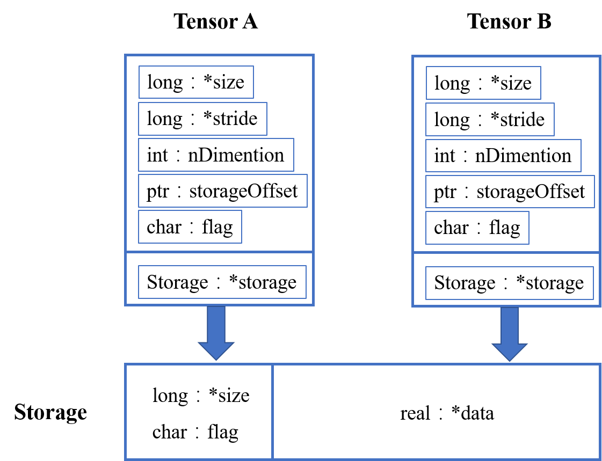
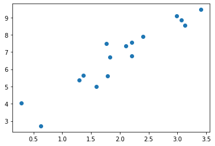
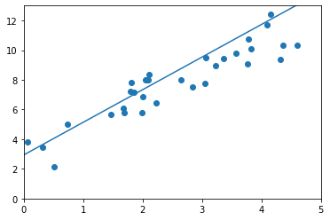
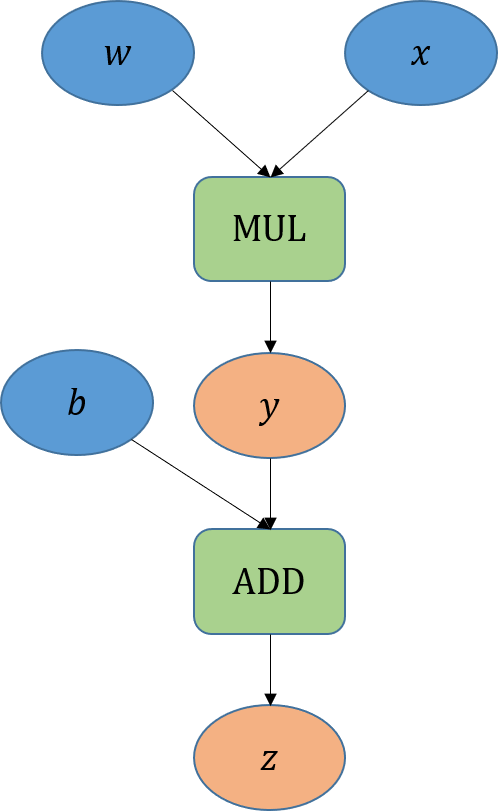
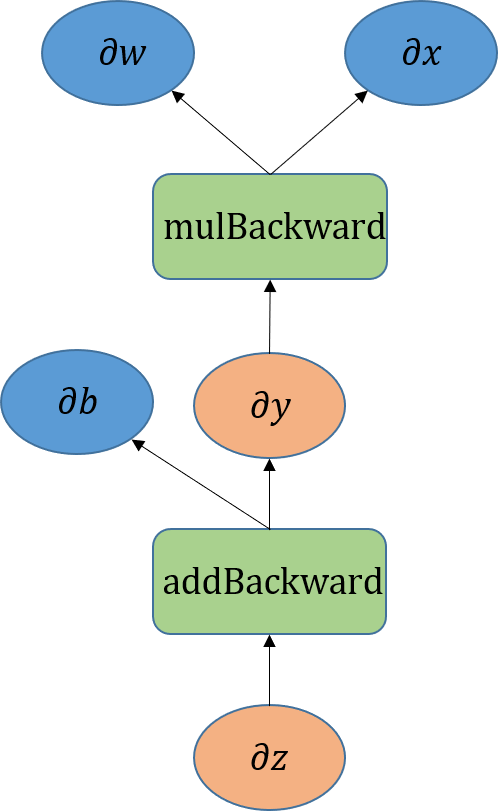
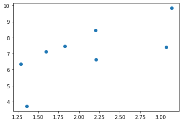
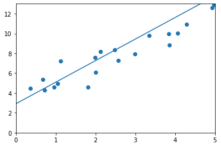
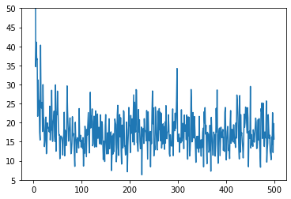

# 第3章 Tensor

本章开始深入系统地讲解PyTorch的各部分知识。PyTorch背后的设计核心是张量和计算图，张量实现了高性能的数据结构和运算，计算图通过计算梯度以优化网络参数。本章将介绍PyTorch的张量系统（Tensor）和自动微分系统（autograd）。

## 3.1 Tensor基础

Tensor，又名张量，读者可能对这个名词似曾相识，它不仅在PyTorch中出现过，而且也是其他深度学习框架（如TensorFlow、MXNet等）中重要的数据结构。从工程角度讲，可以简单地认为Tensor是一个支持高效科学计算的数组。Tensor可以是一个数（标量）、一维数组（向量）、二维数组（如矩阵、黑白图片）或者更高维的数组（如高阶数据、视频等）。Tensor与NumPy的ndarray用法类似，而PyTorch的Tensor支持GPU加速。

本节将系统地讲解Tensor的基本用法，力求面面俱到，但不会涉及每个函数。对于Tensor的其他函数及其用法，读者可在IPython/Notebook中使用函数名加`?`查看帮助文档，或查阅PyTorch的官方文档。

### 3.1.1 Tensor的基本操作

学习过NumPy的读者对本节内容会比较熟悉，因为Tensor的接口设计与NumPy类似。本节不要求读者事先掌握NumPy的相关知识。

从接口的角度来说，对Tensor的操作可以分为以下两类。

- 形如`torch.function`的操作，如`torch.save`等。

- 形如`tensor.function`的操作，如`tensor.view`等。

为了方便用户使用，对Tensor的大部分操作同时支持这两类接口，在本书中不做具体区分。例如，`torch.sum(a, b)`等价于`a.sum(b)`。

从存储的角度来说，对Tensor的操作可以分为以下两类。

- 不会修改自身存储数据的操作，如 `a.add(b)`， 加法的结果会返回一个新的Tensor。

- 会修改自身存储数据的操作，如 `a.add_(b)`， 加法的结果会存储在`a`中，并返回这个结果。

函数名以`_`结尾的函数都是inplace方式，即会修改调用者自己存储的数据，这一点在实际应用中需加以区分。

#### 创建Tensor

在PyTorch中创建Tensor的方法有很多种，具体如表3-1所示。

:常见的创建Tensor的方法

|函数|功能|
|:---:|:---:|
|`Tensor(*sizes)`|基础构造函数|
|`tensor(data,)`|类似np.array的构造函数|
|`ones(*sizes)`|返回全1的Tensor|
|`zeros(*sizes)`|返回全0的Tensor|
|`eye(*sizes)`|对角线为1，其余值为0的Tensor|
|`arange(s,e,step)`|从s到e，步长为step|
|`linspace(s,e,steps)`|从s到e，均匀切分成steps份|
|`rand/randn(*sizes)`|均匀/标准分布|
|`normal(mean,std)/uniform(from,to)`|正态分布/均匀分布|
|`randperm(m)`|随机排列|
|`tensor.new_*/torch.*_like` | 创建一个相同形状，用*类型去填充的张量，具有相同的torch.dtype和torch.device |

表3-1中的创建方法都可以在创建Tensor的时候指定它的数据类型`dtype`和存放设备`device`（CPU/GPU）。其中，在使用函数`torch.Tensor()`新建一个Tensor的时候，有下面几种方式。

- 接收对象为一个list，根据list的数据创建Tensor。

- 根据指定的形状新建Tensor。

- 输入数据是其他的Tensor。

下面举例说明：

```python
In: # 查看PyTorch的版本号
    import torch as t
    t.__version__
```

```
Out:'1.8.0'
```

```python
In: # 指定Tensor的形状
    a = t.Tensor(2, 3)
    a # 数值取决于内存空间的状态，print时候可能overflow
```


```
Out:tensor([[-8.9209e-11,  4.5846e-41, -8.9209e-11],
        	[ 4.5846e-41,  4.4400e-29,  3.0956e-41]])
```


```python
In: # 用list数据创建Tensor
    b = t.Tensor([[1,2,3],[4,5,6]])
    b
```


```
Out:tensor([[1., 2., 3.],
        	[4., 5., 6.]])
```


```python
In: b.tolist() # 把Tensor转为list
```


```
Out:[[1.0, 2.0, 3.0], [4.0, 5.0, 6.0]]
```

```python
In: # 输入数据是一个Tensor
    c = t.Tensor(t.rand(2, 3))
    c
```

```
Out: tensor([[0.4217, 0.3367, 0.4271],
        	 [0.9251, 0.4068, 0.6382]])
```

通过`tensor.size()`可以查看Tensor的形状，它返回一个`torch.Size`对象。该对象虽然是tuple的子类，但是在作为`torch.Tensor()`的输入对象时，它与tuple略有区别。


```python
In: b_size = b.size()
    b_size
```


```
Out:torch.Size([2, 3])
```


```python
In: # 创建一个和b形状一样的Tensor c
    c = t.Tensor(b_size)
    # 创建一个元素为2和3的Tensor d
    d = t.Tensor((2, 3))
    c, d
```


```
Out:(tensor([[0., 0., 0.],
         	 [0., 0., 0.]]), tensor([2., 3.]))
```

**注意：使用`torch.Tensor(*sizes)`创建Tensor时，系统不会马上分配空间，只会计算剩余的内存是否足够使用，在真正使用到创建的Tensor时才会分配空间。**其他操作都是在创建完Tensor之后马上进行空间分配的。在创建Tensor时，读者很容易混淆`torch.Tensor()`与`torch.tensor()`，二者的区别如下。

- `torch.Tensor()`是Python类，默认是`torch.FloatTensor()`。运行`torch.Tensor([2,3])`会直接调用Tensor类的构造函数`__init__()`，生成结果是单精度浮点类型的Tensor。关于Tensor的类型，将在下一小节介绍。
- `torch.tensor()`是Python函数，函数的原型为：`torch.tensor(data, dtype=None, device=None, requires_grad=False)`，其中`data`支持list、tuple、array、scalar等类型的数据。`torch.tensor()`直接从`data`中进行数据拷贝，并根据原数据的类型生成相应类型的Tensor。

由于`torch.tensor()`能够根据数据类型生成对应类型的Tensor，而且接口与NumPy更像，因此在实际应用中，笔者更加推荐使用`torch.tensor()`创建一个新的Tensor。下面举例说明：


```python
In: # torch.Tensor()可以直接创建空的张量
    t.Tensor()
```


```
Out:tensor([])
```


```python
In: # torch.tensor()不可以直接创建空的张量，必须传入一个data
    # t.tensor() 
    # TypeError: tensor() missing 1 required positional arguments: "data"
    t.tensor(()) # ()等效于一个空数据
```


```
Out:tensor([])
```


```python
In: a = t.tensor([2, 3]) # t.tensor会从数据中推理出所需的数据类型
    print(a.type())
    b = t.Tensor([2, 3]) # t.Tensor默认是FloatTensor
    print(b.type())
```

```
Out:torch.LongTensor
    torch.FloatTensor
```


```python
In: import numpy as np
    arr = np.ones((2, 3), dtype=np.float64)
    a = t.tensor(arr)  # 也可以使用t.from_numpy(arr)，但实现有区别，见3.1.3节
    a
```


```
Out:tensor([[1., 1., 1.],
        	[1., 1., 1.]], dtype=torch.float64)
```

其他的创建Tensor方法举例如下：


```python
In: # 创建一个形状是(2,3)，值全为1的Tensor
    t.ones(2, 3)
```


```
Out:tensor([[1., 1., 1.],
        	[1., 1., 1.]])
```

与`torch.ones()`类似的函数还有`torch.ones_like(input)`。其中，输入`input`是一个Tensor，函数返回一个与之大小相同，值全部为1的新Tensor。也就是说，`torch.ones_like(input)`等价于`torch.ones(input.size(), dtype=input.dtype, layout=input.layout, device=input.device)`。


```python
In: input_tensor = t.tensor([[1, 2, 3], [4, 5, 6]])
    t.ones_like(input_tensor)
```


```
Out:tensor([[1, 1, 1],
        	[1, 1, 1]])
```


```python
In: # 创建一个形状是(2,3)，值全0的Tensor
    t.zeros(2, 3)
```


```
Out:tensor([[0., 0., 0.],
        	[0., 0., 0.]])
```


```python
In: # 创建一个对角线值为1，其余值为0的Tensor，不要求行列数一致
    t.eye(2, 3, dtype=t.int)
```


```
Out:tensor([[1, 0, 0],
        	[0, 1, 0]], dtype=torch.int32)
```


```python
In: # 创建一个起始值为1，上限为6，步长为2的Tensor
    t.arange(1, 6, 2)
```


```
Out:tensor([1, 3, 5])
```


```python
In: # 创建一个均匀间距的Tensor，将1到10的数分为3份
    t.linspace(1, 10, 3)
```


```
Out:tensor([ 1.0000,  5.5000, 10.0000])
```


```python
In: # 创建一个形状是(2,3)的Tensor，取值是从标准正态分布中抽取的随机数
    t.randn(2, 3)
```


```
Out:tensor([[ 1.3969, -1.5042, -0.8430],
        	[-0.8707, -1.0794, -1.3357]])
```


```python
In: # 创建一个长度为5、随机排列的Tensor
    t.randperm(5) 
```


```
Out:tensor([2, 4, 0, 3, 1])
```


```python
In: # 创建一个大小为(2,3)，值全为1的Tensor，保留原始的torch.dtype和torch.device
    a = t.tensor((), dtype=t.int32)
    a.new_ones((2, 3))
```


```
Out:tensor([[1, 1, 1],
        	[1, 1, 1]], dtype=torch.int32)
```

```python
In: # 统计a中的元素总数，两种方式等价
    a.numel(), a.nelement()
```

```
Out:(6, 6)
```

#### Tensor的类型

Tensor的类型可以细分为设备类型（device）和数据类型（dtype）。其中，设备类型分为CUDA和CPU，数值类型有bool、float、int等。Tensor的数据类型如表3-2所示，每种数据类型都有CPU和GPU版本。读者可以通过`tensor.device`获得Tensor的设备类型，通过`tensor.dtype`获得Tensor的数据类型。

Tensor的默认数据类型是FloatTensor，读者可以通过`torch.set_default_tensor_type` 修改默认的Tensor类型（如果默认类型为GPU Tensor，那么所有操作都将在GPU上进行）。了解Tensor的类型对分析内存占用很有帮助，例如，一个形状为$(1000, 1000, 1000)$​的FloatTensor，它有$1000\times 1000\times 1000=10^9$​个元素，每个元素占$32 \text{bit} \div 8 = 4 \text{Byte}$​内存，所以这个Tensor占大约4GB内存/显存。HalfTensor是专门为GPU版本设计的，同样的元素个数，HalfTensor的显存占用只有FloatTensor的一半，因此使用HalfTensor可以极大缓解GPU显存不足的问题。**需要注意的是，HalfTensor所能表示的数值大小和精度有限，可能会出现数据溢出等问题**。

:Tensor的数据类型

| Data type | dtype | CPU tensor   | GPU tensor   |
| :----------------------: | :-------------------------------: | :---------------------------------------: | :-----------------------: |
| 32-bit 浮点型   | `torch.float32` or `torch.float`  | `torch.FloatTensor`  | `torch.cuda.FloatTensor`  |
| 64-bit 浮点型   | `torch.float64` or `torch.double` | `torch.DoubleTensor` | `torch.cuda.DoubleTensor` |
| 16-bit 半精度浮点型    | `torch.float16` or `torch.half`  | `torch.HalfTensor`| `torch.cuda.HalfTensor`|
| 8-bit 无符号整型 | `torch.uint8`  | `torch.ByteTensor`| `torch.cuda.ByteTensor`|
| 8-bit 有符号整型 | `torch.int8`  | `torch.CharTensor`| `torch.cuda.CharTensor`|
| 16-bit 有符号整型 | `torch.int16` or `torch.short`   | `torch.ShortTensor` | `torch.cuda.ShortTensor`  |
| 32-bit 有符号整型 | `torch.int32` or `torch.int`  | `torch.IntTensor` | `torch.cuda.IntTensor` |
| 64-bit 有符号整型 | `torch.int64` or `torch.long`  | `torch.LongTensor` | `torch.cuda.LongTensor`|
| 布尔型 | `torch.bool` | `torch.BoolTensor` | `torch.cuda.BoolTensor` |


不同类型Tensor之间相互转换的常用方法如下。

- 最通用的做法是`tensor.type(new_type)`，同时还有`tensor.float()`、`tensor.long()`、`tensor.half()`等快捷方法。

- CPU Tensor与GPU Tensor之间的互相转换通过`tensor.cuda()`和`tensor.cpu()`实现，此外还可以使用`tensor.to(device)`。

- 创建同种类型的张量：`torch.*_like` 和 `tensor.new_*`，这两种方法适用于编写设备兼容的代码。其中，`torch.*_like(tensorA)` 可以生成和`tensorA`拥有同样属性（如类型、形状和CPU/GPU）的新Tensor；`tensor.new_*(new_shape)` 可以新建一个不同形状、但是拥有相同属性的Tensor。

下面举例说明Tensor之间的相互转换：


```python
In: # 更改默认Tensor的类型
    a = t.rand(2, 3)
    print(a.dtype)
    # 设置默认类型为DoubleTensor
    t.set_default_tensor_type('torch.DoubleTensor')
    a = t.rand(2, 3)
    print(a.dtype)
    # 恢复之前的默认设置
    t.set_default_tensor_type('torch.FloatTensor')
```

```
Out:torch.float32
    torch.float64
```


```python
In: # 通过type方法和快捷方法修改Tensor的类型
    b1 = a.type(t.FloatTensor)
    b2 = a.float()
    b3 = a.type_as(b1) # 等价于a.type(b.dtype)或a.type(b.type())
    a.dtype, b1.dtype, b2.dtype, b3.dtype
```


```
Out:(torch.float64, torch.float32, torch.float32, torch.float32)
```


```python
In: # 之所以new_*方法相当于利用DoubleTensor的构造函数，是因为此时a是torch.float64类型
    a.new_ones(2, 4)
```


```
Out:tensor([[1., 1., 1., 1.],
        	[1., 1., 1., 1.]], dtype=torch.float64)
```

```python
In: # new_*方法同时还会复制Tensor的device
    a = t.randn(2, 3).cuda()
    a.new_ones(2, 4)
```

```
Out: tensor([[1., 1., 1., 1.],
        	 [1., 1., 1., 1.]], device='cuda:0')
```

#### 索引操作

在NumPy中经常使用索引操作获取指定位置的数据。Tensor支持与NumPy类似的索引操作，下面通过一些示例讲解常用的索引操作。其中，大多数索引操作通过修改Tensor的stride等属性与原Tensor共享内存，即修改了其中一个Tensor，另一个Tensor会跟着改变。关于索引操作更详细的内容将在本书第6章中进行讲解。


```python
In: a = t.randn(3, 4)
    a
```


```
Out:tensor([[-0.0317,  1.7469, -1.4530, -0.4462],
        	[ 2.5300, -1.0586, -1.0968,  0.0187],
        	[-0.5891,  0.1420,  0.3084, -0.5744]])
```


```python
In: print("查看第1行结果：", a[0])
    print("查看第2列结果：", a[:,1])
    print("查看第2行最后两个元素：", a[1, -2:])
```

```
Out:查看第1行结果： tensor([-0.0317,  1.7469, -1.4530, -0.4462])
    查看第2列结果： tensor([ 1.7469, -1.0586,  0.1420])
    查看第2行最后两个元素： tensor([-1.0968,  0.0187])
```


```python
In: # 返回一个BoolTensor
    print(a > 0) # 布尔型
    print((a > 0).int()) # 整型
```

```
Out:tensor([[False,  True, False, False],
            [ True, False, False,  True],
            [False,  True,  True, False]])
    tensor([[0, 1, 0, 0],
            [1, 0, 0, 1],
            [0, 1, 1, 0]], dtype=torch.int32)
```


```python
In: # 返回Tensor中满足条件的结果，下面两种写法等价
    # 选择返回的结果与原Tensor不共享内存空间
    print(a[a > 0])
    print(a.masked_select(a>0)) 
    # 用torch.where保留原始的索引位置，不满足条件的位置置0
    print(t.where(a > 0, a, t.zeros_like(a)))
```

```
Out:tensor([1.7469, 2.5300, 0.0187, 0.1420, 0.3084])
    tensor([1.7469, 2.5300, 0.0187, 0.1420, 0.3084])
    tensor([[0.0000, 1.7469, 0.0000, 0.0000],
            [2.5300, 0.0000, 0.0000, 0.0187],
            [0.0000, 0.1420, 0.3084, 0.0000]])
```

PyThon中常用的选择函数如表3-3所示。

:常用的选择函数

|函数|功能|
|:---:|:---:|
|`index_select(input, dim, index)`|在指定维度dim上选取，比如选取某些行、某些列|
|`masked_select(input, mask)`|例子如上，a[a>0]，使用BoolTensor进行选取|
|`non_zero(input)`|非0元素的下标|
|`gather(input, dim, index)`|根据index，在dim维度上选取数据，输出的size与index一样|

其中，`gather`是一个比较复杂的操作，对一个二维的Tensor，每个位置的元素输出如下：

```python
out[i][j] = input[index[i][j]][j]  # dim=0
out[i][j] = input[i][index[i][j]]  # dim=1
```


```python
In: a = t.arange(0, 16).view(4, 4)
    a
```


```
Out:tensor([[ 0,  1,  2,  3],
        	[ 4,  5,  6,  7],
        	[ 8,  9, 10, 11],
        	[12, 13, 14, 15]])
```


```python
In: # 选取对角线的元素
    index = t.tensor([[0,1,2,3]])
    a.gather(0, index)
```


```
Out:tensor([[ 0,  5, 10, 15]])
```


```python
In: # 选取反对角线上的元素
    index = t.tensor([[3,2,1,0]]).t()
    a.gather(1, index)
```


```
Out:tensor([[ 3],
        	[ 6],
        	[ 9],
        	[12]])
```


```python
In: # 选取正反对角线上的元素
    index = t.tensor([[0,1,2,3],[3,2,1,0]]).t()
    b = a.gather(1, index)
    b
```


```
Out:tensor([[ 0,  3],
        	[ 5,  6],
        	[10,  9],
        	[15, 12]])
```

与`gather`相对应的逆操作是`scatter_`：`gather`将数据从input中按index取出，`scatter_`按照index将数据写入。**注意：`scatter_`函数是inplace操作，会直接对当前数据进行修改。**

```python
out = input.gather(dim, index)
-->近似逆操作
out = Tensor()
out.scatter_(dim, index)
```


```python
In: # 将正反对角线元素放至指定位置
    c = t.zeros(4,4).long()
    c.scatter_(1, index, b)
```


```
Out:tensor([[ 0,  0,  0,  3],
        	[ 0,  5,  6,  0],
        	[ 0,  9, 10,  0],
        	[12,  0,  0, 15]])
```

对Tensor进行任意索引操作得到的结果仍然是一个Tensor，如果想获取标准的Python对象数值，那么需要调用`tensor.item()`。这个方法只对仅包含一个元素的Tensor适用。


```python
In: t.Tensor([1.]).item()
    # t.Tensor([1, 2]).item()  ->
    # raise ValueError: only one element tensors can be converted to Python scalars
```


```
Out:1.0
```

#### 拼接操作

拼接操作是指将多个Tensor在指定维度上拼（Concatenate）在一起的操作，常用的拼接操作函数如表3-4所示。

:常用的拼接函数

|         函数          |                功能                 |
| :-------------------: | :---------------------------------: |
|  `cat(tensors, dim)`  | 将多个Tensor在指定维度dim上进行拼接 |
| `stack(tensors, dim)` | 将多个Tensor沿一个新的维度进行拼接  |

函数`cat`和`stack`的输入对象都是多个Tensor组成的一个序列（如列表、元组等），所有的Tensor在拼接之外的维度必须相同或者可以进行广播。`cat`和`stack`在指定维度时稍有区别，`cat`会将多个Tensor在维度dim上进行拼接，而`stack`指定的维度dim是一个新的维度，最终是在这个新的维度上进行的拼接。下面举例说明两个函数的用法和区别：

```python
In: a = t.arange(6).view(2, 3)
    a
```

```
Out:tensor([[0, 1, 2],
        	[3, 4, 5]])
```

```python
In: # cat函数在dim=0上进行拼接
    t.cat((a, a), 0)
    # 等价于t.cat([a, a], 0)
```

```
Out:tensor([[0, 1, 2],
            [3, 4, 5],
            [0, 1, 2],
            [3, 4, 5]])
```

```python
In: # cat函数在dim=1上进行拼接
    t.cat((a, a), 1)
    # 等价于t.cat([a, a], 1)
```

```
Out:tensor([[0, 1, 2, 0, 1, 2],
        	[3, 4, 5, 3, 4, 5]])
```

```python
In: # stack函数在dim=0上进行拼接
    b = t.stack((a, a), 0)
    b
```

```
Out:tensor([[[0, 1, 2],
             [3, 4, 5]],
            [[0, 1, 2],
             [3, 4, 5]]])
```

```python
In: # 注意输出形状的改变
    b.shape
```

```
Out:torch.Size([2, 2, 3])
```

从上面的例子可以看出，`stack`函数会在Tensor上扩展一个新的维度，然后基于这个维度完成Tensor的拼接。

#### 高级索引

目前，PyTorch已经支持绝大多数NumPy风格的高级索引。高级索引虽然可以看成是基本索引操作的扩展，但是操作结果一般不和原始的Tensor共享内存。关于高级索引的更多内容将在本书第6章进行详细介绍。


```python
In: x = t.arange(0,16).view(2,2,4)
    x
```


```
Out:tensor([[[ 0,  1,  2,  3],
         	 [ 4,  5,  6,  7]],
        	[[ 8,  9, 10, 11],
         	 [12, 13, 14, 15]]])
```


```python
In: x[[1, 0], [1, 1], [2, 0]] # x[1,1,2]和x[0,1,0]
```


```
Out:tensor([14,  4])
```


```python
In: x[[1, 0], [0], [1]] # 等价于x[1,0,1],x[0,0,1]
```


```
Out:tensor([9, 1])
```

#### 逐元素操作

逐元素（point-wise，又名element-wise）操作会对Tensor的每一个元素进行操作，此类操作的输入与输出形状一致。常用的逐元素操作如表3-5所示。

:常用的逐元素操作

|函数|功能|
|:--:|:--:|
|abs/sqrt/div/exp/fmod/log/pow...|绝对值/平方根/除法/指数/求余/对数/求幂...|
|cos/sin/asin/atan2/cosh...|三角函数|
|ceil/round/floor/trunc| 上取整/四舍五入/下取整/只保留整数部分|
|`clamp(input, min, max)`|超过min和max部分截断|
|sigmod/tanh/...|激活函数|

PyTorch对很多操作都实现了运算符重载，读者可以很方便地直接使用。例如，`torch.pow(a,2)` 等价于`a ** 2`，`torch.mul(a,2)`等价于`a * 2`。

截断函数`clamp(x, min, max)`通常用在需要比较大小的地方，它的运算规则如式(3.1)所示：
$$
y_i =
\begin{cases}
\text{min},  & \text{如果 } x_i \lt \text{min} \\
x_i,  & \text{如果 } \text{min} \le x_i \le \text{max}  \\
\text{max},  & \text{如果 } x_i \gt \text{max}\\
\end{cases}\tag{3.1}
$$
下面举例说明一些常见的逐元素操作：


```python
In: a = t.arange(0, 6).float().view(2, 3)
    t.cos(a)
```


```
Out:tensor([[ 1.0000,  0.5403, -0.4161],
        	[-0.9900, -0.6536,  0.2837]])
```


```python
In: # 取模运算的运算符重载，二者等价
    print(a % 3)
    print(t.fmod(a, 3))
```

```
Out:tensor([[0., 1., 2.],
            [0., 1., 2.]])
    tensor([[0., 1., 2.],
            [0., 1., 2.]])
```


```python
In: # 将a的值进行上下限截断
    print(a)
    print(t.clamp(a, min=2, max=4))
```

```
Out:tensor([[0., 1., 2.],
            [3., 4., 5.]])
    tensor([[2., 2., 2.],
            [3., 4., 4.]])
```

####  归并操作 

归并操作只使用Tensor中的部分元素进行计算，其输出结果的形状通常小于输入形状。用户可以沿着某一维度进行指定的归并操作，例如，加法`sum`既可以计算整个Tensor的和，又可以计算Tensor中每一行或每一列的和。常用的归并操作如表3-6所示。

:常用的归并操作

|函数|功能|
|:---:|:---:|
|mean/sum/median/mode|均值/求和/中位数/众数|
|norm/dist|范数/距离|
|std/var|标准差/方差|
|cumsum/cumprod|累加/累乘|

大多数执行归并操作的函数都有一个维度参数`dim`，它用来指定这些操作是在哪个维度上执行的。关于`dim`（对应于NumPy中的axis）的解释众说纷纭，这里提供一个简单的记忆方式。

假设输入的形状是(m, n, k)，有如下三种情况。

- 如果指定dim=0，那么输出的形状是(1, n, k)或者(n, k)。
- 如果指定dim=1，那么输出的形状是(m, 1, k)或者(m, k)。
- 如果指定dim=2，那么输出的形状是(m, n, 1)或者(m, n)。

输出形状中是否有维度`1`，取决于参数`keepdim`，如果指定`keepdim=True`，那么结果就会保留维度`1`。注意：以上只是经验总结，并非所有函数都符合这种形状变化方式，如`cumsum`，下面举例说明：


```python
In: # 注意对比是否保留维度1的区别
    b = t.ones(2, 3)
    print(b.sum(dim=0, keepdim=True ), b.sum(dim=0, keepdim=True ).shape)
    print(b.sum(dim=0, keepdim=False), b.sum(dim=0, keepdim=False).shape)
```

```
Out:tensor([[2., 2., 2.]]) torch.Size([1, 3])
    tensor([2., 2., 2.]) torch.Size([3])
```


```python
In: a = t.arange(2, 8).view(2, 3)
    print(a)
    print(a.cumsum(dim=1)) # 沿着行累加
```

```
Out:tensor([[2, 3, 4],
            [5, 6, 7]])
    tensor([[ 2,  5,  9],
            [ 5, 11, 18]])
```

#### 比较函数

PyTorch的部分比较函数是逐元素比较，操作类似于逐元素操作，另外一些类似于归并操作。常用的比较函数如表3-7所示。

:常用的比较函数

|函数|功能|
|:--:|:--:|
|gt/lt/ge/le/eq/ne|大于/小于/大于等于/小于等于/等于/不等于|
|`topk(input, k)`|返回最大的k个数和它们的索引|
|`sort(input, dim)`|对指定维度进行排序|
|`argsort(input, dim)`|返回指定维度排序结果的索引|
|max/min|比较两个Tensor的最大、最小值|
|`allclose(tensor1, tensor2)`|比较两个浮点类型Tensor近似相等|

表3-7中第一行的比较操作因为已经实现了运算符重载，所以可以使用`a>=b`、`a>b`、`a!=b`和`a==b`，其返回结果是一个`BoolTensor`，可以用来选取元素。max/min这两个操作比较特殊，以max为例，它有以下三种使用情况。
- `torch.max(tensor)`：返回Tensor中最大的一个数。
- `torch.max(tensor, dim)`：指定维上最大的数，返回Tensor和索引。
- `torch.max(tensor1, tensor2)`： 返回两个Tensor对应位置上较大的元素。

下面举例说明：


```python
In: a = t.linspace(0, 15, 6).view(2, 3)
    b = t.linspace(15, 0, 6).view(2, 3)
    print(a > b)
    print("a中大于b的元素: ", a[a > b]) # 返回a中大于b的元素
    print("a中最大的元素: ", t.max(a))  # 返回a中最大的元素
```

```
Out:tensor([[False, False, False],
            [ True,  True,  True]])
    a中大于b的元素:  tensor([ 9., 12., 15.])
    a中最大的元素:  tensor(15.)
```


```python
In: t.max(b, dim=1)
    # 第一个返回值15和6分别表示第1行和第2行最大的元素
    # 第二个返回值的0和0表示每行最大元素的索引
```


```
Out:torch.return_types.max(
	values=tensor([15.,  6.]),
	indices=tensor([0, 0]))
```


```python
In: t.max(a, b) # 返回两个Tensor对应位置上较大的元素
```


```
Out:tensor([[15., 12.,  9.],
        	[ 9., 12., 15.]])
```

```python
In: a = t.tensor([2, 3, 4, 5, 1])
    t.topk(a, 3) # 返回最大的3个值和它们对应的索引
```

```
Out:torch.return_types.topk(
    values=tensor([5, 4, 3]),
	indices=tensor([3, 2, 1]))
```

```python
In: a = t.randn(2, 3)
    a
```

```
Out:tensor([[-0.1712,  0.2442, -1.1505],
        	[-0.0754, -0.1402,  1.1420]])
```

```python
In: t.argsort(a, dim=1) # 第一行的数据是-1.1505<-0.1712<0.2442，对应的索引是2,0,1
```

```
Out:tensor([[2, 0, 1],
        	[1, 0, 2]])
```

在比较两个整型Tensor时，可以使用符号`==`直接进行比较。对于有精度限制的浮点数，需要使用`allclose`函数进行比较：

```python
In: a = t.tensor([1.000001, 1.000001, 0.999999])
    b = t.ones_like(a) # [1., 1., 1.]
    print(a == b)
    t.allclose(a, b)
```

```
Out:tensor([False, False, False])
	True
```

#### 其他函数

PyTorch 1.8版本新增了快速傅里叶变换FFT（`torch.fft`）和线性代数模块（`torch.linalg`），常用的线性代数函数如表3-8所示。

:常用的线性代数函数

|函数|功能|
|:---:|:---:|
|`linalg.det()`|行列式|
|`linalg.matrix_rank()`|矩阵的秩|
|`linalg.norm()`|矩阵或向量范数|
|`linalg.inv()`|矩阵的逆|
|`linalg.pinv()`|矩阵的伪逆（Moore-Penrose广义逆矩阵）|
|`linalg.svd()`|奇异值分解|
|`linalg.qr()`|QR分解|
|`fft.fft()`|一维离散傅里叶变换|
|`fft.ifft()`|一维离散傅里叶逆变换|

此外，在`torch.distributions`中，PyTorch提供了可自定义参数的概率分布函数和采样函数，其中封装了伯努利分布、柯西分布、正态分布、拉普拉斯分布等。关于这些函数的详细用法，读者可以参考PyTorch的官方文档。

### 3.1.2 命名张量

命名张量（Named Tensors）允许用户将显式名称与Tensor的维度关联起来，便于对Tensor进行其他操作。笔者推荐使用维度的名称进行维度操作，这样可以避免重复计算Tensor每个维度的位置。支持命名张量的工厂函数（factory functions）有`tensor`、`empty`、`ones`、`zeros`、`randn`等。

下面举例说明命名张量的使用，其中`N`代表batch_size，`C`代表通道数，`H`代表高度，`W`代表宽度。


```python
In: # 命名张量API在后续还有可能还有变化，系统会提示warning，在此忽略
    import warnings
    warnings.filterwarnings("ignore")
    # 直接使用names参数创建命名张量
    imgs = t.randn(1, 2, 2, 3, names=('N', 'C', 'H', 'W'))
    imgs.names
```


```
Out:('N', 'C', 'H', 'W')
```


```python
In: # 查看旋转操作造成的维度变换
    imgs_rotate = imgs.transpose(2, 3)
    imgs_rotate.names
```


```
Out:('N', 'C', 'W', 'H')
```


```python
In: # 通过refine_names对未命名的张量命名，不需要名字的维度可以用None表示
    another_imgs = t.rand(1, 3, 2, 2)
    another_imgs = another_imgs.refine_names('N', None, 'H', 'W')
    another_imgs.names
```


```
Out:('N', None, 'H', 'W')
```


```python
In: # 修改部分维度的名称
    renamed_imgs = imgs.rename(H='height', W='width')
    renamed_imgs.names
```


```
Out:('N', 'C', 'height', 'width')
```


```python
In: # 通过维度的名称做维度转换
    convert_imgs = renamed_imgs.align_to('N', 'height', 'width', 'C')
    convert_imgs.names
```


```
Out:('N', 'height', 'width', 'C')
```

在进行张量的运算时，命名张量可以提供更高的安全性。例如，在进行Tensor的加法时，如果两个Tensor的维度名称没有对齐，那么即使它们的维度相同也无法进行计算。

```python
In: a = t.randn(1, 2, 2, 3, names=('N', 'C', 'H', 'W'))
    b = t.randn(1, 2, 2, 3, names=('N', 'H', 'C', 'W'))
    # a + b 
    # 报错，RuntimeError: Error when attempting to broadcast dims ['N', 'C', 'H', 'W'] and dims ['N', 'H', 'C', 'W']: dim 'H' and dim 'C' are at the same position from the right but do not match.
```

### 3.1.3 Tensor与NumPy

Tensor在底层设计上参考了NumPy数组，它们彼此之间的相互转换非常简单高效。因为NumPy中已经封装了常用操作，同时与Tensor之间在某些情况下共享内存，所以当遇到CPU Tensor不支持的操作时，可以先将其转成NumPy数组，完成相应处理后再转回Tensor。由于这样的操作开销很小，所以在实际应用中经常进行二者的相互转换，下面举例说明：


```python
In: import numpy as np
    a = np.ones([2, 3], dtype=np.float32)
    a
```


```
Out:array([[1., 1., 1.],
       	   [1., 1., 1.]], dtype=float32)
```


```python
In: # 从NumPy数组转化为Tensor，由于dtype为float32，所以a和b共享内存
    b = t.from_numpy(a)
    # 该种情况下，使用t.Tensor创建的Tensor与NumPy数组仍然共享内存
    # b = t.Tensor(a)
    b
```


```
Out:tensor([[1., 1., 1.],
        	[1., 1., 1.]])
```


```python
In: # 此时，NumPy数组和Tensor是共享内存的
    a[0, 1] = -1
    b # 修改a的值，b的值也会被修改
```


```
Out:tensor([[ 1., -1.,  1.],
        	[ 1.,  1.,  1.]])
```

注意：使用`torch.Tensor()`创建的张量默认dtype为float32，如果NumPy的数据类型与默认类型不一致，那么数据仅会被复制，不会共享内存。


```python
In: a = np.ones([2, 3])
    # 注意和上面的a的区别（dtype不是float32）
    a.dtype
```


```
Out:dtype('float64')
```


```python
In: b = t.Tensor(a) # 此处进行拷贝，不共享内存
    b.dtype
```


```
Out:torch.float32
```


```python
In: c = t.from_numpy(a) # 注意c的类型（DoubleTensor）
    c
```


```
Out:tensor([[1., 1., 1.],
        	[1., 1., 1.]], dtype=torch.float64)
```


```python
In: a[0, 1] = -1
    print(b) # b与a不共享内存，所以即使a改变了，b也不变
    print(c) # c与a共享内存
```

```
Out:tensor([[1., 1., 1.],
            [1., 1., 1.]])
    tensor([[ 1., -1.,  1.],
            [ 1.,  1.,  1.]], dtype=torch.float64)
```

注意：无论输入类型是什么，`torch.tensor()`都只进行进行数据拷贝，不会共享内存。读者需要注意`torch.Tensor()`，`torch.from_numpy()`与`torch.tensor()`在内存共享方面的区别。


```python
In: a_tensor = t.tensor(a)
    a_tensor[0, 1] = 1
    a # a和a_tensor不共享内存
```


```
Out:array([[ 1., -1.,  1.],
           [ 1.,  1.,  1.]])
```

除了使用上述操作完成NumPy和Tensor之间的数据转换，PyTorch还构建了`torch.utils.dlpack`模块。该模块可以实现PyTorch张量和DLPack内存张量结构之间的相互转换，因此，用户可以轻松实现不同深度学习框架的张量数据的交换。注意：转换后的DLPack张量与原PyTorch张量仍然是共享内存的。

### 3.1.4 Tensor的基本结构

Tensor的数据结构如图3-1所示。Tensor分为头信息区（Tensor）和存储区（Storage），头信息区主要保存Tensor的形状（size）、步长（stride）、数据类型（type）等信息，真正的数据在存储区保存成连续数组。头信息区元素占用内存较少，主要内存占用取决于Tensor中元素的数目，即存储区的大小。

一般来说，一个Tensor有与之对应的Storage，Storage是在data之上封装的接口。Tensor的内存地址指向Tensor的头（head），不同Tensor的头信息一般不同，但可能使用相同的Storage。关于Tensor的很多操作虽然创建了一个新的head，但是它们仍共享同一个Storage，下面举例说明。




```python
In: a = t.arange(0, 6).float()
    b = a.view(2, 3)
    # Storage的内存地址一样，即它们是同一个Storage
    a.storage().data_ptr() == b.storage().data_ptr()
```


```
Out:True
```


```python
In: # a改变，b也随之改变，因为它们共享Storage
    a[1] = 100
    b
```


```
Out:tensor([[  0., 100.,   2.],
        	[  3.,   4.,   5.]])
```


```python
In: # 对a进行索引操作，只改变了head信息，Storage相同
    c = a[2:] 
    a.storage().data_ptr() == c.storage().data_ptr()
```


```
Out:True
```


```python
In: c.data_ptr(), a.data_ptr() # data_ptr返回Tensor首元素的内存地址
    # 可以看出两个内存地址相差8，这是因为2×4=8：相差两个元素，每个元素占4个字节(float)
    # 如果差值不是8，如16，那么可以用a.type()查看一下数据类型是不是torch.FloatTensor
```


```
Out:(94880397551496, 94880397551488)
```


```python
In: c[0] = -100 # c[0]的内存地址对应a[2]的内存地址
    a
```


```
Out:tensor([   0.,  100., -100.,    3.,    4.,    5.])
```


```python
In: d = t.Tensor(c.storage()) # d和c仍然共享内存
    d[0] = 6666
    b
```


```
Out:tensor([[ 6.6660e+03,  1.0000e+02, -1.0000e+02],
        	[ 3.0000e+00,  4.0000e+00,  5.0000e+00]])
```


```python
In: # 下面四个Tensor共享Storage
    a.storage().data_ptr() == b.storage().data_ptr() == c.storage().data_ptr() == d.storage().data_ptr()
```


```
Out:True
```


```python
In: # c取得a的部分索引，改变了偏移量
    a.storage_offset(), c.storage_offset(), d.storage_offset()
```


```
Out:(0, 2, 0)
```


```python
In: e = b[::2, ::2] # 隔2行/列取一个元素
    print(a.storage().data_ptr() == e.storage().data_ptr()) # 共享内存
    print(e.is_contiguous()) # e的存储空间是不连续的
```

```
Out:True
    False
```

由此可见，绝大多数操作不是修改Tensor的Storage，而是修改了Tensor的头信息。这种做法更节省内存，同时提升了处理速度。此外，有些操作会导致Tensor不连续，这时需要调用`tensor.contiguous()`方法将它们变成连续的数据。该方法会复制数据到新的内存，不再与原来的数据共享Storage。

读者可以思考一个问题，高级索引一般不共享Storage，而基本索引共享Storage，这是为什么呢？（提示：基本索引可以通过修改Tensor的offset、stride和size实现，不用修改Storage的数据，高级索引则不行。）

### 3.1.5 变形记：*N*种改变Tensor形状的方法

Tensor作为PyTorch的基本数据对象，在使用过程中经常需要进行变形操作。在设计上，PyTorch允许一个Tensor是另外一个Tensor的视图（view），这有效避免了显式的数据复制，从而更加高效便捷地进行Tensor的变形、切片等操作。在PyTorch中有很多用于改变Tensor形状的函数，本小节将详细介绍它们的用法。

本小节介绍的所有函数都可以用`tensor.shape`和`tensor.reshape(*new_shape)`实现。下面笔者对与Tensor形状相关的常见操作进行总结，以方便读者选择最灵活便捷的函数。


#### 查看Tensor的维度

关于Tensor的形状信息，除了使用`tensor.shape`，还有以下三个常用函数。
- `tensor.size()` ，等价于`tensor.shape`。
- `tensor.dim()` ，用于查看Tensor的维度，其等效于`len(tensor.shape)`，对应于NumPy中的`array.ndim`。
- `tensor.numel()` ，用来查看Tensor中元素的数量，等价于`tensor.shape[0]*tensor.shape[1]*...`，或者`np.prod(tensor.shape)`， 对应于NumPy中的`array.size`。


```python
In: import torch as t
    tensor = t.arange(24).reshape(2, 3, 4)
    # tensor.shape和tensor.size()等价
    print(f"a.shape={tensor.shape}. a.size()={tensor.size()}")
```

```
Out:a.shape=torch.Size([2, 3, 4]). a.size()=torch.Size([2, 3, 4])
```


```python
In: f'这是个{tensor.dim()}维Tensor, 共有{tensor.numel()}个元素'
```


```
Out:'这是个3维Tensor, 共有24个元素'
```

#### 改变Tensor的维度

所有改变Tensor形状的操作都可以通过`tensor.reshape()`实现。`tensor.reshape(new_shape)`首先会把不连续的Tensor变成连续的，然后再进行形状变化，这一操作等价于`tensor.contiguous().view(new_shape)`。关于`view`和`reshape`的选用可参考下面两点建议。

- `reshape`：接口更加便捷，会自动把不连续的Tensor变为连续的，可以避免很多报错。它的函数名与NumPy一致，便于使用。

- `view`：函数名更短，仅能处理内存连续的Tensor，经过`view`操作之后的Tensor仍然共享存储空间。

`reshape`和`view`之间还有一些区别：如果Tensor的内存不是连续的，那么`tensor.reshape` 会先把将原Tensor进行拷贝，利用`contiguous()`方法把它变成连续的之后再执行形状变化，而`tensor.view` 会报错。


```python
In: a = t.arange(1, 13)
    b = a.view(2, 6)
    c = a.reshape(2, 6) # 此时view和reshape等价，因为Tensor是contiguous
    # a, b, c三个对象的内存地址是不一样的，其中保存的是Tensor的形状（size）、步长（stride）、数据类型（type）等信息
    id(a) == id(b) == id(c)
```


```
Out:False
```


```python
In: # view和reshape虽然存储在与原始对象不同的地址内存中，但是它们共享存储器Storage，也就意味着它们共享基础数据
    a.storage().data_ptr() == b.storage().data_ptr() == c.storage().data_ptr()
```


```
Out:True
```


```python
In: b = b.t() # b不再连续
    b.reshape(-1, 4) # 仍然可以使用reshape操作进行形状变化
    
    # 下面会报错，view无法在改变数据存储的情况下进行形状变化
    # b.view(-1, 4)
```


```
Out:tensor([[ 1,  7,  2,  8],
        	[ 3,  9,  4, 10],
        	[ 5, 11,  6, 12]])
```

常用的快捷变形方法有以下几种。

- `tensor.view(dim1,-1,dimN)`：在调整Tensor的形状时，用户不需要指定每一维的形状，可以把其中一个维度指定为-1，PyTorch会自动计算对应的形状。

- `tensor.view_as(other)`：将Tensor的形状变为和other一样，等价于`tensor.view(other.shape)`。

- `tensor.squeeze()`：将Tensor中尺寸为1的维度去掉，例如形状(1, 3, 1, 4)会变为(3, 4)。

- `tensor.flatten(start_dim=0, end_dim=-1)`：将Tensor形状中某些连续维度合并为一个维度，例如形状(2, 3, 4, 5)会变为(2, 12, 5)。

- `tensor[None]` 和`tensor.unsqueeze(dim)`：为Tensor新建一个维度，该维度尺寸为1，例如形状(2, 3)会变为(2, 1, 3)。


```python
In: # 创建一张噪声图像, 并计算RGB每一个通道的噪声均值
    img_3xHxW = t.randn(3, 128, 256) 
    
    # 将img_3xHxW的后两维合并
    img_3xHW = img_3xHxW.view(3, -1)
    # 等价于 img_3xHxW.view(3, 128*256)
    # 也等价于 img_3xHxW.flatten(1, 2)
    img_3xHW.mean(dim=1)
```


```
Out:tensor([-1.6643e-03, -3.8993e-03,  8.6497e-07])
```


```python
In: # 图片除了RGB通道，还可以有alpha通道用来表示透明度
    alpha_HxW = t.rand(128, 256)
    alpha_1xHxW = alpha_HxW[None] # 等价于 alpha.unsqueeze(0)
    rgba_img = t.cat([alpha_1xHxW, img_3xHxW], dim=0)
    rgba_img.shape 
```


```
Out:torch.Size([4, 128, 256])
```


```python
In: # 去掉第一维的1
    # 等价于alpha_1xHxW.squeeze()：去掉所有为1的维度
    # 等价于alpha_1xHxW.flatten(0,1)：1和128合并
    # 等价于alpha_1xHxW[0]：通过索引取出第一维的数据
    alpha_HxW = alpha_1xHxW.view(128, 256)
```

#### Tensor的转置

Tensor的转置（transpose）和改变形状（reshape）是两个不一样的概念。例如，将一张图片旋转90度属于向量的转置，无法通过改变向量的形状实现。

`transpose`函数和`permute`函数虽然都可以用于高维矩阵的转置，但是用法上稍有区别：`transpose`只能用于两个维度的转置，即只能改变两个维度的信息；`permute`可以对任意高维矩阵进行转置，直接输入目标矩阵维度的索引即可。通过多次`transpose`变换可以达到和`permute`相同的效果。常用的转置操作还有`tensor.t()`和`tensor.T`，它们和`tensor.transpose()`一样都属于`permute`的特例。

另外，虽然在大多数情况下转置操作的输出和输入的Tensor共享存储，但是转置操作会使得Tensor变得不连续，此时最好通过`tensor.contiguous()`将其变成连续的。部分操作（比如`tensor.sum()/max()`）支持了对不连续的Tensor进行运算，就无需连续化这一步操作，这样可以节省内存/显存。


```python
In: mask = t.arange(6).view(2,3) # 一张高为2，宽为3的图片
    mask
```


```
Out:tensor([[0, 1, 2],
        	[3, 4, 5]])
```


```python
In: # 将图片旋转90度, 也就是第一个维度和第二个维度交换
    # 等价于mask.transpose(1,0)
    # 等价于mask.t() 或 img.T
    # 等价于mask.permute(1,0), 不等价于img.permute(0,1)
    mask.transpose(0,1)
```


```
Out:tensor([[0, 3],
        	[1, 4],
        	[2, 5]])
```


```python
In: # 单纯改变图片的形状
    # 注意和上面的区别，结果仍然是连续的
    mask.view(3,2)
```


```
Out:tensor([[0, 1],
        	[2, 3],
        	[4, 5]])
```


```python
In: # PyTorch等深度学习框架中图片一般存储为C×H×W
    img_3xHxW = t.randn(3, 128, 256) 
    
    # 在OpenCV/NumPy/skimage中，图片一般存储为H×W×C
    # img_3xHxW的形状为shape=[3, H, W],经过permute(1, 2, 0)得到的形状为:
    # [shape[1], shape[2], shape[0]] = [H, W, 3]
    img_HxWx3 = img_3xHxW.permute(1,2,0)
    
    img_HxWx3.is_contiguous()
```


```
Out:False
```


```python
In: img_HxWx3.reshape(-1) # .view会报错，因为img_HxWx3不连续
```


```
Out:tensor([ 0.4553,  1.0848, -1.9221,  ..., -0.6087,  0.2638, -0.0149])
```

在选择使用`tensor.reshape()`还是使用`tensor.transpose()`时，如果输出Tensor的维度数据排列和输入一样，那么使用`tensor.reshape()`，否则应该使用`tensor.transpose()`。


```python
In: H, W = 4, 5
    img_3xHxW = t.randn(3, H, W)
    
    # 目标数据排列和输入一样，直接使用reshape
    img_3xHW = img_3xHxW.reshape(3, -1)
    
    # 目标数据排列和输入不一样，先通过transpose变成(3,W,H), 再变成(3,WH)
    img_3xWH = img_3xHxW.transpose(1, 2).reshape(3, -1)
    
    # 再变形为3xWxH的形式
    img_3xWxH = img_3xWH.reshape(3, W, H)
```

## 3.2 小试牛刀：线性回归

线性回归是机器学习的入门内容，应用十分广泛。线性回归利用数理统计中的回归分析来确定两种或两种以上变量间相互依赖的定量关系，其表达形式为$y = wx+b+e$。其中，$x$和$y$是输入输出数据，$w$和$b$是可学习参数，误差$e$服从均值为0的正态分布。线性回归的损失函数如式(3.2)所示。
$$
\text{loss} = \sum_i^N \frac 1 2 ({y_i-(wx_i+b)})^2\tag{3.2}
$$
本节利用随机梯度下降法更新参数$w$​和$b$​来最小化损失函数，最终学得$w$​和$b$​的数值。


```python
In: import torch as t
    %matplotlib inline
    from matplotlib import pyplot as plt
    from IPython import display
    
    device = t.device('cpu') #如果使用GPU，则改成t.device('cuda:0')
```


```python
In: # 设置随机数种子，保证在不同机器上运行时下面的输出一致
    t.manual_seed(2021) 
    
    def get_fake_data(batch_size=8):
        ''' 产生随机数据：y=2x+3，加上了一些噪声'''
        x = t.rand(batch_size, 1, device=device) * 5
        y = x * 2 + 3 +  t.randn(batch_size, 1, device=device)
        return x, y
```


```python
In: # 来看看产生的x-y分布
    x, y = get_fake_data(batch_size=16)
    plt.scatter(x.squeeze().cpu().numpy(), y.squeeze().cpu().numpy())
```


```
Out:<matplotlib.collections.PathCollection at 0x7fcd24179c88>
```



```python
In: # 随机初始化参数
    w = t.rand(1, 1).to(device)
    b = t.zeros(1, 1).to(device)
    
    lr = 0.02 # 学习率learning rate
    
    for ii in range(500):
        x, y = get_fake_data(batch_size=4)
        
        # forward：计算loss
        y_pred = x.mm(w) + b.expand_as(y) # expand_as用到了广播法则
        loss = 0.5 * (y_pred - y) ** 2 # 均方误差
        loss = loss.mean()
        
        # backward：手动计算梯度
        dloss = 1
        dy_pred = dloss * (y_pred - y)
        
        dw = x.t().mm(dy_pred)
        db = dy_pred.sum()
        
        # 更新参数
        w.sub_(lr * dw) # inplace函数
        b.sub_(lr * db)
        
        if ii % 50 == 0:
            # 画图
            display.clear_output(wait=True)
            x = t.arange(0, 6).float().view(-1, 1)
            y = x.mm(w) + b.expand_as(x)
            plt.plot(x.cpu().numpy(), y.cpu().numpy()) # 线性回归的结果
            
            x2, y2 = get_fake_data(batch_size=32) 
            plt.scatter(x2.numpy(), y2.numpy()) # 真实的数据
            
            plt.xlim(0, 5)
            plt.ylim(0, 13)
            plt.show()
            plt.pause(0.5)
            
    print(f'w: {w.item():.3f}, b: {b.item():.3f}')
```




```
Out:w: 1.911 b: 3.044
```

可见程序已经基本学出$w=2$、$b=3$，并且图中直线和数据已经实现较好的拟合。

上面提到了Tensor的许多操作，这里不要求读者全部掌握，今后使用时可以再查阅这部分内容或者查阅官方文档，在此读者只需有个基本印象即可。

## 3.3 autograd和计算图基础

在训练网络时使用Tensor非常方便，从3.2节线性回归的例子来看，反向传播过程需要手动实现，这对于像线性回归这样较为简单的模型还比较容易。在实际使用中经常出现非常复杂的网络结构，此时手动实现反向传播，不仅费时费力，而且容易出错，难以检查。`torch.autograd`就是为了方便用户使用而专门开发的一套自动求导引擎，它能够根据输入和前向传播过程自动构建计算图，执行反向传播。

计算图（Computation Graph）是包括PyTorch和TensorFlow在内的许多现代深度学习框架的核心，它为反向传播（Back Propogation）算法提供了计算基础，了解计算图在实际写程序的过程中会有极大的帮助。

### 3.3.1 autograd的用法：requires_grad与backward

PyTorch在autograd模块中实现了计算图的相关功能，autograd中的核心数据结构依然是Tensor，只需要对Tensor增加一个`requires_grad=True`属性。当用户定义网络模型时，autograd会记录与网络相关的所有Tensor操作，从而形成一个前向传播的有向无环图（Directed Acyclic Graph，DAG）。在这个图中，输入网络的Tensor称为叶子节点，网络输出的Tensor称为根节点。autograd从根节点开始遍历，并对其中所有`requires_grad=True`的Tensor进行求导操作，这样逐层遍历至叶子节点时，可以通过链式操作计算梯度，从而自动完成反向传播操作。autograd中核心的反向传播函数如下：

```python
torch.autograd.backward(tensors, grad_tensors=None, retain_graph=None, create_graph=False)
```

它主要涉及以下四个参数。
- tensors：用于计算梯度的Tensor，如`torch.autograd.backward(y)`，等价于`y.backward()`。
- grad_tensors：形状与tensors一致，对于`y.backward()`，grad_tensors相当于链式法则${\mathrm{d}z \over \mathrm{d}x}={\mathrm{d}z \over \mathrm{d}y} \times {\mathrm{d}y \over \mathrm{d}x}$中的${\mathrm{d}z} \over {\mathrm{d}y}$。
- retain_graph：反向传播需要缓存一些中间结果，在反向传播之后，这些缓存就被清空了。可通过指定这个参数不清空缓存，用来多次反向传播。
- create_graph：对反向传播过程再次构建计算图，可通过`backward of backward`实现求高阶导数。

下面举几个简单的例子来说明autograd的用法：


```python
In: import torch as t
    # 下面两种写法等价
    a = t.randn(3, 4, requires_grad=True)
    # a = t.randn(3, 4).requires_grad_()
    a.requires_grad
```


```
Out:True
```


```python
In: # 也可以单独设置requires_grad
    a = t.randn(3, 4)
    a.requires_grad = True
```


```python
In: b = t.zeros(3, 4).requires_grad_()
    c = (a + b).sum()
    c.backward()
    c
```


```
Out:tensor(-1.6152, grad_fn=<SumBackward0>)
```


```python
In: a.grad
```


```
Out:tensor([[1., 1., 1., 1.],
        	[1., 1., 1., 1.],
        	[1., 1., 1., 1.]])
```


```python
In: # 此处虽然没有指定c需要求导，但c依赖于a，而a需要求导，
    # 因此c的requires_grad属性会自动设为True
    a.requires_grad, b.requires_grad, c.requires_grad
```


```
Out:(True, True, True)
```

对于计算图中的Tensor而言， `is_leaf=True`的Tensor称为Leaf Tensor，也就是计算图中的叶子节点。设计Leaf Tensor的初衷是为了节省内存/显存，通常情况下不会直接使用非叶子节点的梯度信息。Leaf Tensor的判断准则如下。

- 当Tensor的requires_grad为False的时候，它就是Leaf Tensor。
- 当Tensor的requires_grad为True，同时是由用户创建的时候，它也是Leaf Tensor，它的梯度会被保留下来。

**注意：Leaf Tensor的grad_fn属性为None。**


```python
In: a.is_leaf, b.is_leaf, c.is_leaf
```


```
Out:(True, True, False)
```


```python
In: a = t.rand(10, requires_grad=True)
    a.is_leaf
```


```
Out:True
```


```python
In: # 接下来几个测试是在GPU的环境下进行的
    b = t.rand(10, requires_grad=True).cuda(0)
    b.is_leaf # b是由CPU上的Tensor转换为cuda上的Tensor时创建的，所以不是Leaf Tensor
```


```
Out:False
```


```python
In: c = t.rand(10, requires_grad=True) + 2
    c.is_leaf
```


```
Out:False
```


```python
In: d = t.rand(10).cuda(0)
    print(d.requires_grad) # False
    print(d.is_leaf) # 除了创建，没有其他操作（由autograd实现的）
```

```
Out:False
    True
```


```python
In: e = t.rand(10).cuda(0).requires_grad_()
    e.is_leaf # 同样的，在创建e的时候没有额外的操作
```


```
Out:True
```

下面来看看autograd计算的导数和手动推导的导数之间的区别。对于函数$y = x^2\text{e} ^x$，它的导函数如式(3.3)所示。
$$
{\mathrm{d}y \over \mathrm{d}x} = 2x\text{e}^x + x^2\text{e}^x\tag{3.3}
$$


```python
In: def f(x):
        '''计算y'''
        y = x**2 * t.exp(x)
        return y
    
    def gradf(x):
        '''手动求导函数'''
        dx = 2*x*t.exp(x) + x**2*t.exp(x)
        return dx
```


```python
In: x = t.randn(3, 4, requires_grad=True)
    y = f(x)
    y
```


```
Out:tensor([[0.0109, 0.2316, 0.8111, 7.1278],
        	[0.4126, 0.5035, 0.5146, 0.9632],
        	[0.5159, 1.0523, 0.0118, 0.3755]], grad_fn=<MulBackward0>)
```


```python
In: y.backward(t.ones(y.size())) # gradient形状与y一致
    assert t.all(x.grad == gradf(x)) # 没有抛出异常，说明autograd的计算结果与利用公式手动计算的结果一致
```

### 3.3.2 autograd的原理：计算图

PyTorch中autograd的底层采用了计算图，计算图是一种特殊的有向无环图，用于记录算子与变量之间的关系。一般用矩形表示算子，椭圆形表示变量。例如，表达式$z = wx + b$可以分解为$y = wx$和$z = y + b$，其计算图如图3-4所示，图中的`MUL`，`ADD`都是算子，$w$、$x$、$b$为变量。



在上述有向无环图中，$x$和$b$是叶子节点，它们通常由用户自己创建，不依赖于其他变量。$z$称为根节点，是计算图的最终目标。利用链式法则很容易求得各个叶子节点的梯度，如式(3.4)所示。
$$
\begin{array}{c}
\frac{\partial z}{\partial b}=1, \frac{\partial z}{\partial y}=1 \\
\frac{\partial y}{\partial w}=x, \frac{\partial y}{\partial x}=w \\
\frac{\partial z}{\partial x}=\frac{\partial z}{\partial y}\times \frac{\partial y}{\partial x}=1 \times w \\
\frac{\partial z}{\partial w}=\frac{\partial z}{\partial y}\times  \frac{\partial y}{\partial w}=1 \times x
\end{array}\tag{3.4}
$$
有了计算图，链式求导即可利用计算图的反向传播自动完成，其过程如图3-5所示。




在PyTorch的实现中，autograd会随着用户的操作，记录生成当前Tensor的所有操作，由此建立一个有向无环图。用户每进行一个操作，相应的计算图就会发生改变。更底层的实现中，图中记录了操作`Function`，每一个变量在图中的位置可通过其`grad_fn`属性在图中的位置推测得到。在反向传播过程中，autograd沿着这个图从当前变量（根节点$z$）溯源，利用链式求导法则计算所有叶子节点的梯度。每一个前向传播操作的函数都有与之对应的反向传播函数用来计算输入Tensor的梯度，这些函数的函数名通常以`Backward`结尾。下面结合代码学习autograd的实现细节：


```python
In: x = t.ones(1)
    b = t.rand(1, requires_grad = True)
    w = t.rand(1, requires_grad = True)
    y = w * x # 等价于y=w.mul(x)
    z = y + b # 等价于z=y.add(b)
    
    x.requires_grad, b.requires_grad, w.requires_grad
```


```
Out:(False, True, True)
```


```python
In: # 虽然未指定y.requires_grad为True，但由于y依赖于需要求导的w
    # 因此y.requires_grad为True
    y.requires_grad
```


```
Out:True
```


```python
In: # grad_fn可以查看这个Tensor的反向传播函数，
    # z是add函数的输出，所以它的反向传播函数是AddBackward
    z.grad_fn 
```


```
Out:<AddBackward0 at 0x7fcd240d3e80>
```


```python
In: # next_functions保存grad_fn的输入，grad_fn的输入是一个tuple
    # 第一个是y，它是乘法（mul）的输出，所以对应的反向传播函数y.grad_fn是MulBackward
    # 第二个是b，它是叶子节点，需要求导，所以对应的反向传播函数是AccumulateGrad
    z.grad_fn.next_functions 
```


```
Out:((<MulBackward0 at 0x7fcd240d3f28>, 0),
 	(<AccumulateGrad at 0x7fcd240d3f60>, 0))
```


```python
In: # 第一个是w，叶子节点，需要求导，梯度是累加的
    # 第二个是x，叶子节点，不需要求导，所以为None
    y.grad_fn.next_functions
```


```
Out:((<AccumulateGrad at 0x7fcd240d3da0>, 0), (None, 0))
```


```python
In: # 叶子节点的grad_fn是None
    w.grad_fn, x.grad_fn
```


```
Out:(None, None)
```

计算$w$的梯度时，需要用到$x$的数值（${\partial y\over \partial w} = x $），这些数值在前向过程中会保存成buffer，在计算完梯度之后会自动清空。为了能够多次反向传播，需要指定`retain_graph=True`来保留这些buffer。


```python
In: # 使用retain_graph来保存buffer
    z.backward(retain_graph=True)
    w.grad
```


```
Out:tensor([1.])
```


```python
In: # 多次反向传播，梯度累加，这也就是w中AccumulateGrad标识的含义
    z.backward()
    w.grad
```


```
Out:tensor([2.])
```

PyTorch使用的是动态图，因为它的计算图在每次前向传播时都是从头开始构建的，所以它能够使用Python控制语句（如for、if等）根据需求创建计算图。这点在自然语言处理领域中很有帮助，它意味着无需事先构建所有可能用到的图路径，图在运行时才进行构建。


```python
In: def abs(x):
        if x.data[0] > 0: return x
        else: return -x
    x = t.ones(1, requires_grad=True)
    y = abs(x)
    y.backward()
    x.grad
```


```
Out:tensor([1.])
```


```python
In: def f(x):
        result = 1
        for ii in x:
            if ii.item() > 0: result = ii * result
        return result
    x = t.arange(-2, 4).float().requires_grad_()
    y = f(x) # y = x[3]*x[4]*x[5]
    y.backward()
    x.grad
```


```
Out:tensor([0., 0., 0., 6., 3., 2.])
```

变量的`requires_grad`属性默认为False，如果某一个节点`requires_grad`被设置为True，那么所有依赖它的节点`requires_grad`都是True。这其实很好理解，对于$ x\to y \to z$，`x.requires_grad` 为 True。计算$\partial z \over \partial x$时，根据链式法则$\frac{\partial z}{\partial x} = \frac{\partial z}{\partial y} \times \frac{\partial y}{\partial x}$，自然也需要求$ \frac{\partial z}{\partial y}$，所以`y.requires_grad`会被自动标为True。

有些时候可能并不希望autograd对Tensor求导，求导需要缓存许多中间结构，从而增加额外的内存/显存开销。对于不需要反向传播的情景（如测试推理时），关闭自动求导可实现一定程度的速度提升，并节省约一半显存。


```python
In: x = t.ones(1, requires_grad=True)
    w = t.rand(1, requires_grad=True)
    y = x * w
    # y依赖于w，而w.requires_grad = True
    x.requires_grad, w.requires_grad, y.requires_grad
```


```
Out:(True, True, True)
```


```python
In: with t.no_grad(): # 关闭自动求导
        x = t.ones(1)
        w = t.rand(1, requires_grad = True)
        y = x * w
    # y依赖于w和x，虽然w.requires_grad=True，但是y的requires_grad依旧为False
    x.requires_grad, w.requires_grad, y.requires_grad
```


```
Out:(False, True, False)
```


```python
In: t.set_grad_enabled(False) # 更改了默认设置
    x = t.ones(1)
    w = t.rand(1, requires_grad = True)
    y = x * w
    # y依赖于w和x，虽然w.requires_grad=True，但是y的requires_grad依旧为False
    x.requires_grad, w.requires_grad, y.requires_grad
```


```
Out:(False, True, False)
```


```python
In: # 恢复默认配置
    t.set_grad_enabled(True)
```


```
Out:<torch.autograd.grad_mode.set_grad_enabled at 0x7fcd240d62e8>
```

如果想要修改Tensor的数值，又不希望被autograd记录，那么可以对`tensor.data`进行操作。


```python
In: a = t.ones(3, 4, requires_grad=True)
    b = t.ones(3, 4, requires_grad=True)
    c = a * b
    
    a.data # 同样是一个Tensor
```


```
Out:tensor([[1., 1., 1., 1.],
        	[1., 1., 1., 1.],
        	[1., 1., 1., 1.]])
```


```python
In: a.data.requires_grad # 已经独立于计算图之外了
```


```
Out:False
```

在反向传播过程中，非叶子节点的导数计算完之后即被清空。如果想查看这些变量的梯度，那么有以下两种方法。
- 使用`autograd.grad`函数。
- 使用`hook`方法。

`autograd.grad`和`hook`方法都是很强大的工具，详细的用法可以参考官方文档，这里仅举例说明基础的使用方法。笔者推荐使用`hook`方法。


```python
In: x = t.ones(3, requires_grad=True)
    w = t.rand(3, requires_grad=True)
    y = x * w
    # y依赖于w，而w.requires_grad = True
    z = y.sum()
    x.requires_grad, w.requires_grad, y.requires_grad
```


```
Out:(True, True, True)
```


```python
In: # 非叶子节点grad计算完之后自动清空，y.grad是None
    z.backward()
    (x.grad, w.grad, y.grad)
```


```
Out:(tensor([0.8637, 0.1238, 0.0123]), tensor([1., 1., 1.]), None)
```


```python
In: # 第一种方法：使用grad获取中间变量的梯度
    x = t.ones(3, requires_grad=True)
    w = t.rand(3, requires_grad=True)
    y = x * w
    z = y.sum()
    # z对y的梯度，隐式调用backward()
    t.autograd.grad(z, y)
```


```
Out:(tensor([1., 1., 1.]),)
```


```python
In: # 第二种方法：使用hook
    # hook是一个函数，输入是梯度，不应该有返回值
    def variable_hook(grad):
        print('y的梯度：', grad)
    
    x = t.ones(3, requires_grad=True)
    w = t.rand(3, requires_grad=True)
    y = x * w
    # 注册hook
    hook_handle = y.register_hook(variable_hook)
    z = y.sum()
    z.backward()
    
    # 除非每次都要使用hook，否则用完之后记得移除hook
    hook_handle.remove()
```

```
Out:y的梯度： tensor([1., 1., 1.])
```

在PyTorch中计算图的特点可总结如下。

- autograd根据用户对Tensor的操作构建计算图，这些操作可以抽象为`Function`。
- 由用户创建的节点称为叶子节点，叶子节点的`grad_fn`为None。叶子节点中需要求导的Tensor，因为其梯度是累加的，所以具有`AccumulateGrad`标识。
- Tensor默认是不需要求导的，即`requires_grad`属性默认为False。如果某一个节点requires_grad被设置为True，那么所有依赖它的节点`requires_grad`都为True。
- 多次反向传播时，梯度是累加的。反向传播的中间缓存会被清空，为进行多次反向传播需指定`retain_graph=True`来保存这些缓存。
- 非叶子节点的梯度计算完之后即被清空，可以使用`autograd.grad`或`hook`技术获取非叶子节点的梯度值。
- Tensor的grad与data形状一致，应避免直接修改`tensor.data`，因为对data的直接操作无法利用autograd进行反向传播。
- PyTorch采用动态图设计，可以很方便地查看中间层的输出，从而动态地设计计算图结构。

这些内容在大多数情况下并不影响读者对PyTorch的正常使用，但掌握这些内容有助于更好地理解PyTorch，并有效地避开很多潜在的陷阱。

### 3.3.3 扩展autograd：Function


目前，绝大多数函数都可以使用autograd实现反向求导。如果需要自己写一个复杂的函数，但不支持自动反向求导，这时应该怎么办呢？答案是写一个`Function`，实现它的前向传播和反向传播代码。`Function`对应于计算图中的矩形，它接收参数，计算并返回结果。下面给出一个例子：


```python
In: from torch.autograd import Function
    class MultiplyAdd(Function):
                                                                
        @staticmethod
        def forward(ctx, w, x, b):                              
            ctx.save_for_backward(w, x) # 记录中间值
            output = w * x + b
            return output
            
        @staticmethod
        def backward(ctx, grad_output):                         
            w, x = ctx.saved_tensors # 取出中间值
            grad_w = grad_output * x
            grad_x = grad_output * w
            grad_b = grad_output * 1
            return grad_w, grad_x, grad_b  
```

从上面扩展autograd的示例中，需要关注以下几点。

- 自定义的`Function`需要继承`autograd.Function`，没有构造函数`__init__`，forward和backward函数都是静态方法。

- backward函数的输出和forward函数的输入一一对应，backward函数的输入和forward函数的输出一一对应。

- 反向传播中可能会利用前向传播的某些中间结果，在前向传播过程中，需要保存这些中间结果，否则前向传播结束后这些对象即被释放。

- 使用`Function.apply(tensor)`调用新实现的`Function`。


```python
In: x = t.ones(1)
    w = t.rand(1, requires_grad = True)
    b = t.rand(1, requires_grad = True)
    # 开始前向传播
    z = MultiplyAdd.apply(w, x, b)
    # 开始反向传播
    z.backward()
    
    # x不需要求导，中间过程还是会计算它的导数，但随后被清空
    x.grad, w.grad, b.grad
```


```
Out:(None, tensor([1.]), tensor([1.]))
```


```python
In: x = t.ones(1)
    w = t.rand(1, requires_grad = True)
    b = t.rand(1, requires_grad = True)
    # print('开始前向传播')
    z = MultiplyAdd.apply(w, x, b)
    # print('开始反向传播')
    
    # 调用MultiplyAdd.backward
    # 输出grad_w, grad_x, grad_b
    z.grad_fn
```

```
Out:<torch.autograd.function.MultiplyAddBackward object at 0x7fcd1fe14668>
```

```python
In: z.grad_fn.apply(t.ones(1))
```


```
Out:(tensor([1.]), tensor([0.3763], grad_fn=<MulBackward0>), tensor([1.]))
```

### 3.3.4 小试牛刀：用autograd实现线性回归

在3.2节中讲解了如何利用Tensor实现线性回归，本小节将讲解如何利用autograd实现线性回归，读者可以从中体会autograd的便捷之处。


```python
In: import torch as t
    %matplotlib inline
    from matplotlib import pyplot as plt
    from IPython import display 
    import numpy as np
```


```python
In: # 设置随机数种子，保证结果可复现
    t.manual_seed(1000) 
    
    def get_fake_data(batch_size=8):
        ''' 产生随机数据：y = x * 2 + 3，加上了一些噪声'''
        x = t.rand(batch_size,1) * 5
        y = x * 2 + 3 + t.randn(batch_size, 1)
        return x, y
```


```python
In: # 来看看产生x-y分布是什么样的
    x, y = get_fake_data()
    plt.scatter(x.squeeze().numpy(), y.squeeze().numpy())
```


```
Out:<matplotlib.collections.PathCollection at 0x7fcd1c1ed3c8>
```



```python
In: # 随机初始化参数
    w = t.rand(1,1, requires_grad=True)
    b = t.zeros(1,1, requires_grad=True)
    losses = np.zeros(500)
    
    lr =0.005 # 学习率
    
    for ii in range(500):
        x, y = get_fake_data(batch_size=32)
        
        # forward：计算loss
        y_pred = x.mm(w) + b.expand_as(y)
        loss = 0.5 * (y_pred - y) ** 2
        loss = loss.sum()
        losses[ii] = loss.item()
        
        # backward：自动计算梯度
        loss.backward()
        
        # 更新参数
        w.data.sub_(lr * w.grad.data)
        b.data.sub_(lr * b.grad.data)
        
        # 梯度清零
        w.grad.data.zero_()
        b.grad.data.zero_()
        
        if ii%50 ==0:
            # 画图
            display.clear_output(wait=True)
            x = t.arange(0, 6).float().view(-1, 1)
            y = x.mm(w.data) + b.data.expand_as(x)
            plt.plot(x.numpy(), y.numpy()) # predicted
            
            x2, y2 = get_fake_data(batch_size=20) 
            plt.scatter(x2.numpy(), y2.numpy()) # true data
            
            plt.xlim(0,5)
            plt.ylim(0,13)   
            plt.show()
            plt.pause(0.5)
            
    print(f'w: {w.item():.3f}, b: {b.item():.3f}')
```




```
Out:w: 2.026 b: 2.973
```


```python
In: plt.plot(losses)
    plt.ylim(5,50)
```



相比于3.2节的线性回归，利用autograd实现的线性回归不需要手动实现反向传播，可以自动计算微分。这一点不单是在深度学习中，在许多机器学习的问题中都很有用。**需要注意的是，在每次反向传播之前，需要先把梯度值清零，避免累加**。

## 3.4 小结

本章主要介绍了PyTorch中基础底层的数据结构Tensor和自动微分模块autograd。Tensor是一个类似NumPy数组的数据结构，能高效地执行数据计算，并提供GPU加速。autograd是PyTorch的自动微分引擎，采用动态计算图技术，能够自动地计算导数，快速便捷地完成反向传播。这两部分内容是PyTorch底层的模块，本书后续的所有内容都构建在这两个模块之上。
