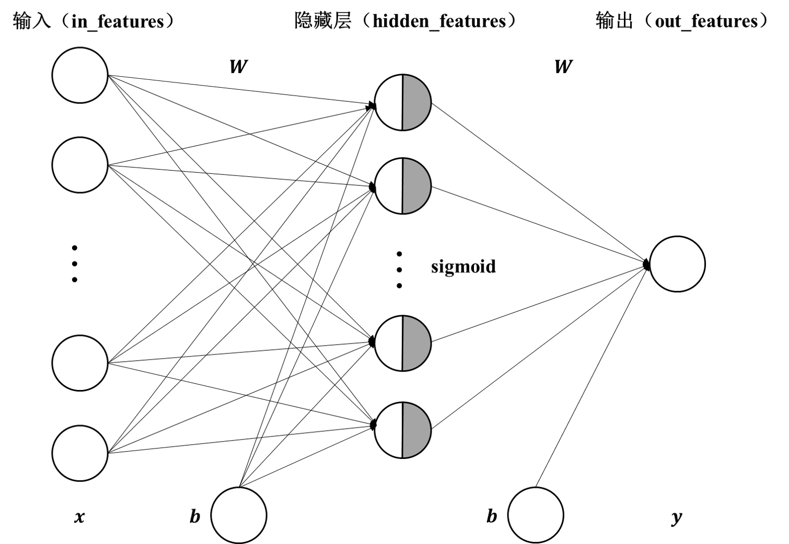
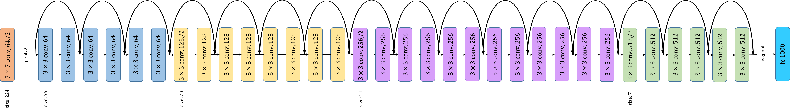
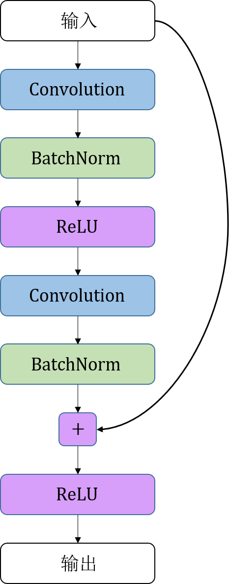

# 第4章 神经网络工具箱nn

第3章中提到，虽然使用autograd可以实现深度学习模型，但是它的抽象程度较低，需要编写的代码量极大。本章介绍的`nn`模块，是构建于autograd之上的神经网络模块。除了`nn`，本章还会介绍神经网络中常用的工具，比如优化器`optim`、初始化`init`等。

## 4.1 nn.Module

`torch.nn`是专门为深度学习设计的模块，它的核心数据结构是`Module`。`torch.nn`是一个抽象的概念，既可以表示神经网络中的某个层（layer），又可以表示一个包含很多层的神经网络。在实际使用中，最常见的做法是继承`nn.Module`，然后编写自己的网络/层。下面先来看看如何使用`nn.Module`实现自己的全连接层。全连接层，又名仿射层，它的输出$\boldsymbol{y}$和输入$\boldsymbol{x}$满足$\boldsymbol{y}=\boldsymbol{Wx}+\boldsymbol{b}$，其中$\boldsymbol{W}$和$\boldsymbol{b}$是可学习的参数。


```python
In: import torch as t
    from torch import nn
    print(t.__version__)
```

```
Out:1.8.0
```


```python
In: # 继承nn.Module，必须重写构造函数__init__和前向传播函数forward
    class Linear(nn.Module): 
        def __init__(self, in_features, out_features):
            super().__init__() # 等价于nn.Module.__init__(self)，常用super方式
            # nn.Parameter内的参数是网络中可学习的参数
            self.W = nn.Parameter(t.randn(in_features, out_features))
            self.b = nn.Parameter(t.randn(out_features))
        
        def forward(self, x):
            x = x.mm(self.W) # 矩阵乘法，等价于x@(self.W)
            return x + self.b.expand_as(x)
```


```python
In: layer = Linear(4,3)
    input = t.randn(2,4)
    output = layer(input)
    output
```


```
Out:tensor([[-1.0987, -0.2932, -3.5264],
        	[-0.0662, -5.5573, -8.1498]], grad_fn=<AddBackward0>)
```


```python
In: for name, parameter in layer.named_parameters():
        print(name, parameter) # W和b 
```

```
Out:W Parameter containing:
	tensor([[ 0.5180,  1.4337,  0.4373],
        	[ 0.2299, -1.6198, -0.7570],
        	[ 0.0694, -1.7724, -0.2443],
        	[ 0.0258,  0.1944,  3.4072]], requires_grad=True)
	b Parameter containing:
	tensor([-0.4774,  1.4022, -1.4314], requires_grad=True)
```

从上面的例子可以看出，全连接层的实现非常简单，代码量不超过10行。以上述代码为例，在自定义层时需要注意以下几点。
- 自定义层Linear必须继承`nn.Module`，在构造函数中需要调用`nn.Module`的构造函数，即`super().__init__()` 或`nn.Module.__init__(self)`，笔者推荐使用第一种方法。
- 在构造函数`__init__()`中必须自行定义可学习的参数，并封装成`nn.Parameter`。在本例中将$\boldsymbol{W}$和$\boldsymbol{b}$封装成`Parameter`。`Parameter`是一种特殊的Tensor，它默认需要求导（`requires_grad=True`），感兴趣的读者可以通过`nn.Parameter??`查看`Parameter`类的源代码。
- forward函数实现了前向传播过程，它的输入可以是一个或者多个Tensor。
- 反向传播函数无需手动编写，`nn.Module`能够利用autograd自动实现反向传播，这点比`Function`简单许多。
- 使用时，可以将layer看成数学概念中的函数，调用`layer(input)`可以得到`input`对应的结果，它等价于`layers.__call__(input)`。在`__call__`函数中，主要是调用 `layer.forward(x)`，同时还对钩子函数（hook）做了一些处理。在实际使用中应尽量使用`layer(x)`，而不是使用`layer.forward(x)`，关于钩子技术的具体内容将在下文讲解。
- `nn.Module`中的可学习参数可以通过`named_parameters()`或者`parameters()`返回一个迭代器，前者会给每个参数都附上名字，使其更具有辨识度。

利用`nn.Module`实现的全连接层，相较于利用`Function`实现的更加简单，这是因为无需手动编写反向传播函数。`nn.Module`能够自动检测到自己的`Parameter`，并将其作为学习参数。除了`Parameter`，module还可能包含子module，主module能够递归查找子module中的`Parameter`，下面以多层感知机为例进行说明。

多层感知机的网络结构如图4-1所示，它由两个全连接层组成，采用sigmoid函数作为激活函数。其中$\boldsymbol{x}$表示输入，$\boldsymbol{y}$表示输出，$\boldsymbol{b}$表示偏置，$\boldsymbol{W}$表示全连接层的参数。




```python
In: class Perceptron(nn.Module):
        def __init__(self, in_features, hidden_features, out_features):
            super().__init__()
            # 此处的Linear是前面自定义的全连接层
            self.layer1 = Linear(in_features, hidden_features) 
            self.layer2 = Linear(hidden_features, out_features)
        def forward(self, x):
            x = self.layer1(x)
            x = t.sigmoid(x)
            return self.layer2(x)
```


```python
In: perceptron = Perceptron(3, 4, 1)
    for name, param in perceptron.named_parameters():
        print(name, param.size())
```

```
Out:layer1.W torch.Size([3, 4])
	layer1.b torch.Size([4])
	layer2.W torch.Size([4, 1])
	layer2.b torch.Size([1])
```

即使是稍微复杂的多层感知机，它的实现仍然很简单。在构造函数`__init__()`中，可以将前面自定义的Linear层（module）作为当前module对象的一个子module。子module的可学习参数，也会成为当前module的可学习参数。在forward函数中，可以加上各层之间的处理函数（如激活函数、数学处理等），并定义层与层之间的关系。

在module中，`Parameter`的全局命名规范如下。

- `Parameter`直接命名。例如`self.param_name = nn.Parameter(t.randn(3, 4))`，可以直接命名为`param_name`。

- 子module中的`Parameter`，会在其名字前面加上当前module的名字。例如`self.sub_module = SubModel()`，在SubModel中有个`Parameter`的名字叫做param_name，那么二者拼接而成的参数名称是`sub_module.param_name`。

为了方便用户使用，PyTorch实现了神经网络中绝大多数的网络层，这些层都继承于`nn.Module`，它们都封装了可学习参数`Parameter`，并实现了forward函数。同时，大部分layer都专门针对GPU运算进行了cuDNN优化，它们的速度和性能都十分优异。本章不会对`nn.Module`中的所有层进行详细介绍，具体内容读者可参考官方文档，或在IPython/Jupyter中使用`nn.layer?`进行查看。读者在阅读文档时应该主要关注以下几点。

- 构造函数的参数，例如`nn.Linear(in_features, out_features, bias)`，需关注这三个参数的作用。

- 属性、可学习的网络参数和包含的子module。如`nn.Linear`中有weight和bias两个可学习参数，不包含子module。

- 输入、输出的形状，例如`nn.linear`的输入形状是`(N, input_features)`，输出为`(N, output_features)`，其中N是batch_size。

这些自定义layer对输入形状都有规定：输入的是一个batch数据，而不是单个数据。当输入只有一个数据时，必须调用`tensor.unsqueeze(0)`或`tensor[None]`将数据伪装成`batch_size=1`的一个batch。

下面将从应用层面出发，对一些常用的网络层进行简单介绍。

## 4.2 常用神经网络层

本节对常用的神经网络层进行介绍，这部分内容在神经网络的构建中将发挥重要作用。

### 4.2.1 图像相关层

图像相关层主要包括卷积层（Conv）、池化层（Pool）等，这些层在实际使用中可以分为一维（1D）、二维（2D）和三维（3D）几种情况。池化方式包括平均池化（AvgPool）、最大值池化（MaxPool）、自适应平均池化（AdaptiveAvgPool）等。卷积层除了常用的前向卷积，还有逆卷积或转置卷积（TransposeConv）。

#### 卷积层

与图像处理相关的网络结构中最重要的就是卷积层。卷积神经网络的本质是卷积层、池化层、激活层以及其他层的叠加，理解卷积层的工作原理是极其重要的。本节以最常见的二维卷积为例对卷积层进行说明。

在`torch.nn`工具箱中，已经封装好了二维卷积类 ： 
```python
torch.nn.Conv2d(in_channels, out_channels, kernel_size, stride, padding, dilation, groups, bias, padding_mode)  
```
它有以下六个重要的参数。
- in_channels：输入图像的维度。常见RGB彩色图像维度为3，灰度图像的维度为1。
- out_channels：经过卷积操作后输出的维度。
- kernel_size：卷积核大小，常见卷积核为2维方阵，维度为$[T\times T]$，正方形卷积核可以写为$T(\text{int})$。
- stride：每次卷积操作移动的步长。
- padding：卷积操作在边界是否有填充，默认为0。
- bias：是否有偏置，偏置是一个可学习参数，默认为True。

在卷积操作中需要知道输出结果的形状，以便对后续网络结构进行设计。假设输入的形状为$(N,C_{\text{in}},H_{\text{in}},W_{\text{in}})$，输出的形状为$(N,C_{\text{out}},H_{\text{out}},W_{\text{out}})$​​，通过式(4.1)可以得到卷积输出结果的形状。
$$
\begin{array}{l}
   H_{\text{out}} = \lfloor {H_{\text{in}}+{2}\times{\text{padding[0]}}-\text{kernel\_size[0]} \over \text{stride[0]}}+1 \rfloor \\
   W_{\text{out}} = \lfloor {W_{\text{in}}+{2}\times{\text{padding[1]}}-\text{kernel\_size[1]} \over \text{stride[1]}}+1 \rfloor
\end{array}\tag{4.1}
$$

下面举例说明卷积操作的具体过程：


```python
In: from PIL import Image
    from torchvision.transforms import ToTensor, ToPILImage
    to_tensor = ToTensor() # img → Tensor
    to_pil = ToPILImage()
    lena = Image.open('imgs/lena.png')
    lena # 将lena可视化输出
```


```python
In: # 输入是一个batch，batch_size＝1
    lena = to_tensor(lena).unsqueeze(0) 
    print("Input Size:",lena.size()) # 查看input维度
    # 锐化卷积核
    kernel = t.ones(3, 3) / (-9.)
    kernel[1][1] = 1
    conv = nn.Conv2d(1, 1, (3, 3), 1, bias=False)
    conv.weight.data = kernel.view(1, 1, 3, 3)
    
    out = conv(lena)
    print("Output Size:",out.size())
    to_pil(out.data.squeeze(0))
```

```
Out:Input Size: torch.Size([1, 1, 200, 200])
	Output Size: torch.Size([1, 1, 198, 198])
```


在上面的例子中，输入Tensor的大小为200×200，卷积核大小为3×3，步长为1，填充为0，根据式(4.1)可以计算得到输出的形状为：$H_{\text{out}}=W_{\text{out}} = \lfloor {200+{2}\times{0}-3 \over 1 }+1\rfloor=198$，这与程序输出的维度一致。

本小节以二维卷积为例，对卷积层的输入输出进行了介绍。除了二维卷积，图像的卷积操作还有各种变体，感兴趣的读者可以进一步查阅相关资料。

#### 池化层

池化层可以看作是一种特殊的卷积层，它主要用于下采样。增加池化层可以在保留主要特征的同时降低参数量，从而一定程度上防止过拟合。池化层没有可学习参数，它的weight是固定的。在`torch.nn`工具箱中封装好了各种池化层，常用的有最大池化和平均池化，下面举例说明：


```python
In: input = t.randint(10, (1, 1, 4, 4))
    print(input)
    pool = nn.AvgPool2d(2, 2) # 平均池化，池化中的卷积核为2×2，步长默认等于卷积核长度，无填充
    pool(input)
```

```
Out:tensor([[[[6, 8, 9, 2],
          	[0, 3, 1, 4],
          	[7, 0, 9, 9],
          	[9, 3, 2, 7]]]])
```


```
Out:tensor([[[[4, 4],
          	[4, 6]]]])
```


```python
In: list(pool.parameters()) # 可以看到，池化层中并没有可学习参数。
```


```
Out:[]
```


```python
In: out = pool(lena)
    to_pil(out.data.squeeze(0)) # 输出池化后的lena
```


#### 其他层

除了卷积层和池化层，深度学习中还经常使用以下几个层。
- Linear：全连接层。
- BatchNorm：批标准化层，分为1D、2D和3D。除了标准的BatchNorm，还有在风格迁移中常用到的InstanceNorm层。
- Dropout：Dropout层用于防止过拟合，同样分为1D、2D和3D。

下面举例说明它们的使用方法：


```python
In: # 输入的batch_size为2，维度为3
    input = t.randn(2, 3)
    linear = nn.Linear(3, 4)
    h = linear(input)
    h
```


```
Out:tensor([[-0.2782, -0.7852,  0.0166, -0.1817],
        	[-0.1064, -0.5069, -0.2169, -0.0372]], grad_fn=<AddmmBackward>)
```


```python
In: # 4 channel，初始化标准差为4，均值为0
    bn = nn.BatchNorm1d(4)
    bn.weight.data = t.ones(4) * 4
    bn.bias.data = t.zeros(4)
    
    bn_out = bn(h)
    bn_out
```

```
Out:tensor([[-3.9973, -3.9990,  3.9985, -3.9962],
        	[ 3.9973,  3.9990, -3.9985,  3.9962]],
       		grad_fn=<NativeBatchNormBackward>)
```

```python
In: # 注意输出的均值和方差
    bn_out.mean(0), bn_out.std(0, unbiased=False)
```


```
Out:(tensor([ 0.0000e+00, -8.3447e-07,  0.0000e+00,  0.0000e+00],
        	grad_fn=<MeanBackward1>),
 	tensor([3.9973, 3.9990, 3.9985, 3.9962], grad_fn=<StdBackward1>))
```


```python
In: # 每个元素以0.5的概率随机舍弃
    dropout = nn.Dropout(0.5)
    o = dropout(bn_out)
    o # 有一半左右的数变为0
```


```
Out:tensor([[-7.9946, -0.0000,  0.0000, -0.0000],
        	[ 0.0000,  0.0000, -7.9971,  7.9923]], grad_fn=<MulBackward0>)
```

以上例子都是对module的可学习参数直接进行操作，在实际使用中，这些参数一般会随着学习的进行不断改变。除非需要使用特殊的初始化，否则应该尽量不要直接修改这些参数。

### 4.2.2 激活函数

线性模型不能够解决所有的问题，因此激活函数应运而生。激活函数给模型加入非线性因素，可以提高神经网络对模型的表达能力，解决线性模型不能解决的问题。PyTorch实现了常见的激活函数，它们可以作为独立的layer使用，这些激活函数的具体接口信息可以参考官方文档。这里对最常用的激活函数ReLU进行介绍，它的数学表达式如式(4.2)所示。
$$
\text{ReLU}(x)=\text{max}(0,x) \tag{4.2}
$$

下面举例说明如何在`torch.nn`中使用ReLU函数：


```python
In: relu = nn.ReLU(inplace=True)
    input = t.randn(2, 3)
    print(input)
    output = relu(input)
    print(output) # 小于0的都被截断为0
    # 等价于input.clamp(min=0)
```

```
Out:tensor([[ 0.1584,  1.3065,  0.6037],
        	[ 0.4320, -0.0310,  0.0563]])
	tensor([[0.1584, 1.3065, 0.6037],
        	[0.4320, 0.0000, 0.0563]])
```

ReLU函数有个inplace参数，如果设为True，那么它的输出会直接覆盖输入，可以有效节省内存/显存。之所以这里可以直接覆盖输入，是因为在计算ReLU的反向传播时，只需要根据输出就能够推算出反向传播的梯度。只有少数的autograd操作才支持inplace操作，如`tensor.sigmoid_()`。如果一个Tensor只作为激活层的输入使用，那么这个激活层可以设为`inplace=True`。除了ReLU函数，常见的激活函数还有tanh函数和sigmoid函数，读者可以根据实际的网络结构、数据分布等灵活地选用各类激活函数。

### 4.2.3 构建神经网络
在上面的例子中，每一层的输出基本上都直接成为下一层的输入，这样的网络称为前馈传播网络（Feedforward Neural Network，FFN）。对于此类网络，每次都编写复杂的forward函数会比较麻烦，这里有两种简化方式：ModuleList和Sequential。Sequential是一个特殊的module，它可以包含几个子module，前向传播时会将输入一层接一层地传递下去。ModuleList也是一个特殊的module，它也可以包含几个子module，读者可以像使用list一样使用它，但不能直接将输入传给ModuleList。下面举例说明：


```python
In: # Sequential的三种写法
    net1 = nn.Sequential()
    net1.add_module('conv', nn.Conv2d(3, 3, 3))
    net1.add_module('batchnorm', nn.BatchNorm2d(3))
    net1.add_module('activation_layer', nn.ReLU())
    
    net2 = nn.Sequential(
                nn.Conv2d(3, 3, 3),
                nn.BatchNorm2d(3),
                nn.ReLU()
            )
    
    from collections import OrderedDict
    net3= nn.Sequential(OrderedDict([
              ('conv1', nn.Conv2d(3, 3, 3)),
              ('bn1', nn.BatchNorm2d(3)),
              ('relu1', nn.ReLU())
            ]))
    print('net1:', net1)
    print('net2:', net2)
    print('net3:', net3)
```

```
Out:net1: Sequential(
  		(conv): Conv2d(3, 3, kernel_size=(3, 3), stride=(1, 1))
  		(batchnorm): BatchNorm2d(3, eps=1e-05, momentum=0.1, affine=True, track_running_stats=True)
  		(activation_layer): ReLU()
	)
	net2: Sequential(
  		(0): Conv2d(3, 3, kernel_size=(3, 3), stride=(1, 1))
  		(1): BatchNorm2d(3, eps=1e-05, momentum=0.1, affine=True, track_running_stats=True)
  		(2): ReLU()
	)
	net3: Sequential(
  		(conv1): Conv2d(3, 3, kernel_size=(3, 3), stride=(1, 1))
  		(bn1): BatchNorm2d(3, eps=1e-05, momentum=0.1, affine=True, track_running_stats=True)
  		(relu1): ReLU()
	)
```


```python
In: # 可根据名字或序号取出子module
    net1.conv, net2[0], net3.conv1
```


```
Out:(Conv2d(3, 3, kernel_size=(3, 3), stride=(1, 1)),
 	Conv2d(3, 3, kernel_size=(3, 3), stride=(1, 1)),
 	Conv2d(3, 3, kernel_size=(3, 3), stride=(1, 1)))
```


```python
In: # 调用已构建的网络
    input = t.rand(1, 3, 4, 4)
    output = net1(input)
    output = net2(input)
    output = net3(input)
    output = net3.relu1(net1.batchnorm(net1.conv(input)))
```


```python
In: modellist = nn.ModuleList([nn.Linear(3,4), nn.ReLU(), nn.Linear(4,2)])
    input = t.randn(1, 3)
    for model in modellist:
        input = model(input)
    # 下面会报错，因为modellist没有实现forward方法
    # output = modelist(input)
```

看到这里读者可能会问，为什么不直接使用Python中自带的list，非要多此一举呢？这是因为ModuleList是`nn.Module`的子类，当在module中使用它的时候，ModuleList能够自动被module识别为子module，下面举例说明：


```python
In: class MyModule(nn.Module):
        def __init__(self):
            super().__init__()
            self.list = [nn.Linear(3, 4), nn.ReLU()]
            self.module_list = nn.ModuleList([nn.Conv2d(3, 3, 3), nn.ReLU()])
        def forward(self):
            pass
    model = MyModule()
    model
```


```
Out:MyModule(
        (module_list): ModuleList(
            (0): Conv2d(3, 3, kernel_size=(3, 3), stride=(1, 1))
            (1): ReLU()
        )
	)
```


```python
In: for name, param in model.named_parameters():
        print(name, param.size())
```

```
Out:module_list.0.weight torch.Size([3, 3, 3, 3])
	module_list.0.bias torch.Size([3])
```

可以看出，list中的子module不能被主module识别，ModuleList中的子module能够被主module所识别。这意味着，如果使用list保存子module，那么在反向传播时无法调整子module的参数，因为子module中的参数并没有加入到主module的参数中。

除了ModuleList还有ParameterList，它是一个可以包含多个`Parameter`的类似于list的对象。在实际应用中，ParameterList的使用方式与ModuleList类似。如果在构造函数`__init__()`中用到list、tuple、dict等对象时，那么一定要思考是否应该用ModuleList或ParameterList代替。

### 4.2.4 循环神经网络
近年来，随着深度学习和自然语言处理的逐渐火热，循环神经网络（RNN）得到了广泛的关注。PyTorch中实现了最常用的三种循环神经网络：RNN（vanilla RNN）、LSTM和GRU，此外还有对应的三种RNNCell。

RNN和RNNCell层的区别在于，前者一次能够处理整个序列，后者一次只处理序列中一个时间点的数据。RNN的封装更完备，也更易于使用；RNNCell层更具灵活性，RNN层可以通过组合调用RNNCell来实现。


```python
In: t.manual_seed(2021)
    # 输入：batch_size=3，序列长度都为2，序列中每个元素占4维
    input = t.randn(2, 3, 4).float()
    # lstm输入向量4维，3个隐藏元，1层
    lstm = nn.LSTM(4, 3, 1)
    # 初始状态：1层，batch_size=3，表示3个隐藏元
    h0 = t.randn(1, 3, 3) # 隐藏层状态（hidden state）
    c0 = t.randn(1, 3, 3) # 单元状态（cell state）
    out1, hn = lstm(input, (h0, c0))
    out1.shape
```


```
Out:torch.Size([2, 3, 3])
```


```python
In: t.manual_seed(2021)
    input = t.randn(2, 3, 4).float()
    # 一个LSTMCell对应的层数只能是一层
    lstm = nn.LSTMCell(4, 3)
    hx = t.randn(3, 3)
    cx = t.randn(3, 3)
    out = []
    for i_ in input:
        hx, cx = lstm(i_, (hx, cx))
        out.append(hx)
    out2 = t.stack(out)
    out2.shape
```


```
Out:torch.Size([2, 3, 3])
```

上述两种LSTM实现的结果是完全一致的。读者可以对比一下这两种实现方式有何区别，并从中体会RNN和RNNCell层的区别。


```python
In: # 受限于精度问题，这里使用allclose函数说明结果的一致性
    out1.allclose(out2)
```


```
Out:True
```

词向量在自然语言中应用十分广泛，PyTorch提供了用于生成词向量的Embedding层：


```python
In: # 有4个词，每个词用5维的向量表示
    embedding = nn.Embedding(4, 5)
    # 可以用预训练好的词向量初始化embedding
    weight = t.arange(0, 20).view(4,  5).float()
    nn.Embedding.from_pretrained(weight)
```


```
Out:Embedding(4, 5)
```


```python
In: input = t.arange(3, 0, -1).long()
    output = embedding(input)
    output
```


```
Out:tensor([[-0.6590, -2.2046, -0.1831, -0.5673,  0.6770],
        	[ 1.8060,  1.0928,  0.6670,  0.4997,  0.1662],
        	[ 0.1592, -0.3728, -1.1482, -0.4520,  0.5914]],
       		grad_fn=<EmbeddingBackward>)
```

### 4.2.5 损失函数
在深度学习中会经常使用各种各样的损失函数（loss function），这些损失函数可以看作是一种特殊的layer，PyTorch将这些损失函数实现为`nn.Module`的子类。在实际使用中通常将这些损失函数专门提取出来，作为独立的一部分。读者可以参考官方文档了解损失函数的具体用法，下面以分类问题中最常用的交叉熵损失CrossEntropyLoss为例进行讲解：


```python
In: # batch_size=3，计算对应每个类别的分数（只有两个类别）
    score = t.randn(3, 2)
    # 三个样本分别属于1，0，1类，label必须是LongTensor
    label = t.Tensor([1, 0, 1]).long()
    
    # loss与普通的layer无差异
    criterion = nn.CrossEntropyLoss()
    loss = criterion(score, label)
    loss
```


```
Out:tensor(0.5865)
```

本小节对`nn`中的常用模块进行了详细的介绍，读者可以利用这些模块快速地搭建神经网络。在使用这些模块时应当注意每一个module所包含的参数和输入、输出的形状及含义，从而避免一些不必要的错误。

## 4.3 nn.functional

`torch.nn`中还有一个很常用的模块：`nn.functional`。`torch.nn`中的大多数layer，在`functional`中都有一个与之相对应的函数。`nn.functional`中的函数和`nn.Module`的主要区别在于：使用`nn.Module`实现的layer是一个特殊的类，其由`class layer(nn.Module)`定义，会自动提取可学习的参数；使用`nn.functional`实现的layer更像是纯函数，由`def function(input)`定义。

### 4.3.1 与nn.Module的区别

下面举例说明`functional`的使用，并对比它与`nn.Module`的不同之处：


```python
In: input = t.randn(2, 3)
    model = nn.Linear(3, 4)
    output1 = model(input)
    output2 = nn.functional.linear(input, model.weight, model.bias)
    output1.equal(output2)
```


```
Out:True
```


```python
In: b1 = nn.functional.relu(input)
    b2 = nn.ReLU()(input)
    b1.equal(b2)
```


```
Out:True
```

此时读者可能会问，应该什么时候使用`nn.Module`，什么时候使用`nn.functional`呢？答案很简单，如果模型具有可学习的参数，那么最好用`nn.Module`，否则既可以使用`nn.functional`，也可以使用`nn.Module`。二者在性能上没有太大差异，具体的选择取决于个人的喜好。由于激活函数（如ReLU、sigmoid、tanh）、池化（如MaxPool）等层没有可学习参数，可以使用对应的`functional`函数代替，对于卷积、全连接等具有可学习参数的层，建议使用`nn.Module`。另外，虽然dropout操作也没有可学习参数，但是建议使用`nn.Dropout`而不是`nn.functional.dropout`，因为dropout在训练和测试两个阶段的行为有所差异，使用`nn.Module`对象能够通过`model.eval()`操作加以区分。下面举例说明如何在模型中搭配使用`nn.Module`和`nn.functional`：


```python
In: from torch.nn import functional as F
    class Net(nn.Module):
        def __init__(self):
            super().__init__()
            self.conv1 = nn.Conv2d(3, 6, 5)
            self.conv2 = nn.Conv2d(6, 16, 5)
            self.fc1 = nn.Linear(16 * 5 * 5, 120)
            self.fc2 = nn.Linear(120, 84)
            self.fc3 = nn.Linear(84, 10)
    
        def forward(self, x):
            x = F.pool(F.relu(self.conv1(x)), 2)
            x = F.pool(F.relu(self.conv2(x)), 2)
            x = x.view(-1, 16 * 5 * 5)
            x = F.relu(self.fc1(x))
            x = F.relu(self.fc2(x))
            x = self.fc3(x)
            return x
```

对于不具备可学习参数的层（如激活层、池化层等），可以将它们用函数代替，这样可以不用放置在构造函数`__init__()`中。对于有可学习参数的模块，也可以用`functional`代替，只不过实现起来较为烦琐，需要手动定义参数`Parameter`。例如，前面实现的全连接层，就可以将weight和bias两个参数单独拿出来，在构造函数中初始化为`Parameter`：


```python
In: class MyLinear(nn.Module):
        def __init__(self):
            super().__init__()
            self.weight = nn.Parameter(t.randn(3, 4))
            self.bias = nn.Parameter(t.zeros(3))
        def forward(self):
            return F.linear(input, weight, bias)
```

关于`nn.functional`的设计初衷，以及它和`nn.Module`的比较说明，读者可参考PyTorch论坛的相关讨论和说明。

### 4.3.2 采样函数
在`nn.functional`中还有一个常用的函数：采样函数`torch.nn.functional.grid_sample`，它的主要作用是对输入的Tensor进行双线性采样，并将输出变换为用户想要的形状。下面以lena为例进行说明：


```python
In: to_pil(lena.data.squeeze(0)) # 原始的lena数据
```


```python
In: # lena的形状是1×1×200×200，(N,C,Hin,Win)
    # 进行仿射变换，对图像进行旋转
    angle = -90 * math.pi / 180
    theta = t.tensor([[math.cos(angle), math.sin(-angle), 0], \						
                      [math.sin(angle), math.cos(angle), 0]], dtype=t.float)
    # grid形状为（N,Hout,Wout,2）
    # grid最后一个维度大小为2，表示输入中pixel的位置信息，取值范围在（-1,1）
    grid = F.affine_grid(theta.unsqueeze(0), lena.size())
```


```python
In: import torch
    from torch.nn import functional as F
    import warnings
    warnings.filterwarnings("ignore")
    
    out = F.grid_sample(lena, grid=grid, mode='bilinear')
    to_pil(out.data.squeeze(0))
```


## 4.4 初始化策略
在深度学习中参数的初始化十分重要，良好的初始化能让模型更快地收敛，并达到更高水平，糟糕的初始化可能使模型迅速崩溃。PyTorch中`nn.Module`中的模块参数都采取了较为合理的初始化策略，用户一般无需再进行设计。读者也可以用自定义的初始化策略来代替系统的默认初始化。在使用`Parameter`时，自定义初始化尤为重要，这是因为`torch.Tensor()`返回的是内存中的随机数，很可能会有极大值，这在实际训练网络时会造成溢出或者梯度消失。PyTorch中的`nn.init`模块就是专门为初始化设计的一个模块，它实现了常用的初始化策略，下面举例说明它的用法：


```python
In: # 利用nn.init初始化
    from torch.nn import init
    linear = nn.Linear(3, 4)
    t.manual_seed(2021)
    
    init.xavier_normal_(linear.weight)
```


```
Out:Parameter containing:
	tensor([[ 1.2225,  0.3428, -0.4605],
        	[-0.1951, -0.3705,  0.4823],
        	[-1.4530, -0.7739,  0.3334],
        	[ 0.2577, -1.2324,  0.4905]], requires_grad=True)
```


```python
In: # 利用公式，直接初始化
    t.manual_seed(2021)
    
    # xavier初始化的计算公式
    std = 2 ** 0.5 / 7 ** 0.5
    linear.weight.data.normal_(0, std)
```


```
Out:tensor([[ 1.2225,  0.3428, -0.4605],
        	[-0.1951, -0.3705,  0.4823],
        	[-1.4530, -0.7739,  0.3334],
        	[ 0.2577, -1.2324,  0.4905]])
```


```python
In: # 对模型的所有参数进行初始化
    net = Net()
    for name, params in net.named_parameters():
        if name.find('linear') != -1:
            # init linear
            params[0] # weight
            params[1] # bias
        elif name.find('conv') != -1:
            pass
        elif name.find('norm') != -1:
            pass
```

## 4.5 优化器

PyTorch将深度学习中常用的优化方法全部封装在`torch.optim`中，它的设计非常灵活，能够方便地扩展为自定义的优化方法。所有的优化方法都是继承基类`optim.Optimizer`，并实现了自己的优化步骤。下面以最基本的优化方法——随机梯度下降法（SGD）为例进行说明，这里需要重点掌握以下几点。

- 优化方法的基本使用方法。

- 如何对模型的不同部分设置不同的学习率。

- 如何调整学习率。


```python
In: # 以4.1节的感知器为例
    class Perceptron(nn.Module):
        def __init__(self, in_features, hidden_features, out_features):
            super().__init__()
            # 此处的Linear是前面自定义的全连接层
            self.layer1 = Linear(in_features, hidden_features) 
            self.layer2 = Linear(hidden_features, out_features)
        def forward(self, x):
            x = self.layer1(x)
            x = t.sigmoid(x)
            return self.layer2(x)
    
    net = Perceptron(3, 4, 1)
```


```python
In: from torch import optim
    # 第一种用法：为一个网络设置学习率
    optimizer = optim.SGD(params=net.parameters(), lr=1)
    optimizer.zero_grad() # 梯度清零，等价于net.zero_grad()
    
    input = t.randn(32, 3)
    output = net(input)
    output.backward(output) # fake backward
    
    optimizer.step() # 执行优化
```


```python
In: # 第二种用法：为不同的参数分别设置不同的学习率
    weight_params = [param for name, param in net.named_parameters() if name.endswith('.W')]
    bias_params = [param for name, param in net.named_parameters() if name.endswith('.b')]
    
    optimizer =optim.SGD([
                    {'params': bias_params},
                    {'params': weight_params, 'lr': 1e-2}
                ], lr=1e-5)
```

调整学习率主要有以下两种做法。

- 修改`optimizer.param_groups`中对应的学习率。

- 新建一个优化器。

`optimizer`十分轻量级，构建新的`optimizer`的开销很小。然而，新建优化器会重新初始化动量等状态信息，这对于使用动量的优化器（如Adam），可能会造成损失函数在收敛过程中出现震荡等情况。下面举例说明如何新建一个优化器：


```python
In: # 调整学习率，新建一个optimizer
    prev_lr = 0.1
    optimizer1 =optim.SGD([
                    {'params': bias_params},
                    {'params': weight_params, 'lr': prev_lr*0.1}
                ], lr=1e-5)
```


```python
In: # 调整学习率, 手动decay, 保存动量
    for param_group in optimizer.param_groups:
        param_group['lr'] *= 0.1 # 学习率为之前的0.1倍
```

## 4.6 nn.Module深入分析

如果想要更加深入地理解`nn.Module`，那么研究它的底层原理是十分必要的。首先来看`nn.Module`基类的构造函数：
```python
def __init__(self):
    self._parameters = OrderedDict()
    self._modules = OrderedDict()
    self._buffers = OrderedDict()
    self._backward_hooks = OrderedDict()
    self._forward_hooks = OrderedDict()
    self.training = True
```
它有以下五个重要的属性。

- `_parameters`：有序字典，保存用户直接设置的`Parameter`。例如，对于`self.param1 = nn.Parameter(t.randn(3, 3))`，构造函数会在在字典中加入一个key为`param1`，value为对应`Parameter`的item。`self.submodule = nn.Linear(3, 4)`中的`Parameter`不会保存在该字典中。
- `_modules`：子module。例如，通过`self.submodel = nn.Linear(3, 4)`指定的子module会保存于此。
- `_buffers`：缓存。例如，BatchNorm使用momentum机制，每次前向传播需要用到上一次前向传播的结果。
- `_backward_hooks`与`_forward_hooks`：钩子技术，用来提取中间变量。
- `training`：BatchNorm与Dropout层在训练阶段和测试阶段中采取的策略不同，通过`training`标签决定前向传播策略。

在上述几个属性中，通过`self.key`可以获得`_parameters`、`_modules`和`_buffers`这三个字典中的键值，效果等价于`self._parameters['key']`，下面举例说明：


```python
In: class Net(nn.Module):
        def __init__(self):
            super().__init__()
            # 等价与self.register_parameter('param1', nn.Parameter(t.randn(3, 3)))
            self.param1 = nn.Parameter(t.rand(3, 3))
            self.submodel1 = nn.Linear(3, 4) 
        def forward(self, input):
            x = self.param1.mm(input)
            x = self.submodel1(x)
            return x
    net = Net()
    net
```


```
Out:Net(
  		(submodel1): Linear(in_features=3, out_features=4, bias=True)
	)
```


```python
In: net._modules
```


```
Out:OrderedDict([('submodel1', Linear(in_features=3, out_features=4, bias=True))])
```


```python
In: net._parameters
```


```
Out:OrderedDict([('param1', Parameter containing:
              	tensor([[0.9518, 0.6976, 0.2651],
                      	[0.0453, 0.1703, 0.0534],
                      	[0.6597, 0.9927, 0.1376]], requires_grad=True))])
```


```python
In: net.param1 # 等价于net._parameters['param1']
```


```
Out:Parameter containing:
	tensor([[0.9518, 0.6976, 0.2651],
        	[0.0453, 0.1703, 0.0534],
        	[0.6597, 0.9927, 0.1376]], requires_grad=True)
```


```python
In: for name, param in net.named_parameters():
        print(name, param.size())
```

```
Out:param1 torch.Size([3, 3])
	submodel1.weight torch.Size([4, 3])
	submodel1.bias torch.Size([4])
```


```python
In: for name, submodel in net.named_modules():
        print(name, submodel) # 当前module和它的子module
```

```
Out: Net(
  		(submodel1): Linear(in_features=3, out_features=4, bias=True)
	)
	submodel1 Linear(in_features=3, out_features=4, bias=True)
```


```python
In: bn = nn.BatchNorm1d(2)
    input = t.rand(3, 2)
    output = bn(input)
    bn._buffers
```


```
Out:OrderedDict([('running_mean', tensor([0.0397, 0.0299])),
             	('running_var', tensor([0.9065, 0.9008])),
             	('num_batches_tracked', tensor(1))])
```

从上面的示例中可以看出，`nn.Module`在实际使用中可能层层嵌套，即一个module可能包含若干个子module，每一个子module可能包含更多的子module。为了方便用户访问各个子module，`nn.Module`实现了很多方法，如函数`children`可以查看所有直接子module，函数`modules`可以查看所有的子module（包括当前module）。与之对应的函数还有`named_childen`和`named_modules`，它们能在返回module列表的同时返回它们的名字。

由于Dropout、BatchNorm等层在训练与测试时采取的策略不同，所以可以通过设置`training`属性来切换不同的前向传播策略，下面举例说明：


```python
In: input = t.arange(0, 12).view(3, 4).float()
    model = nn.Dropout()
    # 在训练阶段，会有一半左右的数被随机置为0
    model(input)
```


```
Out:tensor([[ 0.,  2.,  4.,  0.],
        	[ 8., 10.,  0.,  0.],
        	[ 0., 18., 20.,  0.]])
```


```python
In: model.training  = False
    # 在测试阶段，dropout什么都不做
    model(input)
```


```
Out:tensor([[ 0.,  1.,  2.,  3.],
        	[ 4.,  5.,  6.,  7.],
        	[ 8.,  9., 10., 11.]])
```

对于这些在训练和测试阶段行为差距较大的层，如果在测试时不将其training值设为False，那么可能会有很大影响，这在实际使用中要格外注意。虽然可以直接设置`training`属性，将子module划分为train模式和eval模式，但这种方式较为繁琐。如果一个模型具有多个Dropout层，那么需要为每个Dropout层指定training属性。笔者推荐的做法是调用`model.train()`函数，它会将当前module及其子module中的所有training属性都设为True。相应地，`model.eval()`函数会把所有training属性都设为False，下面举例说明：


```python
In: net.training, net.submodel1.training
```


```
Out:(True, True)
```


```python
In: net.eval() # eval()将所有的training属性设为False
    net.training, net.submodel1.training
```


```
Out:(False, False)
```


```python
In: list(net.named_modules())
```


```
Out:[('', Net(
    (submodel1): Linear(in_features=3, out_features=4, bias=True)
  )), ('submodel1', Linear(in_features=3, out_features=4, bias=True))]
```

如果想要查看中间层变量的梯度，那么需要使用钩子技术。`register_forward_hook`和`register_backward_hook`函数可以在module前向传播或反向传播时注册钩子，每次前向传播执行结束后会执行钩子函数。前向传播的钩子函数具有如下形式：`hook(module, input, output) -> None`，反向传播的钩子函数具有如下形式：`hook(module, grad_input, grad_output) -> Tensor or None`。钩子函数不应该修改模型的输入和输出，在使用后应该及时删除，避免每次都运行钩子增加运行负载。钩子函数主要用于获取某些中间结果，例如网络中间某一层的输出或某一层的梯度。这些结果本应写在forward函数中，如果在forward函数中专门加上这些处理，那么处理逻辑会比较复杂，此时使用钩子技术更加合适。

下面考虑一种场景：有一个预训练好的模型，需要提取模型的某一层（不是最后一层）的输出作为特征进行分类，但又不希望修改原有模型的定义文件，这时就可以利用钩子函数。下面给出实现的伪代码：

```python
model = VGG()
features = t.Tensor()
def hook(module, input, output):
    '''把这层的输出拷贝到features中'''
    features.copy_(output.data)
    
handle = model.layer8.register_forward_hook(hook)
_ = model(input)
# 用完hook后删除
handle.remove()
```

`nn.Module`对象在构造函数中的行为看起来有些怪异，如果想要真正掌握它的原理，那么需要了解两个魔法方法`__getattr__`和`__setattr__`。在Python中有两个常用的buildin方法：`getattr`和`setattr`，下面对这两种buildin方法进行介绍。

- `getattr(obj, 'attr1')`等价于`obj.attr1`，如果`getattr`函数无法找到所需属性，那么Python会调用`obj.__getattr__('attr1')`方法。如果这个对象没有实现`__getattr__`方法，或者遇到`__getattr__`方法也无法处理的情况，那么程序就会抛出异常`AttributeError`。
- `setattr(obj, 'name', value)`等价于`obj.name = value`，如果obj对象实现了`__setattr__`方法，那么`setattr`会直接调用`obj.__setattr__('name', value)`，否则调用buildin方法。

关于这两种方法的总结如下。

- `result = obj.name`会调用buildin函数`getattr(obj, 'name')`，如果该属性找不到，那么调用`obj.__getattr__('name')`。
- `obj.name = value`会调用buildin函数`setattr(obj, 'name', value)`，如果obj对象实现了`__setattr__`方法，那么`setattr`会直接调用`obj.__setattr__('name', value)`。

`nn.Module`实现了自定义的`__setattr__`函数，当执行`module.name = value`时，会在`__setattr__`中判断value是否为`Parameter`或者`nn.Module`对象。如果是，那么将这些对象加到`_parameters`和`_modules`两个字典中；如果是其他类型的对象，如list、dict等，那么调用默认的操作，将这个值保存在`__dict__`中，下面举例说明：


```python
In: module = nn.Module()
    module.param = nn.Parameter(t.ones(2, 2))
    module._parameters
```


```
Out:OrderedDict([('param', Parameter containing:
              	tensor([[1., 1.],
                      	[1., 1.]], requires_grad=True))])
```


```python
In: submodule1 = nn.Linear(2, 2)
    submodule2 = nn.Linear(2, 2)
    module_list = [submodule1, submodule2]
    # 对于list对象，调用buildin函数，保存在__dict__中
    module.submodules = module_list
    print('_modules: ', module._modules)
    print("__dict__['submodules']:", module.__dict__.get('submodules'))
```

```
Out:_modules:  OrderedDict()
	__dict__['submodules']: [Linear(in_features=2, out_features=2, bias=True), Linear(in_features=2, out_features=2, bias=True)]
```


```python
In: # 如果将list对象变成ModuleList对象，那么它就会保存在self._modules中
    module_list = nn.ModuleList(module_list)
    module.submodules = module_list
    print('ModuleList is instance of nn.Module: ', isinstance(module_list, nn.Module))
    print('_modules: ', module._modules)
    print("__dict__['submodules']:", module.__dict__.get('submodules'))
```

```
Out:ModuleList is instance of nn.Module:  True
	_modules:  OrderedDict([('submodules', ModuleList(
  		(0): Linear(in_features=2, out_features=2, bias=True)
  		(1): Linear(in_features=2, out_features=2, bias=True)
	))])
	__dict__['submodules']: None
```

因为`_modules`和`_parameters`中的item没有保存在`__dict__`中，默认的`getattr`方法无法获取它，所以`nn.Module`实现了自定义的`__getattr__`方法。如果默认的`getattr`无法处理，则调用自定义的`__getattr__`方法，尝试从`_modules`、`_parameters`和`_buffers`这三个字典中获取，下面举例说明：


```python
In: getattr(module, 'training') # 等价于module.training
    # error
    # module.__getattr__('training')
```


```
Out:True
```


```python
In: module.attr1 = 2
    getattr(module, 'attr1')
    # 报错
    # module.__getattr__('attr1')
```


```
Out:2
```


```python
In: # 即module.param, 会调用module.__getattr__('param')
    getattr(module, 'param')
```


```
Out:Parameter containing:
	tensor([[1., 1.],
        	[1., 1.]], requires_grad=True)
```

在PyTorch中保存模型十分简单，所有的module对象都具有`state_dict()`函数，它会返回当前module所有的状态数据。将这些状态数据保存后，下次使用模型时即可利用`model.load_state_dict()`函数将状态加载进来。优化器（optimizer）也有类似的机制。下面举例说明PyTorch中保存模型的方法：


```python
In: # 保存模型
    t.save(net.state_dict(), 'net.pth')
    
    # 加载已保存的模型
    net2 = Net()
    net2.load_state_dict(t.load('net.pth'))
```


```
Out:<All keys matched successfully>
```

实际上还有另外一种保存方法，但因为它严重依赖模型定义方式及文件路径结构等，很容易出问题，所以不建议使用：


```python
In: t.save(net, 'net_all.pth')
    net2 = t.load('net_all.pth')
    net2
```


```
Out:Net(
  		(submodel1): Linear(in_features=3, out_features=4, bias=True)
	)
```

将module放在GPU上运行也十分简单，只需要以下两步。

- `model = model.cuda()`：将模型的所有参数转存到GPU。

- `input.cuda()`：将输入数据放置到GPU上。

至于如何在多个GPU上进行并行计算，PyTorch也提供了两个函数，可以实现简单高效的并行GPU计算。

- `nn.parallel.data_parallel(module, inputs, device_ids=None, output_device=None, dim=0, module_kwargs=None)`

- `class torch.nn.DataParallel(module, device_ids=None, output_device=None, dim=0)`

两个函数的参数十分相似，通过`device_ids`参数可以指定在哪些GPU上进行优化，通过`output_device`参数可以指定输出到哪个GPU上。二者唯一的不同在于：前者直接利用多GPU并行计算得到结果，后者返回一个新的module，能够自动在多个GPU上进行并行加速。

```python
# method 1
new_net = nn.DataParallel(net, device_ids=[0, 1])
output = new_net(input)

# method 2
output = nn.parallel.data_parallel(new_net, input, device_ids=[0, 1])
```

DataParallel并行是将一个batch的数据均分成多份，分别送到对应的GPU进行计算，然后将各个GPU得到的梯度进行累加，与module相关的所有数据也会以浅复制的方式复制多份。更多关于数据并行的操作详见本书第7章。

## 4.7 小试牛刀：搭建ResNet
深度残差网络（ResNet）[^1]作为目前最常用的网络结构，它在深度学习的发展中起到了非常重要的作用。ResNet不仅一举拿下了当年多个计算机视觉比赛项目的冠军，更重要的是这一结构解决了训练极深网络时的梯度消失问题。

```
[^1]:
@inproceedings{he2016deep,
  title={Deep residual learning for image recognition},
  author={HE K, ZHANG X, REN S, et al},
  booktitle={Proceedings of the IEEE conference on computer vision and pattern recognition},
  pages={770--778},
  year={2016}
}
```

这里选取的是ResNet的一个变种：ResNet34，来讲解ResNet的网络结构。ResNet34的网络结构如图4-7所示，除了最开始的卷积、池化和最后的池化、全连接，网络中有很多结构相似的单元，这些重复单元的共同点就是有个跨层直连的shortcut。这个跨层直连的单元称为Residual Block，它的结构如图4-8所示，相比于普通的卷积网络结果而言增加了直连模块。如果输入和输出的通道数不一致，或其步长不为1，那么就需要有一个专门的单元将二者转成一致，使输入和输出可以相加。

另外，Residual Block的大小是有规律的，在最开始的池化之后有连续几个一模一样的Residual Block单元，这些单元的通道数一样。这里将这几个拥有多个Residual Block单元的结构称之为layer（读者需要将这里的layer和之前讲的layer区分开来，这里的layer是几个层的集合）。

考虑到Residual Block和layer出现了多次，可以把它们实现为一个子module或函数。这里将Residual Block实现为一个子module，将layer实现为一个函数。下面是实现代码，规律总结如下。

- 对于模型中的重复部分，实现为子module或者用函数生成相应的module。
- `nn.Module`和`nn.Functional`结合使用。
- 尽量使用`nn.Seqential`。





```python
In: from torch import  nn
    import torch as t
    from torch.nn import functional as F
```


```python
In: class ResidualBlock(nn.Module):
        '''
        实现子module: Residual Block
        '''
        def __init__(self, inchannel, outchannel, stride=1, shortcut=None):
            super().__init__()
            self.left = nn.Sequential(
                    nn.Conv2d(inchannel, outchannel, 3, stride, 1, bias=False),
                    nn.BatchNorm2d(outchannel),
                    nn.ReLU(inplace=True),
                    nn.Conv2d(outchannel, outchannel, 3, 1, 1, bias=False),
                    nn.BatchNorm2d(outchannel) )
            self.right = shortcut
    
        def forward(self, x):
            out = self.left(x)
            residual = x if self.right is None else self.right(x)
            out += residual
            return F.relu(out)
    
    class ResNet(nn.Module):
        '''
        实现主module：ResNet34
        ResNet34 包含多个layer，每个layer又包含多个residual block
        用子module来实现residual block，用_make_layer函数来实现layer
        '''
        def __init__(self, num_classes=1000):
            super().__init__()
            # 前几层图像转换
            self.pre = nn.Sequential(
                    nn.Conv2d(3, 64, 7, 2, 3, bias=False),
                    nn.BatchNorm2d(64),
                    nn.ReLU(inplace=True),
                    nn.MaxPool2d(3, 2, 1)
            )
            
            # 重复的layer，分别有3，4，6，3个Residual Block
            self.layer1 = self._make_layer(64, 64, 3, 1, is_shortcut=False)
            self.layer2 = self._make_layer(64, 128, 4, 2)
            self.layer3 = self._make_layer(128, 256, 6, 2)
            self.layer4 = self._make_layer(256, 512, 3, 2)
    
            # 分类用的全连接
            self.classifier = nn.Linear(512, num_classes)
        
        def _make_layer(self, inchannel, outchannel, block_num, stride, is_shortcut=True):
            '''
            构建layer,包含多个residual block
            '''
            if is_shortcut:
                shortcut = nn.Sequential(
                        nn.Conv2d(inchannel,outchannel,1,stride, bias=False),
                        nn.BatchNorm2d(outchannel))
            else:
                shortcut = None
            
            layers = []
            layers.append(ResidualBlock(inchannel, outchannel, stride, shortcut))
            
            for i in range(1, block_num):
                layers.append(ResidualBlock(outchannel, outchannel))
            return nn.Sequential(*layers)
            
        def forward(self, x):
            x = self.pre(x)
            
            x = self.layer1(x)
            x = self.layer2(x)
            x = self.layer3(x)
            x = self.layer4(x)
    
            x = F.avg_pool2d(x, 7)
            x = x.view(x.size(0), -1)
            return self.classifier(x)
```


```python
In: model = ResNet()
    input = t.randn(1, 3, 224, 224)
    out = model(input)
```

感兴趣的读者可以尝试实现Google的Inception网络结构或ResNet的其他变体，看看如何简洁明了地实现这些经典的网络结构。另外，与PyTorch配套的图像工具包`torchvision`已经实现了深度学习中大多数经典的模型，其中包括ResNet34，读者可以通过下面两行代码使用：
```python
from torchvision import models
model = models.resnet34()
```
关于`torchvision`的具体内容将在本书第5章进行讲解，通过`torchvision`可以方便地使用深度学习中的经典网络模型。

## 4.8 小结

本章详细介绍了神经网络工具箱`nn`的使用。首先，本章对神经网络中常用的层结构进行了介绍，同时举例说明如何使用`nn.Module`模块实现这些常用的层结构。其次，对`nn.Module`进行了深入剖析，介绍了它的构造函数和两种魔法方法，同时详细讲解了神经网络中的初始化策略与优化器。最后，运用`nn.Module`模块实现了经典的ResNet网络结构。通过本章的学习，读者可以掌握神经网络工具箱中大部分类和函数的用法，并按照实际需要搭建自己的网络结构。
