# 第5章  PyTorch中常用的工具

在训练神经网络的过程中需要用到很多的工具，最重要的是数据处理、可视化和GPU加速。本章主要介绍PyTorch在这些方面常用的工具模块，合理使用这些工具可以极大地提高编程效率。

## 5.1 数据处理

解决深度学习问题的过程中，往往需要花费大量的精力去处理数据，包括图像、文本、语音或其他二进制数据等。数据的处理对训练神经网络来说十分重要，良好的数据处理不仅会加速模型训练，而且会提高模型效果。考虑到这一点，PyTorch提供了几个高效便捷的工具，帮助使用者进行数据处理、数据增强等操作，同时可以通过并行化加速数据加载的过程。

### 5.1.1 Dataset

在PyTorch中，数据加载可以通过自定义的数据集对象实现。数据集对象被抽象为`Dataset`类，实现自定义的数据集需要继承`Dataset`，并实现以下两个Python魔法方法。
 - `__getitem__()`：返回一条数据，或一个样本。`obj[index]`等价于`obj.__getitem__(index)`。
 - `__len__()`：返回样本的数量。`len(obj)`等价于`obj.__len__()`。

下面以Kaggle经典挑战赛"Dogs vs. Cats"的数据为例，详细讲解如何进行数据预处理。"Dogs vs. Cats"是一个分类问题，它的任务是判断一张图片是狗还是猫。在该问题中，所有图片都存放在一个文件夹下，可以根据文件名的前缀得到它们的标签值（狗或者猫）。


```python
In: %env LS_COLORS = None 
    !tree --charset ascii data/dogcat/
```

```
Out: env: LS_COLORS=None
     data/dogcat/
     |-- cat.12484.jpg
     |-- cat.12485.jpg
     |-- cat.12486.jpg
     |-- cat.12487.jpg
     |-- dog.12496.jpg
     |-- dog.12497.jpg
     |-- dog.12498.jpg
     `-- dog.12499.jpg

     0 directories, 8 files
```


```python
In: import torch as t
    from torch.utils.data import Dataset
    print(t.__version__)
```

```
Out: 1.8.0
```


```python
In: import os
    from PIL import Image
    import numpy as np

    class DogCat(Dataset):
        def __init__(self, root):
            imgs = os.listdir(root)
            # 所有图片的绝对路径
            # 这里不实际加载图片，只是指定路径，当调用__getitem__时才会真正读取图片
            self.imgs = [os.path.join(root, img) for img in imgs]

        def __getitem__(self, index):
            img_path = self.imgs[index]
            # dog->1， cat->0
            label = 1 if 'dog' in img_path.split('/')[-1] else 0
            pil_img = Image.open(img_path)
            array = np.asarray(pil_img)
            data = t.tensor(array)
            return data, label

        def __len__(self):
            return len(self.imgs)
```


```python
In: dataset = DogCat('./data/dogcat/')
    img, label = dataset[0] # 相当于调用dataset.__getitem__(0)
    for img, label in dataset:
        print(img.size(), img.float().mean(), label)
```

```
Out: torch.Size([374, 499, 3]) tensor(115.5177) 0
     torch.Size([377, 499, 3]) tensor(151.7174) 1
     torch.Size([400, 300, 3]) tensor(128.1550) 1
     torch.Size([499, 379, 3]) tensor(171.8085) 0
     torch.Size([375, 499, 3]) tensor(116.8139) 1
     torch.Size([500, 497, 3]) tensor(106.4915) 0
     torch.Size([375, 499, 3]) tensor(150.5079) 1
     torch.Size([236, 289, 3]) tensor(130.3004) 0
```

上面的代码讲解了如何定义自己的数据集，并对数据集进行遍历。然而，这里返回的数据并不适合实际使用，主要存在以下两个问题。

- 返回样本的形状不统一，也就是每张图片的大小不一样，这对于按batch训练的神经网络来说很不友好。

- 返回样本的数值较大，没有进行归一化。

针对上述问题，PyTorch提供了`torchvision`工具包。`torchvision`是一个视觉工具包，它提供了很多视觉图像处理的工具，其中`transforms`模块提供了一系列数据增强的操作。本章仅对它的部分操作进行介绍，完整内容可参考官方相关文档。

仅支持PIL Image对象的常见操作如下。

- `RandomChoice`：在一系列transforms操作中随机执行一个操作。

- `RandomOrder`：以随意顺序执行一系列transforms操作。  

仅支持Tensor对象的常见操作如下。

- `Normalize`：标准化，即减去均值，除以标准差。
- `RandomErasing`：随机擦除Tensor中一个矩形区域的像素。
- `ConvertImageDtype`：将Tensor转换为指定的类型，并进行相应的缩放。

PIL Image对象与Tensor对象相互转换的操作如下。

- `ToTensor`：将$H\times W\times C$​形状的PIL Image对象转换成形状为$C\times H\times W$​的Tensor，同时会自动将\[0, 255]归一化至\[0, 1]。
- `ToPILImage`：将Tensor转为PIL Image对象。

既支持PIL Image对象，又支持Tensor对象的常见操作如下。

- `Resize`：调整图片尺寸。
- `CenterCrop`、`RandomCrop`、`RandomResizedCrop`、`FiveCrop`： 按照不同规则对图像进行裁剪。

- `RandomAffine`：随机进行仿射变换，保持图像中心不变。
- `RandomGrayscale`：随机将图像变为灰度图。
- `RandomHorizontalFlip`、`RandomVerticalFlip`、`RandomRotation`：随机水平翻转、垂直翻转、旋转图像。

如果需要对图片进行多个操作，那么可以通过`transforms.Compose`将这些操作拼接起来，这点类似于`nn.Sequential`**。注意，这些操作定义后以对象的形式存在，真正使用时需要调用`__call__`方法，这点类似于`nn.Module`。**例如，要将图片的大小调整至$224\times 224$​，首先应构建操作`trans = Resize((224, 224))`，然后调用`trans(img)`。下面使用transforms的这些操作来优化上面的Dataset： 

```python
In: import os
    from PIL import Image
    import numpy as np
    from torchvision import transforms as T

    transform = T.Compose([
        T.Resize(224), 		# 缩放图片(Image)，保持长宽比不变，最短边为224像素
        T.CenterCrop(224), 	# 从图片中间切出224×224的图片
        T.ToTensor(),  		# 将图片(Image)转成Tensor，归一化至[0, 1]
        T.Normalize(mean=[.5, .5, .5], std=[.5, .5, .5]) # 标准化至[-1, 1]，规定均值和标准差
    ])

    class DogCat(Dataset):
        def __init__(self, root, transforms=None):
            imgs = os.listdir(root)
            self.imgs = [os.path.join(root, img) for img in imgs]
            self.transforms = transforms

        def __getitem__(self, index):
            img_path = self.imgs[index]
            label = 0 if 'dog' in img_path.split('/')[-1] else 1
            data = Image.open(img_path)
            if self.transforms:
                data = self.transforms(data)
            return data, label

        def __len__(self):
            return len(self.imgs)

    dataset = DogCat('./data/dogcat/', transforms=transform)
    img, label = dataset[0]
    for img, label in dataset:
        print(img.size(), label)
```

```
Out: torch.Size([3, 224, 224]) 1
     torch.Size([3, 224, 224]) 0
     torch.Size([3, 224, 224]) 0
     torch.Size([3, 224, 224]) 1
     torch.Size([3, 224, 224]) 0
     torch.Size([3, 224, 224]) 1
     torch.Size([3, 224, 224]) 0
     torch.Size([3, 224, 224]) 1
```

除了上述操作，`transforms`还可以通过`Lambda`封装自定义的转换策略。例如，如果要对PIL Image对象进行随机旋转，那么可以写成：`trans = T.Lambda(lambda img: img.rotate(random() * 360))`。

与`torch.nn`以及`torch.nn.functional`类似，`torchvision`将`transforms`分解为`torchvision.transforms`以及`torchvision.transforms.functional`。相比于`transforms`，`transforms.functional`为用户提供了更加灵活的操作，读者在使用时需要自己指定所有的参数。部分`transforms.functional`提供的操作如下，完整内容可参考官方文档。
- `adjust_brightness`，`adjust_contrast`：调整图像的亮度、对比度。
- `crop`，`center_crop`，`five_crop`，`ten_crop`：对图像按不同规则进行裁剪。
- `normalize`：标准化，即减均值，除以标准差。
- `to_tensor`：将PIL Image对象转成Tensor。

可以看出，`transforms.functional`中的操作与`transforms`十分类似。相对于`transforms`而言，`transforms.functional`可以对多个对象以相同的参数进行操作，举例说明如下：

```python
import torchvision.transforms.functional as TF
import random

def transforms_rotate(image1, image2):
    angle = random.randint(0, 360)
    image1 = TF.rotate(image1, angle)
    image2 = TF.rotate(image2, angle)
    return image1, image2
```

除了对数据进行增强操作的`transforms`，`torchvision`还预先实现了常用的dataset，包括前面使用过的CIFAR-10，以及ImageNet、COCO、MNIST、LSUN等数据集，用户可以通过诸如`torchvision.datasets.CIFAR10`的命令进行调用，具体使用方法请参考官方文档。本节介绍一个读者会经常使用到的`Dataset`——`ImageFolder`，它的实现和上述的`DogCat`十分类似。`ImageFolder`假设所有的图片按文件夹保存，每个文件夹下存储同一个类别的图片，文件夹名为类名，它的构造函数如下：

```
ImageFolder(root, transform=None, target_transform=None, loader=default_loader, is_valid_file=None)
```
它主要有以下五个参数。
- `root`：在root指定的路径下寻找图片。
- `transform`：对PIL Image进行相关数据增强，transform的输入是使用`loader`读取图片的返回对象。
- `target_transform`：对label的转换。
- `loader`：指定加载图片的函数，默认操作是读取为PIL Image对象。
- `is_valid_file`：获取图像路径，检查文件的有效性。

在生成数据的label时，首先按照文件夹名进行顺序排序，然后将文件夹名保存为字典，即{类名：类序号（从0开始）}。一般来说，最好直接将文件夹命名为从0开始的数字，这样会和`ImageFolder`实际的label一致。如果不是这种命名规范，那么建议通过`self.class_to_idx`属性了解label和文件夹名的映射关系。


```python
In: !tree --charset ASCII data/dogcat_2/
```

```
Out: data/dogcat_2/
     |-- cat
     |   |-- cat.12484.jpg
     |   |-- cat.12485.jpg
     |   |-- cat.12486.jpg
     |   `-- cat.12487.jpg
     `-- dog
         |-- dog.12496.jpg
         |-- dog.12497.jpg
         |-- dog.12498.jpg
         `-- dog.12499.jpg
    
     2 directories, 8 files
```


```python
In: from torchvision.datasets import ImageFolder
    dataset = ImageFolder('data/dogcat_2/')
    # cat文件夹的图片对应label 0，dog对应1
    dataset.class_to_idx
```


```
Out: {'cat': 0, 'dog': 1}
```


```python
In: # 所有图片的路径和对应的label
    dataset.imgs
```


```
Out: [('data/dogcat_2/cat/cat.12484.jpg', 0),
      ('data/dogcat_2/cat/cat.12485.jpg', 0),
      ('data/dogcat_2/cat/cat.12486.jpg', 0),
      ('data/dogcat_2/cat/cat.12487.jpg', 0),
      ('data/dogcat_2/dog/dog.12496.jpg', 1),
      ('data/dogcat_2/dog/dog.12497.jpg', 1),
      ('data/dogcat_2/dog/dog.12498.jpg', 1),
      ('data/dogcat_2/dog/dog.12499.jpg', 1)]
```


```python
In: # 没有任何的transforms操作，所以返回的还是PIL Image对象
    print(dataset[0][1]) # 第一维是第几张图，第二维为1返回label
    dataset[0][0] 		 # 第二维为0返回图片数据
```

```
Out: 0
```


```python
In: # 加上transforms
    transform = T.Compose([
             T.RandomResizedCrop(224),
             T.RandomHorizontalFlip(), # 水平翻转
             T.ToTensor(),
             T.Normalize(mean=[.5, .5, .5], std=[.5, .5, .5]),
    ])
```


```python
In: dataset = ImageFolder('data/dogcat_2/', transform=transform)
    # 深度学习中图片数据一般保存成C×H×W，即通道数×图片高×图片宽
    dataset[0][0].size()
```


```
Out: torch.Size([3, 224, 224])
```


```python
In: to_img = T.ToPILImage()
    # 0.2和0.4是标准差和均值的近似
    to_img(dataset[0][0] * 0.2 + 0.4)
```


### 5.1.2 DataLoader

`Dataset`只负责数据的抽象，调用一次`__getitem__`返回一个样本。然而，在训练神经网络时，一次处理的对象是一个batch的数据，同时还需要对一批数据进行打乱顺序和并行加速等操作。考虑到这一点，PyTorch提供了`DataLoader`实现这些功能。

`DataLoader`的定义如下：

````python
DataLoader(dataset, batch_size=1, shuffle=False, sampler=None, batch_sampler=None, num_workers=0, collate_fn=None, pin_memory=False, drop_last=False, timeout=0, worker_init_fn=None, multiprocessing_context=None, generator=None, *, prefetch_factor=2, persistent_workers=False)
````

它主要有以下几个参数。
- `dataset`：加载的数据集（`Dataset`对象）。
- `batch_size`：一个batch的大小。
- `shuffle`：是否将数据打乱。
- `sampler`：样本抽样，后续会详细介绍。
- `batch_sampler`：与`sampler`类似，一次返回一个batch的索引（该参数与`batch_size`、`shuffle`、`sampler`和`drop_last`不兼容）。
- `num_workers`：使用多进程加载的进程数，0代表不使用多进程。
- `collate_fn`： 如何将多个样本数据拼接成一个batch，一般使用默认的拼接方式即可。
- `pin_memory`：是否将数据保存在pin memory区，pin memory中的数据转移到GPU速度更快。
- `drop_last`：dataset中的数据个数可能不是batch_size的整数倍，若`drop_last`为True，则将多出来不足一个batch的数据丢弃。
- `timeout`：进程读取数据的最大时间，若超时则丢弃数据。
- `worker_init_fn`：每个worker的初始化函数。
- `prefetch_factor`：每个worker预先加载的样本数。

下面举例说明`DataLoader`的使用方法：


```python
In: from torch.utils.data import DataLoader
    dataloader = DataLoader(dataset, batch_size=3, shuffle=True, num_workers=0, drop_last=False)
    dataiter = iter(dataloader)
    imgs, labels = next(dataiter)
    imgs.size() # batch_size, channel, height, width
```


```
Out: torch.Size([3, 3, 224, 224])
```

`DataLoader`是一个可迭代（iterable）对象，可以像使用迭代器一样使用它，例如：

```python
for batch_datas, batch_labels in dataloader:
    train()
或
dataiter = iter(dataloader)
batch_datas, batch_labels = next(dataiter)
```
在数据处理中，有时会出现某个样本无法读取等问题，例如某张图片损坏。此时在`__getitem__`函数中会抛出异常，最好的解决方案是将出错的样本剔除。如果不便于处理这种情况，那么可以返回None对象，然后在Dataloader中实现自定义的`collate_fn`，将空对象过滤掉。**注意，这种情况下DataLoader返回的一个batch的样本数目会少于batch_size。**


```python
In: class NewDogCat(DogCat): # 继承前面实现的DogCat数据集
    def __getitem__(self, index):
        try:
            # 调用父类的获取函数，即 DogCat.__getitem__(self, index)
            return super().__getitem__(index)
        except:
            return None, None

    from torch.utils.data.dataloader import default_collate # 导入默认的拼接方式
    def my_collate_fn(batch):
        '''
        batch是一个list，每个元素是dataset的返回值，形如(data, label)
        '''
        # 过滤为None的数据
        batch = [_ for _ in batch if _[0] is not None]
        if len(batch) == 0: return t.Tensor()
        return default_collate(batch) # 用默认方式拼接过滤后的batch数据
```


```python
In: dataset = NewDogCat('data/dogcat_wrong/', transforms=transform)
    dataset[8]
```


```
Out: (None, None)
```


```python
In: dataloader = DataLoader(dataset, 2, collate_fn=my_collate_fn, num_workers=0, shuffle=True)
    for batch_datas, batch_labels in dataloader:
        print(batch_datas.size(), batch_labels.size())
```

```
Out: torch.Size([1, 3, 224, 224]) torch.Size([1])
     torch.Size([2, 3, 224, 224]) torch.Size([2])
     torch.Size([2, 3, 224, 224]) torch.Size([2])
     torch.Size([2, 3, 224, 224]) torch.Size([2])
     torch.Size([1, 3, 224, 224]) torch.Size([1])
```

从上述输出中可以看出，第1个batch的batch_size为1，这是因为有一张图片损坏，无法正常返回。最后1个batch的batch_size也为1，这是因为共有9张（包括损坏的文件）图片，无法整除2（batch_size），所以最后一个batch的样本数目小于batch_size。

对于样本损坏或数据集加载异常等情况，还可以通过其他方式解决，例如随机取一张图片代替出现异常的图片：
```python
class NewDogCat(DogCat):
    def __getitem__(self, index):
        try:
            return super().__getitem__(index)
        except:
            new_index = random.randint(0, len(self) - 1)
            return self[new_index]
```
相比于丢弃异常图片而言，这种做法会更好一些，它能保证每个batch的样本数目仍然是batch_size，但是在大多数情况下，最好的方式还是对数据进行彻底清洗。

`DataLoader`中没有太多的魔法方法，它封装了Python的标准库`Multiprocessing`，能够实现多进程加速，下面对`DataLoader`的多进程并行原理进行简要介绍。

`DataLoader`默认使用单进程加载数据，这样的加载方式较慢，但在系统资源有限、数据集较小能够直接加载时十分推荐。这是因为在单进程的工作模式下，若发生异常，用户在调试时能够获取更多错误信息。当数据量较大时，可以通过`num_workers`参数进行多进程的数据读取，多进程并行流程如图5-3所示。

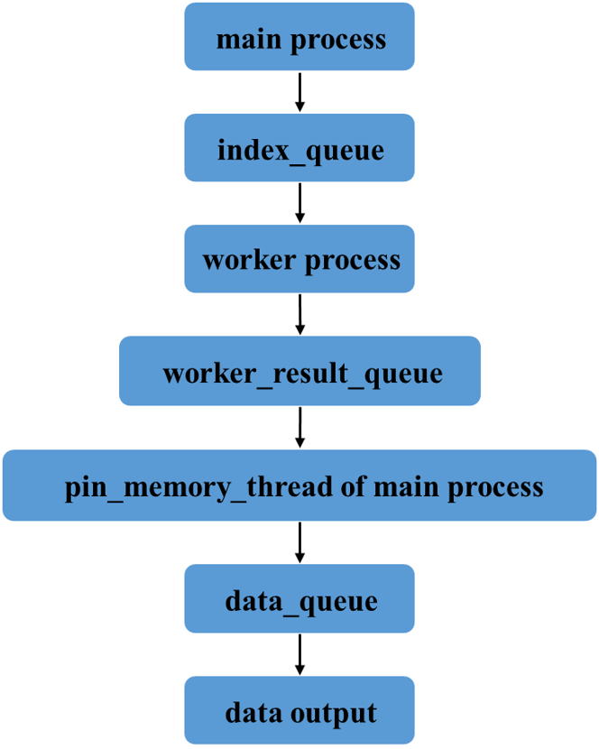

在多进程加载数据时，每一个进程都会拷贝Dataset对象，并执行`_worker_loop`函数。首先，主进程生成一个batch的数据索引，并保存在队列`index_queue`中。然后，每个子进程执行`_worker_loop`函数，根据`index_queue`在拷贝的Dataset对象中执行`__getitem__`函数，获取数据。最后，每个子进程将自身获取的数据放至`work_result_queue`队列中，通过`collate_fn`处理数据，最终得到一个batch的数据`data_queue`。重复执行上述流程，`DataLoader`就实现了多进程的数据加载，更多细节读者可以参考`DataLoader`的相关源码。


在`Dataset`和`DataLoader`的使用方面有以下建议。

- 将高负载的操作放在`__getitem__`中，例如加载图片等。在多进程加载数据时，程序会并行地调用`__getitem__`函数，将负载高的操作放在`__getitem__`函数中能够实现并行加速。

- `Dataset`中应当尽量仅包含只读对象，避免修改任何可变对象。在多进程加载数据时，每个子进程都会拷贝Dataset对象。如果某一个进程修改了部分数据，那么在另外一个进程的拷贝中，这部分数据并不会被修改。下面是一个不好的例子：希望`self.idxs`返回的结果是`[0,1,2,3,4,5,6,7,8]`，实际上4个进程最终的`self.idxs`分别是`[0,4,8]`,`[1,5]`,`[2,6]`,`[3,7]`。而`dataset.idxs`则是`[]`， 因为它并未参与迭代，并行处理的是它的四个拷贝。 

```python
class BadDataset:
    def __init__(self):
        self.idxs = [] # 取数据的次数
    def __getitem__(self, index):
        self.idxs.append(index)
        return self.idxs
    def __len__(self):
        return 9
dataset = BadDataset()
dl = t.utils.data.DataLoader(dataset, num_workers=4)
for item in dl:
    print(item) # 注意这里self.idxs的数值
print('idxs of main', dataset.idxs) # 注意这里的idxs和__getitem__返回的idxs的区别
```

使用`Multiprocessing`库时还有另外一个问题，在使用多进程加载中，如果主程序异常终止（例如使用快捷键“Ctrl+C”强行退出），那么相应的数据加载进程可能无法正常退出。虽然发现程序已经退出了，但是GPU显存和内存仍然被占用着，通过`top`、`ps aux`也能够看到已经退出的程序，这时就需要手动强行杀掉进程，建议使用如下命令：

```bash
ps x | grep <cmdline> | awk '{print $1}' | xargs kill
```

- `ps x`：获取当前用户的所有进程。
- `grep <cmdline>`：找到已经停止的PyTorch程序的进程，例如通过`python train.py`启动程序，需要写成`grep 'python train.py'`。
- `awk '{print $1}'`：获取进程的pid。
- `xargs kill`：杀掉进程，根据需要可能需要写成`xargs kill -9`强制杀掉进程。

在执行这句命令之前，建议先确认仍有未停止进程：
```bash
ps x | grep <cmdline> 
```

PyTorch中还单独提供了一个`Sampler`模块，用来对数据进行采样。常用的有随机采样器`RandomSampler`，当`DataLoader`的`shuffle`参数为True时，系统会自动调用这个采样器打乱数据。默认的采样器是`SequentialSampler`，它会按顺序一个一个进行采样。这里介绍另外一个很有用的采样方法：`WeightedRandomSampler`，它会根据每个样本的权重选取数据，在样本比例不均衡的问题中，可用它进行重采样。

构建`WeightedRandomSampler`时需提供两个参数：每个样本的权重`weights`、选取的样本总数`num_samples`以及一个可选参数`replacement`。权重越大的样本被选中的概率越大，待选取的样本数目一般小于全部的样本数目。`replacement`用于指定是否可以重复选取某一个样本，默认为True，即允许在一个epoch中重复采样某一个数据。如果设为False，那么当某一类的样本被全部选取完，但样本数目仍然未达到`num_samples`时，sampler不会再从该类中选择数据，此时可能导致`weights`参数失效。下面举例说明：


```python
In: dataset = DogCat('data/dogcat/', transforms=transform)
    # 假设狗的图片被取出的概率是猫的概率的两倍
    # 两类图片被取出的概率与weights的绝对大小无关，只和比值有关
    weights = [2 if label == 1 else 1 for data, label in dataset]
    weights
```


```
Out: [2, 1, 1, 2, 1, 2, 1, 2]
```


```python
In: from torch.utils.data.sampler import  WeightedRandomSampler
    sampler = WeightedRandomSampler(weights,\
                                    num_samples=9,\
                                    replacement=True)
    dataloader = DataLoader(dataset,\
                            batch_size=3,\
                            sampler=sampler)
    for datas, labels in dataloader:
        print(labels.tolist())
```

```
Out: [1, 1, 0]
     [0, 1, 1]
     [1, 1, 0]
```

可以看出，猫狗样本比例约为1：2。同时，一共只有8个样本，但是却返回了9个，说明有样本被重复返回，这就是`replacement`参数的作用。下面将`replacement`设为False：


```python
In: sampler = WeightedRandomSampler(weights, 8, replacement=False)
    dataloader = DataLoader(dataset, batch_size=4, sampler=sampler)
    for datas, labels in dataloader:
        print(labels.tolist())
```

```
Out: [1, 0, 1, 0]
     [1, 1, 0, 0]
```

在`replacement`为False的情况下，`num_samples`等于dataset的样本总数。为了不重复选取，`Sampler`会将每个样本都返回，`weight`参数不再生效。

从上面的例子中可以看出`Sampler`在样本采样中的作用：如果指定了`Sampler`，那么`shuffle`参数不再生效，并且`sampler.num_samples`会覆盖dataset的实际大小，即一个epoch返回的图片总数取决于`sampler.num_samples`。

本小节介绍了数据加载中两个常见的操作：`Dataset`与`DataLoader`，并结合实际数据对它们的魔法方法与底层原理进行了详细介绍。数据准备与加载是神经网络训练中最基本的环节之一，读者应该熟悉其常见操作。

## 5.2 预训练模型

除了加载数据，并对数据进行预处理之外，`torchvision`还提供了深度学习中各种经典的网络结构以及预训练模型。这些模型封装在`torchvision.models`中，包括经典的分类模型：VGG、ResNet、DenseNet及MobileNet等，语义分割模型：FCN及DeepLabV3等，目标检测模型：Faster RCNN以及实例分割模型：Mask RCNN等。读者可以通过下述代码使用这些已经封装好的网络结构与模型，也可以在此基础上根据需求对网络结构进行修改：

```python
from torchvision import models
# 仅使用网络结构，参数权重随机初始化
mobilenet_v2 = models.mobilenet_v2()
# 加载预训练权重
deeplab = models.segmentation.deeplabv3_resnet50(pretrained=True)
```

下面使用`torchvision`中预训练好的实例分割模型Mask RCNN进行一次简单的实例分割：


```python
In: from torchvision import models
    from torchvision import transforms as T
    from torch import nn
    from PIL import Image
    import numpy as np
    import random
    import cv2

    # 加载预训练好的模型，不存在的话会自动下载
    # 预训练好的模型保存在 ~/.torch/models/下面
    detection = models.detection.maskrcnn_resnet50_fpn(pretrained=True)
    detection.eval()
    def predict(img_path, threshold):
        # 数据预处理，标准化至[-1, 1]，规定均值和标准差
        img = Image.open(img_path)
        transform = T.Compose([
            T.ToTensor(),
            T.Normalize(mean=[.5, .5, .5], std=[.5, .5, .5])
        ])
        img = transform(img)
        # 对图像进行预测
        pred = detection([img])
        # 对预测结果进行后处理：得到mask与bbox
        score = list(pred[0]['scores'].detach().numpy())
        t = [score.index(x) for x in score if x > threshold][-1]
        mask = (pred[0]['masks'] > 0.5).squeeze().detach().cpu().numpy()
        pred_boxes = [[(i[0], i[1]), (i[2], i[3])] \
                      for i in list(pred[0]['boxes'].detach().numpy())]
        pred_masks = mask[:t+1]
        boxes = pred_boxes[:t+1]
        return pred_masks, boxes
```

Transforms中涵盖了大部分对Tensor和PIL Image的常用处理，这些已在上文提到，本节不再详细介绍。需要注意的是转换分为两步，第一步：构建转换操作，例如`transf = transforms.Normalize(mean=x, std=y)`；第二步：执行转换操作，例如`output = transf(input)`。另外还可以将多个处理操作用`Compose`拼接起来，构成一个处理转换流程。


```python
In: # 随机颜色，以便可视化
    def color(image):
        colours = [[0, 255, 255], [0, 0, 255], [255, 0, 0]]
        R = np.zeros_like(image).astype(np.uint8)
        G = np.zeros_like(image).astype(np.uint8)
        B = np.zeros_like(image).astype(np.uint8)
        R[image==1], G[image==1], B[image==1] = colours[random.randrange(0,3)]
        color_mask = np.stack([R,G,B],axis=2)
        return color_mask
```


```python
In: # 对mask与bounding box进行可视化
    def result(img_path, threshold=0.9, rect_th=1, text_size=1, text_th=2):
        masks, boxes = predict(img_path, threshold)
        img = cv2.imread(img_path)
        img = cv2.cvtColor(img, cv2.COLOR_BGR2RGB)
        for i in range(len(masks)):
            color_mask = color(masks[i])
            img = cv2.addWeighted(img, 1, color_mask, 0.5, 0)
            cv2.rectangle(img, boxes[i][0], boxes[i][1], color=(255,0,0), thickness=rect_th)
        return img
```


```python
In: from matplotlib import pyplot as plt
    img=result('data/demo.jpg')
    plt.figure(figsize=(10, 10))
    plt.axis('off')
    img_result = plt.imshow(img)
```

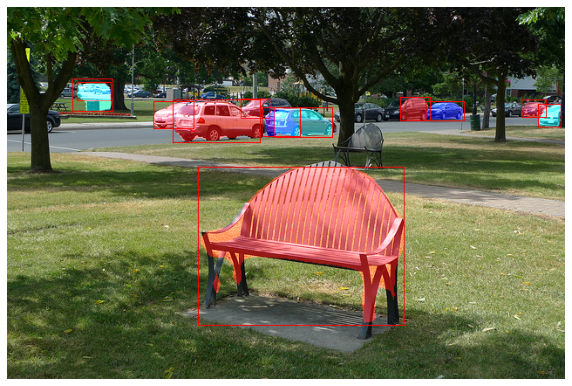


上述代码完成了一个简单的实例分割任务。如图5-4所示，Mask RCNN能够分割出该图像中的部分实例，读者可考虑对预训练模型进行微调，以适应不同场景下的不同任务。注意：上述代码均在CPU上进行，速度较慢，读者可以考虑将数据与模型转移至GPU上，具体操作可以参考5.4节。

## 5.3 可视化工具

在训练神经网络时，通常希望能够更加直观地了解训练情况，例如损失函数曲线、输入图片、输出图片等信息。这些信息可以帮助读者更好地监督网络的训练过程，并为参数优化提供方向和依据。最简单的办法就是打印输出，这种方式只能打印数值信息，不够直观，同时无法查看分布、图片、声音等。本节介绍两个深度学习中常用的可视化工具：TensorBoard和Visdom。

### 5.3.1 TensorBoard

最初，TensorBoard是作为TensorFlow的可视化工具迅速流行开来的。作为和TensorFlow深度集成的工具，TensorBoard能够展示TensorFlow的网络计算图，绘制图像生成的定量指标图以及附加数据。同时，TensorBoard是一个相对独立的工具，只要用户保存的数据遵循相应的格式，TensorBoard就能读取这些数据，进行可视化。 

在PyTorch 1.1.0版本之后，PyTorch已经内置了TensorBoard的相关接口，用户在手动安装TensorBoard后便可调用相关接口进行数据的可视化，TensorBoard的主界面如图5-5所示。

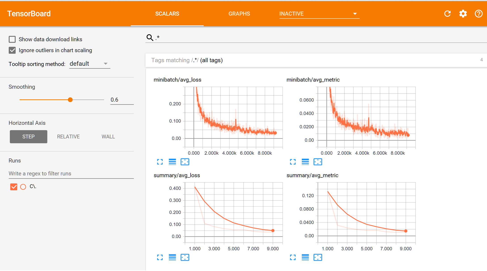


TensorBoard的使用非常简单，首先使用以下命令安装TensorBoard：
```bash
pip install tensorboard
```
待安装完成后，通过以下命令启动TensorBoard，其中path为log文件的保存路径：
```bash
tensorboard --logdir=path
```

TensorBoard的常见操作包括记录标量、显示图像、显示直方图、显示网络结构、可视化embedding等，下面逐一举例说明：

```python
In: import torch
    import torch.nn as nn
    import numpy as np
    from torchvision import models
    from torch.utils.tensorboard import SummaryWriter
    from torchvision import datasets,transforms
    from torch.utils.data import DataLoader
    # 构建logger对象，log_dir用来指定log文件的保存路径
    logger = SummaryWriter(log_dir='runs')
```


```python
In: # 使用add_scalar记录标量
    for n_iter in range(100):
        logger.add_scalar('Loss/train', np.random.random(), n_iter)
        logger.add_scalar('Loss/test', np.random.random(), n_iter)
        logger.add_scalar('Acc/train', np.random.random(), n_iter)
        logger.add_scalar('Acc/test', np.random.random(), n_iter)
```

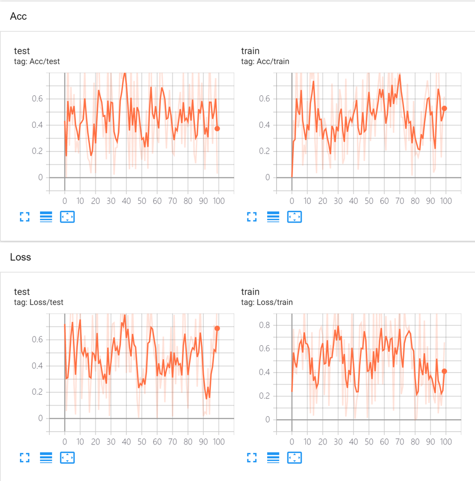


```python
In: transform = transforms.Compose([
        transforms.ToTensor(),
        transforms.Normalize((0.5,),(0.5,))
    ])
    dataset = datasets.MNIST('data/', download=True, train=False, transform=transform)
    dataloader = DataLoader(dataset, shuffle=True, batch_size=16)
    images, labels = next(iter(dataloader))
    grid = torchvision.utils.make_grid(images)
```


```python
In: # 使用add_image显示图像
    logger.add_image('images', grid, 0)
```

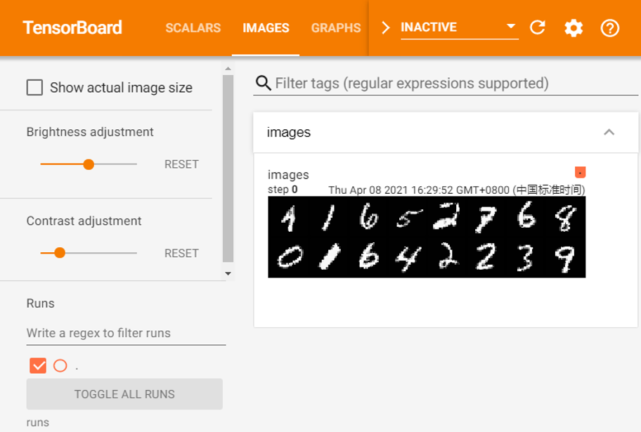


```python
In: # 使用add_graph可视化网络
	class ToyModel(nn.Module):
    	def __init__(self, input_size=28, hidden_size=500, num_classes=10):
        	super().__init__()
        	self.fc1 = nn.Linear(input_size, hidden_size) 
        	self.relu = nn.ReLU()
        	self.fc2 = nn.Linear(hidden_size, num_classes)  
    	def forward(self, x):
        	out = self.fc1(x)
        	out = self.relu(out)
        	out = self.fc2(out)
        	return out
	model = ToyModel()
	logger.add_graph(model, images)
```

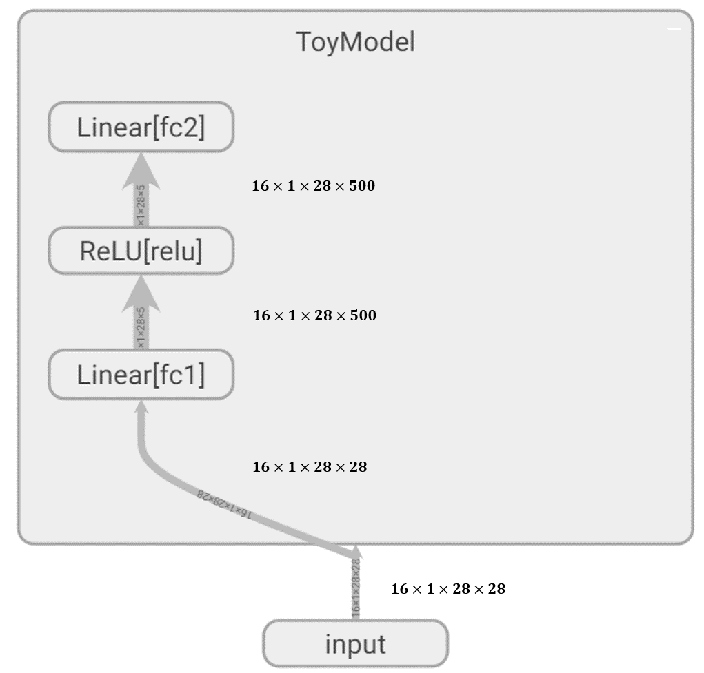


```python
In: # 使用add_histogram显示直方图
    logger.add_histogram('normal', np.random.normal(0,5,1000), global_step=1)
    logger.add_histogram('normal', np.random.normal(1,2,1000), global_step=10)
```
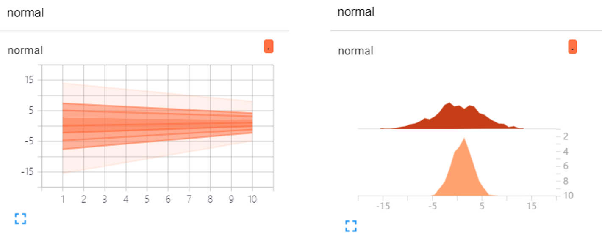


```python
In: # 使用add_embedding进行embedding可视化
    dataset = datasets.MNIST('data/', download=True, train=False)
    images = dataset.data[:100].float()
    label = dataset.targets[:100]
    features = images.view(100, 784)
    logger.add_embedding(features, metadata=label, label_img=images.unsqueeze(1))
```

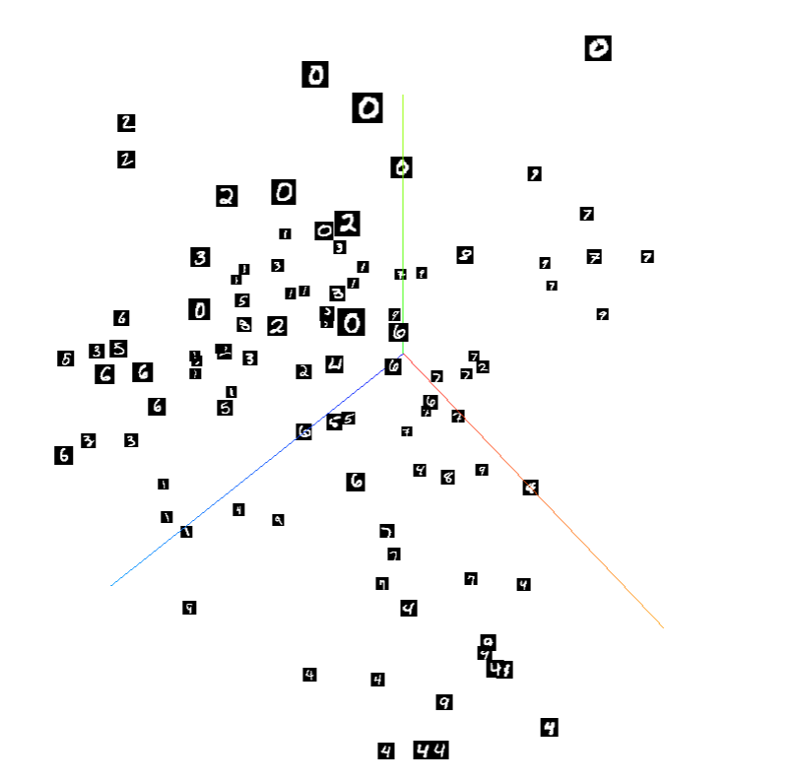

打开浏览器输入`http://localhost:6006`（其中，6006应改成读者TensorBoard所绑定的端口），就可以看到图5-5至图5-10的可视化结果。

TensorBoard十分容易上手，读者可以根据个人需求灵活地使用上述函数进行可视化。本节介绍了TensorBoard的常见操作，更多详细内容读者可参考官方相关源码。

### 5.3.2 Visdom

Visdom是Facebook专门为PyTorch开发的一款可视化工具，开源于2017年3月。Visdom十分轻量级，支持非常丰富的功能，可以胜任大多数的科学运算可视化任务，它的可视化界面如图5-11所示。

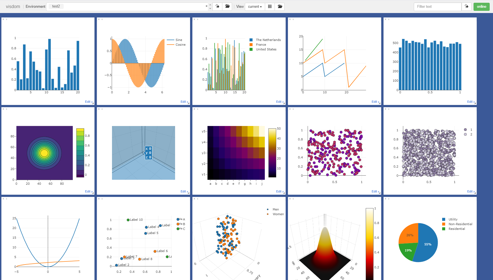


Visdom可以创造、组织和共享多种数据的可视化，包括数值、图像、文本，甚至是视频，同时支持PyTorch、Torch以及NumPy。用户可以通过编程组织可视化空间，或者通过用户接口为数据打造仪表板，以此检查实验结果或调试代码。

Visdom中有以下两个重要概念。

- env：环境。不同环境的可视化结果相互隔离，互不影响，在使用时如果不指定env，则默认使用`main`。不同用户、不同程序一般使用不同的env。

- pane：窗格。窗格用于可视化图像、数值或打印文本等，它可以拖动、缩放、保存和关闭。一个程序可以使用同一个env中的不同pane，每个pane可视化或记录不同信息。

通过命令`pip install visdom`即可完成Visdom的安装，安装完成后，通过`python -m visdom.server`命令启动Visdom服务，或者通过`nohup python -m visdom.server &`命令将服务放至后台运行。Visdom服务是一个Web Server服务，默认绑定8097端口，客户端与服务器间通过tornado进行非阻塞交互。

使用Visdom时需要注意以下两点。

- 需要手动指定保存env，可在web界面点击save按钮或在程序中调用save方法，否则Visdom服务重启后，env等信息会丢失。

- 客户端与服务器之间的交互采用tornado异步框架，可视化操作不会阻塞当前程序，网络异常也不会导致程序退出。

Visdom以Plotly为基础，它支持丰富的可视化操作，下面举例说明一些最常用的操作：


```sh
%%sh
# 启动visdom服务器
nohup python -m visdom.server &
```


```python
In: import torch as t
    import visdom
    # 新建一个连接客户端
    # 指定env = u'test1'，默认端口为8097，host是‘localhost'
    vis = visdom.Visdom(env=u'test1', use_incoming_socket=False)
    x = t.arange(0, 30, 0.01)
    y = t.sin(x)
    vis.line(X=x, Y=y, win='sinx', opts={'title': 'y=sin(x)'})
```


```
Out: 'sinx'
```

输出的结果如图5-12所示。
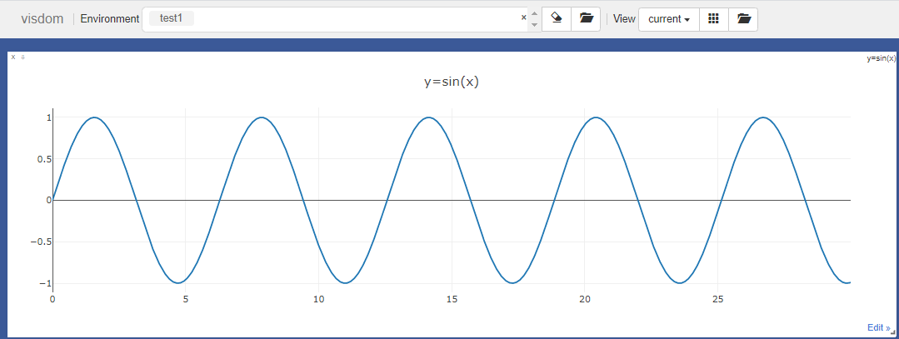

下面逐一分析这几行代码。
- `vis = visdom.Visdom(env=u'test1')`，用于构建一个客户端。客户端除了指定env，还可以指定host、port等参数。
- vis作为一个客户端对象，可以使用以下常见的画图函数。

    - line：类似MATLAB中的`plot`操作，用于记录某些标量的变化，如损失、准确率等。
    - image：可视化图片，可以是输入的图片，也可以是程序生成的图片，还可以是卷积核的信息。
    - text：用于记录日志等文字信息，支持HTML格式。
    - histgram：可视化分布，主要是查看数据、参数的分布。
    - scatter：绘制散点图。
    - bar：绘制柱状图。
    - pie：绘制饼状图。
    - 更多操作可以参考Visdom的GitHub主页。
    

本小节主要介绍深度学习中常见的line、image和text操作。

Visdom同时支持PyTorch的Tensor和NumPy的ndarray两种数据结构，但不支持Python的int、float等数据类型，因此每次传入数据时需要将数据转成ndarray或Tensor类型。上述操作的参数一般不同，但以下两个参数是绝大多数操作都具备的。

- win：用于指定pane的名字，如果不指定，那么Visdom将自动分配一个新的pane。如果两次操作指定的win名字一样，那么新的操作会覆盖当前pane的内容，因此建议每次操作都重新指定win。

- opts：用来可视化配置，接收一个字典，常见的option包括`title`、`xlabel`、`ylabel`、`width`等，主要用于设置pane的显示格式。

在训练网络的过程中，例如损失函数值、准确率等数值不是一成不变的，为了避免覆盖之前pane的内容，需要指定参数`update='append'`。除了使用update参数，还可以使用`vis.updateTrace`方法更新图。`updateTrace`不仅能在指定pane上新增一个和已有数据相互独立的trace，还能像`update='append'`那样在同一条trace上追加数据，下面举例说明：


```python
In: # append 追加数据
    for ii in range(0, 10):
        # y = x
        x = t.Tensor([ii])
        y = x
        vis.line(X=x, Y=y, win='polynomial', update='append' if ii > 0 else None)

    # updateTrace 新增一条线
    x = t.arange(0, 9, 0.1)
    y = (x ** 2) / 9
    vis.line(X=x, Y=y, win='polynomial', name='this is a new Trace', update='new')
```


```
Out: 'polynomial'
```

打开浏览器，输入`http://localhost:8097`，可以看到如图5-13所示的结果。


image的画图功能可以分为以下两类。
- `image`接收一个二维或三维向量，形状为$H\times W$（黑白图像）或$3 \times H\times W$（彩色图像）。
- `images`接收一个四维向量，形状为$N\times C\times H\times W$，其中$C$可以是1或3，分别代表黑白和彩色图像。`images`可以实现类似`torchvision`中`make_grid`的功能，将多张图片拼接在一起。`images`也可以接收一个二维或三维的向量，此时它所实现的功能与`image`一致。


```python
In: # 可视化一个随机的黑白图片
    vis.image(t.randn(64, 64).numpy())

    # 可视化一张随机的彩色图片
    vis.image(t.randn(3, 64, 64).numpy(), win='random2')

    # 可视化36张随机的彩色图片，每一行6张
    vis.images(t.randn(36, 3, 64, 64).numpy(), nrow=6, win='random3', opts={'title':'random_imgs'})
```


```
Out: 'random3'
```

images的可视化输出如图5-14所示。

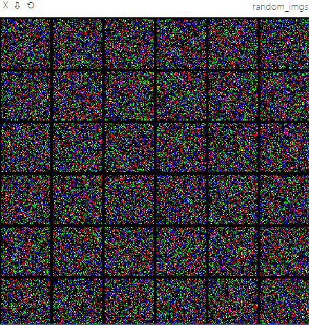

`vis.text`用于可视化文本，它支持所有的HTML标签，同时也遵循着HTML的语法标准。例如，换行需使用`<br>`标签，而`\r\n`无法实现换行，下面举例说明：


```python
In: vis.text(u'''<h1>Validation</h1><br>2021-04-18 20:09:00,399 - mmdet - INFO - Epoch(val) [21][160]	
            <br>bbox_mAP: 0.8180, bbox_mAP_50: 0.9880, bbox_mAP_75: 0.9440, bbox_mAP_s: 0.1510, 
            <br>bbox_mAP_m: 0.8390, bbox_mAP_l: 0.8040, bbox_mAP_copypaste: 0.818 0.988 0.944 0.151 0.839 0.804,
            <br>segm_mAP: 0.8180, segm_mAP_50: 0.9880, segm_mAP_75: 0.9570, segm_mAP_s: 0.2000, segm_mAP_m: 0.8250,
            <br>segm_mAP_l: 0.8120, segm_mAP_copypaste: 0.818 0.988 0.957 0.200 0.825 0.812''',
             win='visdom',
             opts={'title': u'validation' }
            )
```


```
Out: 'visdom'
```

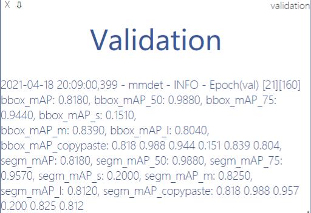

本小节主要介绍了深度学习中两种常见的可视化工具：TensorBoard和Visdom。合理地利用可视化工具便于记录与观察神经网络的中间层与网络整体的训练效果，从而帮助用户更好地对网络进行调整。在本书第9章至第13章中会频繁使用可视化工具在实际案例中进行可视化操作，读者可在后续章节中留意。

## 5.4 使用GPU加速：CUDA

这部分内容在前面介绍`Tensor`、`nn.Module`时已经有所涉及，这里做一个总结，并深入介绍它的相关应用。

在PyTorch中以下数据结构分为CPU和GPU两个版本。
- `Tensor`。
- `nn.Module`（包括常用的layer、损失函数以及容器Sequential等）。

这些数据结构都带有一个`.cuda`方法，调用该方法可以将它们转为对应的GPU对象。**注意，`tensor.cuda`会返回一个新对象，这个新对象的数据已经转移到GPU，之前的Tensor还在原来的设备上（CPU）**。`module.cuda`会将所有的数据都迁移至GPU，并返回自己。所以`module = module.cuda()`和`module.cuda()`效果一致。

除了`.cuda`方法，它们还支持`.to(device)`方法，通过该方法可以灵活地转换它们的设备类型，同时这种方法也更加适合编写设备兼容的代码，这部分内容将在后文详细介绍。

`nn.Module`在GPU与CPU之间的转换，本质上还是利用了Tensor在GPU和CPU之间的转换。`nn.Module`的`.cuda`方法是将`nn.Module`下的所有参数（包括子module的参数）都转移至GPU，而参数本质上也是Tensor。

下面对`.cuda`方法举例说明，这部分代码需要读者具有两块GPU设备。

注意：为什么将数据转移至GPU的方法叫做`.cuda`而不是`.gpu`，就像将数据转移至CPU调用的方法是`.cpu`呢？这是因为GPU的编程接口采用CUDA，而目前不是所有的GPU都支持CUDA，只有部分NVIDIA的GPU才支持。PyTorch1.8目前已经支持AMD GPU，并提供了基于ROCm平台的GPU加速，感兴趣的读者可以自行查询相关文档。


```python
In: tensor = t.Tensor(3, 4)
    # 返回一个新的Tensor，保存在第1块GPU上，原来的Tensor并没有改变
    tensor.cuda(0)
    tensor.is_cuda # False
```


```
Out: False
```


```python
In: # 不指定所使用的GPU设备，默认使用第1块GPU
    tensor = tensor.cuda()
    tensor.is_cuda # True
```


```
Out: True
```


```python
In: module = nn.Linear(3, 4)
    module.cuda(device = 1)
    module.weight.is_cuda # True
```


```
Out: True
```

```python
In: # 使用.to方法，将Tensor转移至第1块GPU上
    tensor = t.Tensor(3, 4).to('cuda:0')
    tensor.is_cuda
```

```
Out: True
```

```python
In: class VeryBigModule(nn.Module):
        def __init__(self):
            super().__init__()
            self.GiantParameter1 = t.nn.Parameter(t.randn(100000, 20000)).to('cuda:0')
            self.GiantParameter2 = t.nn.Parameter(t.randn(20000, 100000)).to('cuda:1')

        def forward(self, x):
            x = self.GiantParameter1.mm(x.cuda(0))
            x = self.GiantParameter2.mm(x.cuda(1))
            return x
```

在最后一段代码中，两个`Parameter`所占用的内存空间都非常大，大约是8GB。如果将这两个`Parameter`同时放在一块显存较小的GPU上，那么显存将几乎被占满，无法再进行任何其他运算。此时可以通过`.to(device_i)`将不同的计算划分到不同的GPU中。

下面是在使用GPU时的一些建议。
- GPU运算很快，但对于很小的运算量来说，它的优势无法被体现。因此，对于一些简单的操作可以直接利用CPU完成。
- 数据在CPU和GPU之间的传递比较耗时，应当尽量避免。
- 在进行低精度的计算时，可以考虑使用HalfTensor，它相比于FloatTensor可以节省一半的显存，但是需要注意数值溢出的情况。

注意：大部分的损失函数都属于`nn.Module`，在使用GPU时，用户经常会忘记使用它的`.cuda`方法，这在大多数情况下不会报错，因为损失函数本身没有可学习参数（learnable parameters），但在某些情况下会出现问题。为了保险起见，同时也为了代码更加规范，用户应记得调用`criterion.cuda`，下面举例说明：


```python
In: # 交叉熵损失函数，带权重
    criterion = t.nn.CrossEntropyLoss(weight=t.Tensor([1, 3]))
    input = t.randn(4, 2).cuda()
    target = t.Tensor([1, 0, 0, 1]).long().cuda()

    # 下面这行会报错，因weight未被转移至GPU
    # loss = criterion(input, target)

    # 下面的代码则不会报错
    criterion.cuda()
    loss = criterion(input, target)

    criterion._buffers
```


```
Out: OrderedDict([('weight', tensor([1., 3.], device='cuda:0'))])
```

除了调用对象的`.cuda`方法，还可以使用`torch.cuda.device`指定默认使用哪一块GPU，或使用`torch.set_default_tensor_type`让程序默认使用GPU，不需要手动调用`.cuda`方法：


```python
In: # 如果未指定使用哪块GPU，则默认使用GPU 0
    x = t.cuda.FloatTensor(2, 3)
    # x.get_device() == 0
    y = t.FloatTensor(2, 3).cuda()
    # y.get_device() == 0

    # 指定默认使用GPU 1
    with t.cuda.device(1):    
        # 在GPU 1上构建Tensor
        a = t.cuda.FloatTensor(2, 3)

        # 将Tensor转移至GPU 1
        b = t.FloatTensor(2, 3).cuda()
        assert a.get_device() == b.get_device() == 1

        c = a + b
        assert c.get_device() == 1

        z = x + y
        assert z.get_device() == 0

        # 手动指定使用GPU 0
        d = t.randn(2, 3).cuda(0)
        assert d.get_device() == 0
```


```python
In: t.set_default_tensor_type('torch.cuda.FloatTensor') # 指定默认Tensor的类型为GPU上的FloatTensor
    a = t.ones(2, 3)
    a.is_cuda
```


```
Out: True
```

如果服务器具有多个GPU，那么`tensor.cuda()`方法会将Tensor保存到第一块GPU上，等价于`tensor.cuda(0)`。如果想要使用第二块GPU，那么需要手动指定`tensor.cuda(1)`，这需要修改大量代码，较为烦琐。这里有以下两种替代方法。

- 先调用`torch.cuda.set_device(1)`指定使用第二块GPU，后续的`.cuda()`都无需更改，切换GPU只需修改这一行代码。

- 设置环境变量`CUDA_VISIBLE_DEVICES`，例如`export CUDA_VISIBLE_DEVICE=1`（下标从0开始，1代表第二块物理GPU），代表着只使用第2块物理GPU，但在程序中这块GPU会被看成是第1块逻辑GPU，此时调用`tensor.cuda()`会将Tensor转移至第二块物理GPU。`CUDA_VISIBLE_DEVICES`还可以指定多个GPU，例如`export CUDA_VISIBLE_DEVICES=0,2,3`，第1、3、4块物理GPU会被映射为第1、2、3块逻辑GPU，此时`tensor.cuda(1)`会将Tensor转移到第三块物理GPU上。

设置`CUDA_VISIBLE_DEVICES`有两种方法，一种是在命令行中执行`CUDA_VISIBLE_DEVICES=0,1 python main.py`，一种是在程序中编写`import os;os.environ["CUDA_VISIBLE_DEVICES"] = "2"`。如果使用IPython或者Jupyter notebook，那么还可以使用`%env CUDA_VISIBLE_DEVICES=1,2`设置环境变量。

基于PyTorch本身的机制，用户可能需要编写设备兼容（device-agnostic）的代码，以适应不同的计算环境。在第3章中已经介绍到，可以通过Tensor的`device`属性指定它加载的设备，同时利用`to`方法可以很方便地将不同变量加载到不同的设备上。然而，如果要保证同样的代码在不同配置的机器上均能运行，那么编写设备兼容的代码是至关重要的，本节将详细介绍如何编写设备兼容的代码。  

首先介绍一下如何指定Tensor加载的设备，这一操作往往通过`torch.device()`实现，其中device类型包含`cpu`与`cuda`，下面举例说明：


```python
In: # 指定设备,使用CPU
    t.device('cpu')
    # 另外一种写法：t.device('cpu',0)
```


```
Out: device(type='cpu')
```


```python
In: # 指定设备，使用第1块GPU
    t.device('cuda:0')
    # 另外一种写法：t.device('cuda',0)
```


```
Out: device(type='cuda', index=0)
```


```python
In: # 更加推荐的做法（同时也是设备兼容的）：如果用户具有GPU设备，那么使用GPU，否则使用CPU
    device = t.device("cuda" if t.cuda.is_available() else "cpu")
    print(device)
```

```
Out: cuda
```


```python
In: # 在确定了设备之后，可以将数据与模型利用to方法加载到指定的设备上。
    x = t.empty((2,3)).to(device)
    x.device
```

```
Out: device(type='cuda', index=0)
```

对于最常见的数据结构Tensor，它封装好的大部分操作也支持指定加载的设备。当拥有加载在一个设备上的Tensor时，通过`torch.Tensor.new_*`以及`torch.*_like`操作可以创建与该Tensor相同类型、相同设备的Tensor，举例说明如下：


```python
In: x_cpu = t.empty(2, device='cpu')
    print(x_cpu, x_cpu.is_cuda)
    x_gpu = t.empty(2, device=device)
    print(x_gpu, x_gpu.is_cuda)
```

```
Out: tensor([-3.6448e+08,  4.5873e-41]) False
     tensor([0., 0.], device='cuda:0') True
```


```python
In: # 使用new_*操作会保留原Tensor的设备属性
    y_cpu = x_cpu.new_full((3,4), 3.1415)
    print(y_cpu, y_cpu.is_cuda)
    y_gpu = x_gpu.new_zeros(3,4)
    print(y_gpu, y_gpu.is_cuda)
```

```
Out: tensor([[3.1415, 3.1415, 3.1415, 3.1415],
             [3.1415, 3.1415, 3.1415, 3.1415],
             [3.1415, 3.1415, 3.1415, 3.1415]]) False
     tensor([[0., 0., 0., 0.],
             [0., 0., 0., 0.],
             [0., 0., 0., 0.]], device='cuda:0') True
```


```python
In: # 使用ones_like或zeros_like可以创建与原Tensor大小类别均相同的新Tensor
    z_cpu = t.ones_like(x_cpu)
    print(z_cpu, z_cpu.is_cuda)
    z_gpu = t.zeros_like(x_gpu)
    print(z_gpu, z_gpu.is_cuda)
```

```
Out: tensor([1., 1.]) False
     tensor([0., 0.], device='cuda:0') True
```

在一些实际应用场景下，代码的可移植性是十分重要的，读者可根据上述内容继续深入学习，在不同场景中灵活运用PyTorch的不同特性编写代码，以适应不同环境的工程需要。 

本节主要介绍了如何使用GPU对计算进行加速，同时介绍了如何编写设备兼容的PyTorch代码。在实际应用场景中，仅仅使用CPU或一块GPU是很难满足网络的训练需求的，因此能否使用多块GPU来加速训练呢？ 

答案是肯定的。自PyTorch 0.2版本后，PyTorch新增了分布式GPU支持。分布式是指有多个GPU在多台服务器上，并行一般指一台服务器上的多个GPU。分布式涉及到了服务器之间的通信，因此比较复杂。幸运的是，PyTorch封装了相应的接口，可以用简单的几行代码实现分布式训练。在训练数据集较大或者网络模型较为复杂时，合理地利用分布式与并行可以加快网络的训练。关于分布式与并行的更多内容将在本书第7章进行详细的介绍。

## 5.5 小结

本章介绍了一些工具模块，这些工具有的已经封装在PyTorch之中，有的是独立于PyTorch的第三方模块。这些模块主要涉及数据加载、可视化与GPU加速的相关内容，合理使用这些模块能够极大地提升编程效率。
