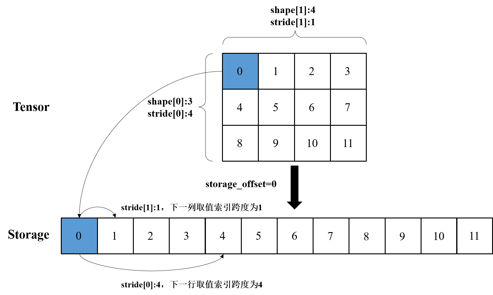
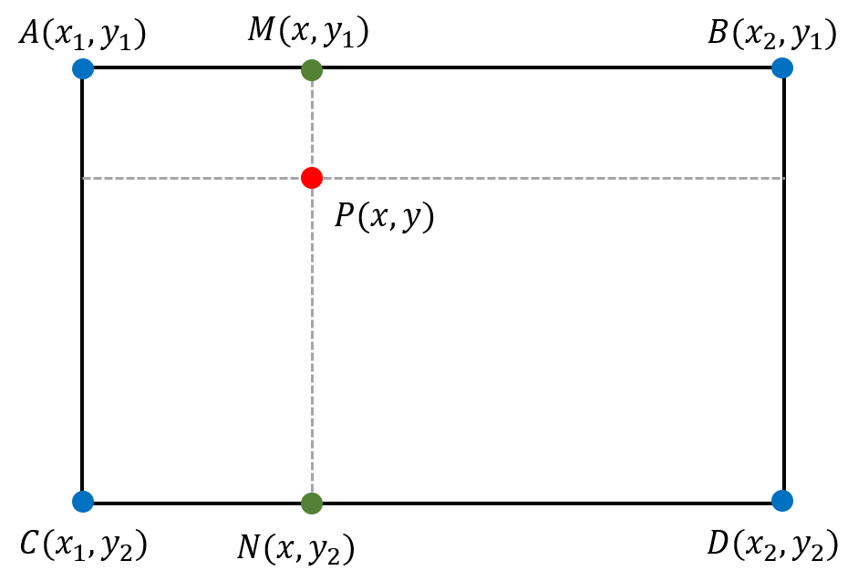

# 第6章 向量化

本章主要介绍PyTorch中的向量化思想。其中6.1节和6.2节介绍向量化的基本概念和广播法则；6.3节介绍PyTorch中的高级索引，这也是向量化思想的重点，通过高级索引操作可以简化向量的计算；6.4节将结合向量化思想解决深度学习中的三个实际问题。

## 6.1 向量化简介

向量化计算是一种特殊的并行计算方式。一般来说，程序在同一时间内只执行一个操作，而并行计算可以在同一时间内执行多个操作。向量化计算是指对不同的数据执行同样的一个或一批指令，或者把指令应用到一个数组或向量上，从而将多次循环操作变成一次计算。

向量化操作可以极大地提高科学运算的效率。尽管Python本身是一门高级语言，使用简便，但是其中存在着许多低效的操作，例如for循环等。因此，在科学计算中应当极力避免使用Python原生的for循环，尽量使用向量化数值运算，下面举例说明：

```python
In: import warnings
    warnings.filterwarnings("ignore")
    
    import torch as t
    # 定义for循环完成加法操作
    def for_loop_add(x, y):
        result = []
        for i, j in zip(x, y):
            result.append(i + j)
        return t.tensor(result)
```


```python
In: x = t.zeros(100)
    y = t.ones(100)
    %timeit -n 100 for_loop_add(x, y)
    %timeit -n 100 (x + y) # +是向量化计算
```

```
Out:100 loops, best of 3: 786 µs per loop
	100 loops, best of 3: 2.57 µs per loop
```

从上面的例子中可以看出，for循环和向量化计算之间存在数百倍的速度差距，在实际使用中读者应该尽量调用内建函数（buildin-function）。这些函数底层由C/C++实现，在实现中使用了向量化计算的思想，通过底层优化实现了高效计算。在日常编程中读者应该养成向量化的编程习惯，避免对较大的Tensor进行逐元素的遍历操作，从而提高程序的运行效率。

## 6.2 广播法则

广播法则（broadcast）是科学计算中经常使用的一个技巧，它在快速执行向量化计算的同时不会占用额外的内存/显存。NumPy中的广播法则定义如下。

- 所有输入数组都与形状（shape）最大的数组看齐，形状不足的部分在前面加1补齐。

- 两个数组要么在某一个维度的尺寸一致，要么其中一个数组在该维度的尺寸为1，否则不符合广播法则的要求。

- 如果输入数组的某个维度的尺寸为1，那么计算时沿此维度复制扩充成目标的形状大小。

虽然PyTorch已经支持了自动广播法则，但是笔者还是建议读者通过以下两种方式的组合手动实现广播法则，这样更加直观，也更不容易出错。

- `unsqueeze`、`view`或者`tensor[None]` ：为数据某一维度补1，实现第一个广播法则。
- `expand`或者`expand_as`，重复数组，实现第三个广播法则；该操作不会复制整个数组，因此不会占用额外的空间。

**注意：`repeat`可以实现与`expand`类似的功能，`expand`是在已经存在的Tensor上创建一个新的视图（view），`repeat`会将相同的数据复制多份，因此会占用额外的空间。**


```python
In: # 比较expand和repeat的内存占用情况
    a = t.ones(1, 3)
    print("原始储存占用：" + str(a.storage().size()))
    # expand不额外占用内存，只返回一个新的视图
    b = a.expand(3, 3)
    print("expand储存占用：" + str(b.storage().size()))
    # repeat复制了原始张量
    c = a.repeat(3, 3)
    print("repeat储存占用：" + str(c.storage().size()))
```

```
Out:原始储存占用：3
	expand储存占用：3
	repeat储存占用：27
```


```python
In: a = t.ones(3, 2)
    b = t.zeros(2, 3, 1)
    
    # 自动广播法则
    # 第一步:a是2维的,b是3维的，所以先在较小的a前面补1个维度，
    #       即：a.unsqueeze(0)，a的形状变成（1，3，2），b的形状是（2，3，1）,
    # 第二步:a和b在第一和第三个维度的形状不一样，同时其中一个为1，
    #       利用广播法则扩展，两个形状都变成了（2，3，2）
    (a + b).shape
```


```
Out:torch.Size([2, 3, 2])
```


```python
In: # 手动广播法则，下面两行操作是等效的，推荐使用None的方法
    # a.view(1, 3, 2).expand(2, 3, 2) + b.expand(2, 3, 2)
    a[None,:,:].expand(2, 3, 2) + b.expand(2, 3, 2)
```


```
Out:tensor([[[1., 1.],
         	[1., 1.],
         	[1., 1.]],

        	[[1., 1.],
         	[1., 1.],
         	[1., 1.]]])
```

## 6.3 索引操作

索引和切片是NumPy和PyTorch中的两种常用操作，本节将从基本索引入手，对比介绍高级索引的相关用法，帮助读者建立向量化思想。

### 6.3.1 基本索引

PyTorch中Tensor的索引和NumPy数组的索引类似，通过索引操作可以定位到数据的具体位置，也可以进行切片操作。基本索引有以下几种形式。

- 元组序列：在索引中直接使用一个元组序列对Tensor中数据的具体位置进行定位，也可以直接使用多个整数（等价于元组序列省略括号的形式）代替。
- 切片对象（Slice Object）：在索引中常见的切片对象形如`start:stop:step`，对一个维度进行全选时可以直接使用`:`。
- 省略号（`...`）：在索引中常用省略号来代表一个或多个维度的切片。
- `None`：与NumPy中的`newaxis`相同，`None`在PyTorch索引中起到增加一个维度的作用。

下面举例说明这几种基本索引的使用方式。

#### 元组序列


```python
In: a = t.arange(1, 25).view(2, 3, 4)
    a
```


```
Out:tensor([[[ 1,  2,  3,  4],
         	[ 5,  6,  7,  8],
         	[ 9, 10, 11, 12]],

        	[[13, 14, 15, 16],
         	[17, 18, 19, 20],
         	[21, 22, 23, 24]]])
```


```python
In: # 提取位置[0, 1, 2]的元素
    # 等价于a[(0, 1, 2)]（保留括号的元组形式）
    a[0, 1, 2]
```


```
Out:tensor(7)
```


```python
In: # 固定前两个维度，提取第三个维度上的切片（省略第三个参数）
    # 等价于a[(1, 1)]，a[(1, 1, )]，a[1, 1, :]
    a[1, 1]
```


```
Out:tensor([17, 18, 19, 20])
```

**注意：`a[0, 1, 2]`与`a[[0, 1, 2]]`、`a[(0, 1, 2),]`并不等价，后面两个不满足基本索引的条件，既不是一个元组序列又不是一个切片对象，它们属于高级索引的范畴，这部分内容将在6.3.2节中进行讲解。**

#### `:` 和 `...`

在实际编程中，经常会在Tensor的任意维度上进行切片操作，PyTorch已经封装好了两个运算符`:`和`...`，它们的用法如下。

- `:`常用于对一个维度进行操作，基本的语法形式是：`start:end:step`。单独使用`:`代表全选这个维度，`start`和`end`为空分别表示从头开始和一直到结束，`step`的默认值是1。

- `...`用于省略任意多个维度，可以用在切片的中间，也可以用在首尾。

下面举例说明这两个运算符的使用方法：


```python
In: a = t.rand(64, 3, 224, 224)
    print(a[:,:,0:224:4,:].shape) # 第三个维度间隔切片
    # 省略start和end代表整个维度
    print(a[:,:,::4,:].shape)
```

```
Out:torch.Size([64, 3, 56, 224])
	torch.Size([64, 3, 56, 224])
```


```python
In: # 使用...代替一个或多个维度，建议一个索引中只使用一次
    a[...,::4,:].shape
    # a[...,::4,...].shape # 如果将最后一个维度也改为...，那么在匹配维度时将混乱出错
```


```
Out:torch.Size([64, 3, 56, 224])
```

#### `None`索引

在PyTorch的源码中，`None`索引经常被使用。`None`索引可以直观地表示维度的扩展，在广播法则中充当1的作用。使用`None`索引，本质上与使用`unsqueeze`函数是等价的，都能起到扩展维度的作用。在维度较多的情况下，或者需要对多个维度先进行扩展再进行矩阵计算时，使用`None`索引会更加清晰直观。因此，笔者推荐使用`None`索引进行维度的扩展，下面举例说明：


```python
In: a = t.rand(2, 3, 4, 5)
    # 在最前面加一个维度，下面两种写法等价
    print(a.unsqueeze(0).shape)
    print(a[None, ...].shape)
```

```
Out:torch.Size([1, 2, 3, 4, 5])
	torch.Size([1, 2, 3, 4, 5])
```


```python
In: # 在原有的四个维度中均插入一个维度，成为（2,1,3,1,4,1,5）
    # unsqueeze方法，每成功增加一个维度，都需要重新计算下一个需要增加的维度位置
    b = a.unsqueeze(1)
    b = b.unsqueeze(3)
    b = b.unsqueeze(5)
    b.shape
```


```
Out:torch.Size([2, 1, 3, 1, 4, 1, 5])
```


```python
In: # None索引方法，直接在需要增加的维度上填写None即可
    a[:,None,:,None,:,None,:].shape
```


```
Out:torch.Size([2, 1, 3, 1, 4, 1, 5])
```

下面例举一个使用`None`索引的例子。假设Tensor $a$是一组图像的feature maps经过全连接层后的结果，维度是$\text{batch_size} \times \text{features}$，现在需要构建每张图像不同维度特征之间的乘积矩阵，形为$\text{batch_size} \times \text{features} \times \text{features}$，读者可以思考一下如何使用`None`索引进行构建。

处理这样一个问题，最直观的想法是进行矩阵乘法：将$n×1$维的矩阵与$1×n$维的矩阵相乘，结果就是$n×n$维的矩阵。因此，将Tensor $a$的第二个维度进行扩展并转置得到$a^T$，再使用矩阵的乘法即可得到每两张图像的关系矩阵，示例如下：


```python
In: # 假设batch_size为16，features为256
    a = t.arange(16 * 256).view(16, 256)
    a1 = a.unsqueeze(1) 	 # shape：16×1×256
    a_T = a1.transpose(2, 1) # shape：16×256×1
    a_matrix = a_T @ a1 	 # @表示矩阵的乘法
    a_matrix.shape
```


```
Out:torch.Size([16, 256, 256])
```

使用`None`索引和广播法则解决这个问题将更加地直观：


```python
In: b = a[:, :, None] * a[:, None, :]
    c = a[:, None, :] * a[:, :, None]
    # 读者可以思考一下，b和c有什么区别？
    b.shape, c.shape
```


```
Out:(torch.Size([16, 256, 256]), torch.Size([16, 256, 256]))
```


```python
In: # 没有触发异常， 说明两种方式得到的结果是一样的
    assert t.equal(b, c)
    assert t.equal(a_matrix, b)
```

从上面的结果可以看出，虽然在生成$b$和$c$时写法不一样，但是最终结果是一样的。这是因为使用`None`索引进行维度扩展时，扩展的维度是1，当维度中有1存在时，Tensor相乘会触发广播法则，在计算的时候自动填充，所以最终的结果是一致的。

### 6.3.2 高级索引

#### Tensor的底层实现

本节介绍更能体现向量化思想的高级索引操作，要理解这些操作，读者需要熟悉Tensor的底层实现。3.1.3节简要地介绍了Tensor的基本结构，这里再深入分析一下它的底层原理。

Tensor的底层使用C/C++实现，它可以用于存储数据，还可以定义如何对数据进行操作。Tensor与Python list最大的区别是：Tensor利用一个连续的内存区域去存储数据，这些数据都未经过封装；list中的每个数据都会被封装成`PyObject`对象，每个对象独立分配内存，离散地存储在内存当中。

在PyTorch底层使用`Storage`类来管理Tensor的内存区域，它使用一个一维数组来存储数据。Tensor通过修改内部的size、storage_offset、stride等属性让这个一维数组“看起来像一个多维数组”（获得多个Tensor的实例），实际上这些Tensor指向同一个`Storage`区域，下面举例说明：


```python
In: a = t.arange(6).view(3, 2)
    b = a.reshape(2, 3)   # 改变形状
    c = a.transpose(1, 0) # 转置
    d = a[:2, 1]          # 切片
    # a,b,c三个实例指向同一个storage
    id(a.storage()) == id(b.storage()) == id(c.storage()) == id(d.storage())
```


```
Out:True
```


```python
In: # 发生改变的实际是三个内部属性：size,storage_offset和stride
    print(a.size(), a.storage_offset(), a.stride())
    print(b.size(), b.storage_offset(), b.stride())
    print(c.size(), c.storage_offset(), c.stride())
    print(d.size(), d.storage_offset(), d.stride())
```

```
Out:torch.Size([3, 2]) 0 (2, 1)
	torch.Size([2, 3]) 0 (3, 1)
	torch.Size([2, 3]) 0 (1, 2)
	torch.Size([2]) 1 (2,)
```

关于这三个属性的说明如下。

- size：控制Tensor每个维度上的取值范围。切片操作、`reshape`操作等都会修改Tensor实例的size属性。
- storage_offset：Tensor实例起始元素对应存储区`Storage`的索引。部分Tensor实例只使用了一部分`Storage`，该属性用来控制每个实例的起始位置。
- stride：一个元组，stride的第$k$个元素表示Tensor的第$k$​个维度中两个元素之间的内存间隔，这一概念使得Tensor的高级索引运算变得更加高效。



图6-1解释了一个高维Tensor是怎样从一个一维数组上存取数据的，这里可以通过storage_offset属性和stride属性，结合维度信息计算出任意位置元素在一维`Storage`上的索引offset，计算方法如式(6.1)所示。
$$
\text{offset}=\sum_{k=0}^{N-1}\text{stride}_{k}\times \text{dim}_{k}+\text{storage_offset}\tag{6.1}
$$

其中，$\text{dim}$表示所取元素的所在的维度，$N$表示Tensor的维度大小。下面举例说明如何应用该式进行计算：


```python
In: a = t.arange(12).view(3, 4)
    a, a.size(), a.storage_offset(), a.stride()
```


```
Out:(tensor([[ 0,  1,  2,  3],
             [ 4,  5,  6,  7],
             [ 8,  9, 10, 11]]), torch.Size([3, 4]), 0, (4, 1))
```

如果想要获取第二行第三列的元素$a[1,2]$，那么可以通过式(6.1)得出：$\text{offset}=4\times1+1\times2+0=6$，也就是Storage中的第7个元素，这与$a[1,2]$得到的值相同。stride元组的计算极为简单，它可以视为多维数组向一维数组映射的权重，它的取值只与当前Tensor实例的size属性有关，计算方法如式(6.2)所示。

$$
\text{stride}_k=\prod_{j=k+1}^{N-1} \text{DimNum}_{j}\tag{6.2}
$$
其中，$\text{DimNum}_{j}=\text{self.shape}[j]$，stride元组的末尾元素默认为1。

**注意：必须在`tensor.is_contiguous=True`的时候，才可以使用式(6.2)计算stride。**


```python
In: # a的size设为2×3×4×5
    a = t.rand(2, 3, 4, 5)
    # 可以通过式(6.2)计算得到，stride0=3×4×5=60，stride1=4×5=20，stride2=5，stride3=1
    a.stride()
```


```
Out:(60, 20, 5, 1)
```

总结：对Tensor的许多操作都可以通过改变Tensor的stride和offset属性实现，更改这些属性前后的Tensor共享同一个存储区域，这样的设计模式可以有效节省内存。

在了解了Tensor的底层实现后，下面对高级索引进行讲解。与基本索引相比，高级索引的触发条件有所不同，常见的高级索引遵循以下三个规律。

- 索引是一个非元组序列：例如`tensor[(0, 1, 2),]`。

- 索引是一个整数类型或者布尔类型的Tensor。

- 索引是元组序列，但是里面至少包含一个整数类型或者布尔类型的Tensor。

#### 整数数组索引

对于整数数组索引（Integer Array Indexing），一般情况下需要先确定输入输出Tensor的形状，这是因为所有的整数索引都有一个相对固定的模式：$\text{tensor}[\text{index}_1, \text{index}_2, ..., \text{index}_N]$。

其中，$N$的大小必须小于等于这个Tensor的维度（`tensor.ndim`）。如果经过索引操作后得到的Tensor形状是$M_1 \times M_2 \times ... \times M_K$，那么这个Tensor的所有索引$\text{index}_1 ... \text{index}_N$的形状都必须是$M_1 \times M_2 \times ... \times M_K$，同时输出的第$[m_1,m_2,...,m_K]$个元素是$\text{tensor}[\text{index}_1[m_1,m_2,...,m_K], \text{index}_2[m_1,m_2,...,m_K], ..., \text{index}_N[m_1,m_2,...,m_K]]$。

如果index的形状不完全相同，但是满足广播法则，那么它们将自动对齐成一样的形状，从而完成整数数组索引操作。对于不能够广播或者不能够得到相同形状的索引，无法进行整数数组索引操作。下面举例说明：


```python
In: a = t.arange(12).view(3, 4)
    # 相同形状的index索引
    # 获取索引为[1,0]、[2,2]的元素
    a[t.tensor([1, 2]), t.tensor([0, 2])]
```


```
Out:tensor([ 4, 10])
```


```python
In: # 不相同形状的index索引，满足广播法则
    # 获取索引为[1,0]、[2,0]、[1,2]、[2,2]的元素
    a[t.tensor([1,2])[None,:], t.tensor([0, 2])[:,None]]
```


```
Out:tensor([[ 4,  8],
        	[ 6, 10]])
```

有时高级索引与基本索引需要混合使用，这时候基本索引（如切片对象、省略号、None等）会将高级索引切分成多个区域。假设高级索引idx1，idx2，idx3的形状都是$M \times N$​，`tensor[idx1, idx2, idx3]`的输出形状即为$M \times N$​。如果将部分高级索引替换为基本索引，那么会先计算高级索引部分的维度，然后补齐输出结果的维度，通常有以下几种情况。

- 所有的高级索引都处于相邻的维度：例如`tensor[idx1, :, :]`或者`tensor[:, idx2, idx3]`，那么直接将所有高级索引所在区域的维度转换成高级索引的维度，Tensor的其他维度按照基本索引正常计算。
- 基本索引将多个高级索引划分到不同区域：例如`tensor[idx1, :, idx3]`，那么统一将高级索引的维度放在输出Tensor维度的开头，剩下部分补齐基本索引的维度。这时所有的高级索引并不相邻，无法确定高级索引的维度应该替换Tensor的哪些维度，因此统一放到开头位置。

下面举例说明：


```python
In: a = t.arange(24).view(2, 3, 4)
    idx1 = t.tensor([[1, 0]]) # shape 1×2
    idx2 = t.tensor([[0, 2]]) # shape 1×2
    # 所有的高级索引相邻
    a[:, idx1, idx2].shape
```


```
Out:torch.Size([2, 1, 2])
```


```python
In: # 手动计算输出形状
    # a的第一个维度保留，后两个维度是索引维度
    a.shape[0], idx1.shape
```


```
Out:(2, torch.Size([1, 2]))
```

```python
In: a = t.arange(120).reshape(2, 3, 4, 5)
    # 中间两个维度替换成高级索引的维度
    a[:, idx1, idx2, :].shape
```


```
Out:torch.Size([2, 1, 2, 5])
```

```python
In: # 高级索引被划分到不同区域
    # 高级索引的维度放在输出维度的最前面，剩下的维度依次补齐
    a[idx1, :, idx2].shape
```


```
Out:torch.Size([1, 2, 3, 5])
```


```python
In: a[:,idx1,:,idx2].shape
```


```
Out:torch.Size([1, 2, 2, 4])
```

通过上述例子，相信读者已经大致理解了整数数组索引的形状计算，接下来分析一个更加复杂的情况：


```python
In: a = t.arange(108).reshape(2, 3, 3, 3, 2)
    idx1 = t.tensor([[1,0]])
    idx2 = t.tensor([[0,1]])
    a[:, idx1, :2, idx2, 0].shape
```


```
Out:torch.Size([1, 2, 2, 2])
```

在这个例子中，`:`、`:2`和`0`都是基本索引，它们将高级索引分到了两个区域。首先，将高级索引的维度放在输出Tensor维度的开头。然后，计算基本索引，将结果放置在高级索引维度之后。最终，得到索引后的结果。

另外，当基本索引和高级索引的总数小于Tensor的维度数（$N < \text{tensor.ndim}$）时，会自动在最后补上`...`操作：


```python
In: a = t.arange(24).view(2, 3, 4, 1)
    a[:, t.tensor([[1, 0]])].shape
```


```
Out:torch.Size([2, 1, 2, 4, 1])
```


```python
In: # 等价于在末尾补上...:
    a[:, t.tensor([[1, 0]]), ...].shape
```


```
Out:torch.Size([2, 1, 2, 4, 1])
```

整数数组索引是根据索引数组（$\text{index}$）来选取Tensor中的任意项。每个索引数组（$\text{index}_N$）代表该维度的多个索引，所有的索引数据（$\text{index}_1,...,\text{index}_N$）必须形状一致，具体可以分为以下两种情况。

- 当索引数组的个数$N$等于Tensor的维度数$\text{tensor.ndim}$时，索引输出的形状等价于$\text{index}$的形状（$\text{index.shape}$），输出的每一个元素等价于$\text{tensor}[\text{index}_1[i], \text{index}_2[i], ..., \text{index}_N[i]]$。

- 当索引数组的个数$N$小于Tensor的维度数$\text{tensor.ndim}$时，类似于切片操作，将这个切片当做索引操作的结果。

下面来看几个示例：


```python
In: a = t.arange(12).view(3, 4)
    print(a)
    print(a[[2,0]]) # 索引数组个数小于a的维度数
    # 索引数组个数等于a的维度数
    # 获取索引为[1,3]、[2,2]、[0,1]的元素
    print(a[[1, 2, 0], [3, 2, 1]]) 
```

```
Out:tensor([[ 0,  1,  2,  3],
        [ 4,  5,  6,  7],
        [ 8,  9, 10, 11]])
	tensor([[ 8,  9, 10, 11],
        	[ 0,  1,  2,  3]])
	tensor([ 7, 10,  1])
```


```python
In: # 输出形状取决于索引数组的形状
    # 获取索引为[0,1]、[2,3]、[1,3]、[0,1]的元素
    idx1 = t.tensor([[0, 2], [1, 0]])
    idx2 = t.tensor([[1, 3], [3, 1]])
    a[idx1, idx2]
```


```
Out:tensor([[ 1, 11],
        	[ 7,  1]])
```


```python
In: # 输出主对角线的元素
    a[[0, 1, 2], [0, 1, 2]]
```


```
Out:tensor([ 0,  5, 10])
```


```python
In: # 获取四个角的元素
    idx1 = t.tensor([[0, 0], [-1, -1]])
    idx2 = t.tensor([[0, -1], [0, -1]])
    a[idx1, idx2]
```


```
Out:tensor([[ 0,  3],
        	[ 8, 11]])
```

从上面的例子可以看出，整数数组索引的机制就是先将索引数组对应位置的数字，组合成源Tensor实例的索引，再根据索引值和Tensor的size、storage_offset和stride属性计算出Storage空间上的真实索引，最后返回结果。如果索引数组的个数小于Tensor的维度数，那么缺少的部分需要对整个轴进行完整的切片，再重复上述过程。

**注意：不能先对索引数组进行组合，再进行索引操作。**如果只有一个索引数组，那么该数组会被视为第一个维度上的索引，示例如下：


```python
In: # 错误示范
    idx1 = [[0, 2], [1, 0]]
    idx2 = [[1, 3], [3, 1]]
    idx = t.tensor([idx1, idx2]) # 提前将索引数组进行组合
    # a[idx]
    # 如果报错，表示超出了索引范围
    # 没报错，但是结果不是想要的结果。这是因为只索引了第一个维度，后面的维度直接进行切片
```

另外，在索引数组中还可以使用`:` 、 `...`和`None`等索引方式，以此进行更加复杂的索引操作，下面举例说明：


```python
In: print(a[[2, 0], 1:3])
    print(a[[1, 0], ...])
    print(a[[1, 0], None, [2, 3]])
```

```
Out:tensor([[ 9, 10],
        	[ 1,  2]])
	tensor([[4, 5, 6, 7],
        	[0, 1, 2, 3]])
	tensor([[6],
        	[3]])
```

#### 布尔数组索引

在高级索引中，如果索引数组的类型是布尔型，那么就会使用布尔数组索引（Boolean Array Indexing）。布尔类型的数组对象可以通过比较运算符产生，下面举例说明：


```python
In: a = t.arange(12).view(3, 4)
    idx_bool = t.rand(3, 4) > 0.5
    idx_bool
```


```
Out:tensor([[ True,  True,  True,  True],
        	[False, False, False, False],
        	[False, False, False, False]])
```


```python
In: a[idx_bool] # 返回idx_bool中为True的部分
```


```
Out:tensor([0, 1, 2, 3])
```

布尔数组索引常用于对特定条件下的数值进行修改。例如，对一个Tensor中的所有正数进行乘2操作，最直观的方法是写一个for循环，遍历整个Tensor，对满足条件的数进行计算。


```python
In: # 利用for循环
    a = t.tensor([[1, -3, 2], [2, 9, -1], [-8, 4, 1]])
    for i in range(a.shape[0]):
        for j in range(a.shape[1]):
            if a[i, j] > 0:
                a[i, j] *= 2
    a
```


```
Out:tensor([[ 2, -3,  4],
        	[ 4, 18, -1],
        	[-8,  8,  2]])
```

此时，可以使用布尔数组索引来简化运算：


```python
In: # 利用布尔数组索引
    a = t.tensor([[1, -3, 2], [2, 9, -1], [-8, 4, 1]])
    a[a > 0] *= 2
    a
```


```
Out:tensor([[ 2, -3,  4],
        	[ 4, 18, -1],
        	[-8,  8,  2]])
```


```python
In: # 返回Tensor中所有行和小于3的行
    a = t.tensor([[1, -3, 2], [2, 9, -1], [-8, 4, 1]])
    row_sum = a.sum(-1)
    a[row_sum < 3, :]
```


```
Out:tensor([[ 1, -3,  2],
        	[-8,  4,  1]])
```

#### 小试牛刀：用高级索引实现卷积

在深度学习中，最常用的操作是卷积操作。除了调用PyTorch封装好的函数，读者也可以自行编写一个函数实现卷积功能。根据卷积的定义，只需要遍历整个图像，依次获取与卷积核相乘的子块，相乘求和后就可以得到卷积的结果。为了进一步简化计算，可以采用`img2col`的思路，将整张图像提前转换成与卷积核相乘的子块，再把每个子块的维度展平，此时形状从$(C_{\text{in}}, H_{\text{in}}, W_{\text{in}})$变化为：$(C_{\text{in}} \times K \times  K, H_{\text{out}}, W_{\text{out}})$。同时，卷积核的形状可以变为$(C_{\text{out}}, C_{\text{in}} \times K \times K)$，最终通过矩阵乘法就能得到卷积计算的结果，示例如下：


```python
In: import torch.nn as nn
    def Conv_base(img, filters, stride, padding):
        '''
        img: 输入图像 channel×height×width
        filters: 卷积核 input_channel×output_channel×height×width
        stride: 卷积核的步长
        padding: 边缘填充的大小
        '''
        Cin, Hin, Win = img.shape
        _, Cout, K, _ = filter.shape
    
        # 计算卷积输出的大小
        Hout = ((Hin + 2 * padding - K) / stride).long() + 1
        Wout = ((Win + 2 * padding - K) / stride).long() + 1
    
        # 首先构建一个输出的样子
        col = torch.zeros(Cin, K, K, Hout, Wout)
        # 通过padding的值将imgs进行扩充
        imgs = nn.ZeroPad2d(padding.item())(img)
        for h in range(Hout):
            for w in range(Wout):
                h1 = int(h * stride.item())
                w1 = int(w * stride.item())
                col[..., h, w] = imgs[:, h1:h1+K, w1:w1+K]
        col = col.view(Cin*K*K, Hout*Wout)
        # 将卷积核变形
        filters = filters.transpose(1, 0).view(Cout, Cin*K*K)
        out_img = (filters @ col).view(Cout, Hout, Wout)
        return out_img
```

```python
In: img = t.arange(36).view(1, 6, 6)
    filters = t.ones(1, 1, 3, 3) / 9
    stride, padding = t.tensor(1.), t.tensor(0)
    output = Conv_base(img, filters, stride, padding)
	print("进行卷积操作的图像为：\n", img[0])
    print("卷积核为：\n", filters[0][0])
    print("卷积后的结果为：\n", output)
```

```
Out:进行卷积操作的图像为：
 	tensor([[ 0,  1,  2,  3,  4,  5],
        	[ 6,  7,  8,  9, 10, 11],
        	[12, 13, 14, 15, 16, 17],
        	[18, 19, 20, 21, 22, 23],
        	[24, 25, 26, 27, 28, 29],
        	[30, 31, 32, 33, 34, 35]])
卷积核为：
 	tensor([[0.1111, 0.1111, 0.1111],
        	[0.1111, 0.1111, 0.1111],
        	[0.1111, 0.1111, 0.1111]])
卷积后的结果为：
 	tensor([[ 7.0000,  8.0000,  9.0000, 10.0000],
        	[13.0000, 14.0000, 15.0000, 16.0000],
        	[19.0000, 20.0000, 21.0000, 22.0000],
        	[25.0000, 26.0000, 27.0000, 28.0000]])
```

本示例模拟了卷积操作中每个分块与卷积核的乘加操作，使用`img2col`的思想简化计算。在上述过程中不可避免地使用了for循环操作，在学习完高级索引后，能否将多层for循环嵌套的卷积操作，转化为“高级索引+矩阵乘法”的形式呢？

卷积运算还可以从整数数组索引的角度考虑，根据卷积的计算公式，在确定了输入形状和卷积核大小后，输出的Tensor形状也就固定了。一旦确定了输入输出Tensor的形状，剩下的计算都可以通过整数数组索引的方式解决。

假设卷积的输入形状是$(C_{\text{in}}, H_{\text{in}}, W_{\text{in}})$，卷积核的形状是$(C_{\text{in}}, C_{\text{out}}, K, K)$，卷积输出的形状是$(C_{\text{out}}, H_{\text{out}}, W_{\text{out}})$，下面对卷积的运算过程进行分解。

卷积核的形状可以变形为$(C_{\text{out}}, C_{\text{in}} \times K \times K)$，如果输入部分能够变形为$(C_{\text{in}} \times K \times K, H_{\text{out}}, W_{\text{out}})$，那么通过矩阵乘法可以直接得到最后的输出形状。此时，可以通过整数数组索引将输入形状$(C_{\text{in}}, H_{\text{in}}, W_{\text{in}})$变形为$(C_{\text{in}}, K, K, H_{\text{out}}, W_{\text{out}})$：只需要构造两个形状为$(K, K, H_{\text{out}}, W_{\text{out}})$的索引$\text{index}_1和\text{index}_2$，执行$\text{input}[:,\text{index}_1,\text{index}_2]$命令就能得到最终结果。其中，索引$\text{index}_1$和$\text{index}_2$是卷积核下标的索引与输出Tensor下标索引的组合。利用整数数组索引实现卷积操作的代码如下：


```python
In: # 定义输入图像的参数
    Cin, Hin, Win = 1, 6, 6
    img = t.arange(Cin*Hin*Win).view(Cin, Hin, Win).float()
    # 定义卷积核的大小和输出通道数
    K, Cout, stride = 3, 1, 1
    filter = t.ones((Cin, Cout, K, K)).float() / (Cin * K * K)
    
    def Conv(img, filter, stride=1, padding=0):
        '''
        img: 形状为 channel_in×height×width
        filter:形状为 channel_in×channel_out×kernel×kernel
        '''
        Cin, Hin, Win = img.shape
        Cout, K = filter.shape[1], filter.shape[2]
        # 计算卷积输出图像的参数，默认stride=1，padding=0
        Hout = ((Hin + 2 * padding - K) / stride).long() + 1
        Wout = ((Win + 2 * padding - K) / stride).long() + 1
    
        # 卷积核下标的索引
        K1 = t.arange(-(K//2), K//2+1)
        idx11, idx12 = t.meshgrid(K1, K1)
    	# 输出Tensor下标索引
        H = t.linspace(K//2, K//2+stride*(Hout-1), Hout).long()
        W = t.linspace(K//2, K//2+stride*(Wout-1), Wout).long()
        idx21, idx22 = t.meshgrid(H, W)
        # 两种索引的组合形式
        idx1 = idx11[:, :, None, None] + idx21[None, None, :, :]
        idx2 = idx12[:, :, None, None] + idx22[None, None, :, :]
    
        # 改变filter的形状，便于接下来的矩阵相乘
        filter = filter.transpose(0,1).reshape(Cout, Cin*K*K)
        # 输入图像经过整数数组索引后改变成适合矩阵乘法的形状
        img = img[:, idx1, idx2].reshape(Cin*K*K, Hout*Wout)
        # 矩阵相乘得到卷积后的结果
        res = (filter @ img).reshape(Cout, Hout, Wout)
        return res
    
    Conv(img, filter, stride)
```


```
Out:tensor([[[ 7.0000,  8.0000,  9.0000, 10.0000],
         	[13.0000, 14.0000, 15.0000, 16.0000],
         	[19.0000, 20.0000, 21.0000, 22.0000],
         	[25.0000, 26.0000, 27.0000, 28.0000]]])
```

从上面的示例可以看出，通过整数数组索引完成的卷积操作，它的结果与使用`img2col`的结果完全一致，同时实现过程更加简洁且目的性更强。使用整数数组索引只需要分析输入数据和输出数据的形状，中间变换过程可以通过索引操作完成。下面，将利用上述卷积操作，模拟对一张图像的平均池化操作：


```python
In: import torch as t
    from PIL import Image
    import numpy as np
    
    # 读取一张图像，模拟池化操作
    img = Image.open('./imgs/input.jpg')
    img
```


```python
In: img = t.tensor(np.array(img)).float()
    # 将img的形状从h×w×c转化为c×h×w
    img = img.transpose(0, 2).transpose(1, 2)
    Cout, K, Cin=3, 3, 3
    filter_pool = t.zeros(Cin, Cout, K, K)
    # 初始化卷积核
    filter_pool[t.arange(Cin), t.arange(Cin),:,:] = 1./K/K
    # 利用卷积去模拟池化，将步长设置为卷积核的大小即可
    out = Conv(img, filter_pool, stride=K)
    # 将输出结果转换为h×w×c的形状，用于显示
    out = out.transpose(1, 0).transpose(1, 2).long()
    Image.fromarray(np.array(out, dtype=np.uint8))
```


可以看出，经过池化操作的图像，它的长宽都变成了原来的三分之一。

本小节介绍了一些特殊的索引操作：整数数组索引与布尔数组索引，灵活的运用这些索引操作可以有效地完成数据的变形与转换。在小试牛刀中介绍了两种运用向量化思想实现卷积的方法：`img2col`与整数数组索引方式，读者应当逐渐体会向量化计算的精妙之处。

### 6.3.3 einsum / einops

在高级索引中还有一类特殊方法：爱因斯坦操作。下面介绍两种常用的爱因斯坦操作：`einsum`和`einops`，它们被广泛地用于向量、矩阵和张量的运算。灵活运用爱因斯坦操作可以用非常简单的方式表示较为复杂的多维Tensor之间的运算。

#### einsum

在数学界中，有一个由爱因斯坦提出来的求和约定，该约定能够有效处理坐标方程。爱因斯坦求和（einsum）就是基于这个法则，省略求和符号和默认成对出现的下标，从而完成对向量、矩阵和张量的运算，下面举例说明：


```python
In: # 转置操作
    import torch as t
    a = t.arange(9).view(3, 3)
    b = t.einsum('ij->ji', a) # 直接交换两个维度
    print(a)
    print(b)
```

```
Out:tensor([[0, 1, 2],
        	[3, 4, 5],
        	[6, 7, 8]])
	tensor([[0, 3, 6],
        	[1, 4, 7],
        	[2, 5, 8]])
```


```python
In: # 求和操作
    a = t.arange(36).view(3, 4, 3)
    b = t.einsum('ijk->', a) # 所有元素求和
    b
```


```
Out:tensor(630)
```


```python
In: # 输入a是三维张量，下标是i、j和k
    # 输入b是三维张量，下标是j、i和m
    # 输出c是二维张量，下标是k和m
    # 操作：a和b中相同的下标i和j是求和下标，结果保留了k和m
    a = t.arange(36).view(3, 4, 3)
    b = t.arange(24).view(4, 3, 2)
    c = t.einsum('ijk,jim->km', a, b)
    c
```


```
Out:tensor([[2640, 2838],
        	[2772, 2982],
        	[2904, 3126]])
```


```python
In: # 多个张量之间的混合运算
    a = t.arange(6).view(2, 3)
    b = t.arange(3)
    # 矩阵对应维度相乘，b进行了广播
    t.einsum('ij,j->ij', a, b)
```


```
Out:tensor([[ 0,  1,  4],
        	[ 0,  4, 10]])
```


```python
In: # 直观表达矩阵的内积和外积
    a = t.arange(6).view(2, 3)
    b = t.arange(6).view(3, 2)
    c_in = t.einsum('ij,ij->', a, a) # 内积，结果是一个数
    c_out = t.einsum('ik,kj->ij', a, b) # 外积，矩阵乘法的结果
    print(c_in)
    print(c_out)
```

```
Out:tensor(55)
	tensor([[10, 13],
        	[28, 40]])
```

#### einops

除了上面介绍的爱因斯坦求和，其他的爱因斯坦操作都封装在`einops`中，它支持NumPy、PyTorch、Chainer、TensorFlow等多种框架的数据格式。在爱因斯坦操作中，多次转置操作不再使用`tensor_x.transpose(1, 2).transpose(2, 3)`，而是用更直观的方式：`rearrange(tensor_x, 'b c h w -> b h w c')`代替。

`einops`有很多复杂的操作，这里仅讲解最常见、最直观的用法，并分析如何在深度学习框架中高效使用`einops`操作。有关`einops`更详细的内容示例和底层实现可以参考einops的说明文档。


```python
In: from einops import rearrange, reduce
    a = t.rand(16, 3, 64, 64) # batch × channel × height × weight
    # 转置操作
    rearrange(a, 'b c h w -> b h w c').shape
```


```
Out:torch.Size([16, 64, 64, 3])
```


```python
In: # 融合部分维度
    y = rearrange(a, 'b c h w -> b (h w c)') # flatten
    y.shape
```


```
Out:torch.Size([16, 12288])
```

Transformer最初起源于NLP领域，在机器翻译等场景下取得了不错的效果。近年来，不少研究者也尝试将Transformer应用于计算机视觉领域。爱因斯坦操作凭借其便捷、直观的特点，在视觉Transformer中得到了广泛的应用，下面以Vision Transformer（ViT）[^1]为例进行说明。假设输入是256×256的彩色图像，根据Transformer的要求，现在需要将其划分成8×8=64个块，每个块有32×32×3=3072个像素，使用爱因斯坦操作实现如下：

```
[^1]:
@article{dosovitskiy2020image,
  title={An image is worth 16x16 words: Transformers for image recognition at scale},
  author={DOSOVITSKIY A, BEYER L, KOLESNIKOV A, et al.},
  booktitle={International Conference on Learning Representations},
  year={2021},
}
```

```python
In: img = t.randn(1, 3, 256, 256)
	x = rearrange(img, 'b c (h p1) (w p2) -> b (p1 p2) (h w c)', p1=8, p2=8)
    x.shape
```

```
Out:torch.Size([1, 64, 3072])
```

搭建神经网络时，会频繁地使用`flatten`操作：例如，当输入图像经过卷积层生成feature maps后，需要对其进行维度压缩，以便后续输入至网络的全连接层，示例如下：

```python
from torch import nn
import torch.nn.functional as F
class Net(nn.Module):
    def __init__(self):
        super(Net, self).__init__()
        self.conv1 = nn.Conv2d(1, 10, kernel_size=5)
        self.conv2 = nn.Conv2d(10, 20, kernel_size=5)
        self.drop = nn.Dropout2d()
        self.fc1 = nn.Linear(320, 50)
        self.fc2 = nn.Linear(50, 10)

    def forward(self, x):
        x = F.relu(F.max_pool2d(self.conv1(x), 2))
        x = F.relu(F.max_pool2d(self.drop(self.conv2(x)), 2))
        x = x.view(-1, 320)
        x = F.relu(self.fc1(x))
        x = self.fc2(x)
        return F.log_softmax(x, dim=1)
```
上述代码是使用`view`将卷积部分和全连接部分串联起来，而`view`只能写在forward中。在网络结构复杂的情况下，通常使用`Sequential`整合网络的各个模块，从而更加直观地展现网络结构，这时`einops`操作就展现出了优势。通过`einops`操作可以直接将维度转换的部分嵌入到网络中，从而在一个`Sequential`中构建整个网络：

```python
import torch.nn as nn
from einops.layers.torch import Rearrange
ConvImproved = nn.Sequential(
    nn.Conv2d(1, 10, kernel_size=5),
    nn.MaxPool2d(kernel_size=2),
    nn.ReLU(),
    nn.Conv2d(10, 20, kernel_size=5),
    nn.MaxPool2d(kernel_size=2),
    nn.ReLU(),
    nn.Dropout2d(),
    Rearrange('b c h w -> b (c h w)'),
    nn.Linear(320, 50),
    nn.ReLU(),
    nn.Dropout(),
    nn.Linear(50, 10),
    nn.LogSoftmax(dim=1)
)
```


```python
In: # 多种concat方式
    y_h = rearrange(a, 'b c h w -> (b h) w c') # concat维度h
    y_c = rearrange(a, 'b c h w -> h w (b c)') # concat通道c
    y_h.shape, y_c.shape
```


```
Out:(torch.Size([1024, 64, 3]), torch.Size([64, 64, 48]))
```

在很多网络结构中，需要提取通道间或者空间像素之间的信息，从而完成通道的部分维度和空间的部分维度之间的转化。直接使用索引等操作会比较烦琐，`einops`操作可以直观地完成这个过程：


```python
In: # Space to Depth
    b = t.rand(16, 32, 64, 64)
    s2d = rearrange(b, 'b c (h h0) (w w0) -> b (h0 w0 c) h w', h0=2, w0=2)
    # Depth to Space
    d2s = rearrange(b, 'b (c h0 w0) h w -> b c (h h0) (w w0)', h0=2, w0=2)
    print("Space to Depth: ", s2d.shape)
    print("Depth to Space: ", d2s.shape)
```

```
Out:Space to Depth:  torch.Size([16, 128, 32, 32])
	Depth to Space:  torch.Size([16, 8, 128, 128])
```

读者在使用`rearrange`进行维度间的相互转化时，一定要注意维度的顺序，如果提取的顺序有误，那么无法得到正确的目标结果。


```python
In: res1 = rearrange(b, 'b c (h h0) (w w0) -> b (h0 w0 c) h w', h0=2, w0=2)
    res2 = rearrange(b, 'b c (h0 h) (w0 w) -> b (h0 w0 c) h w', h0=2, w0=2)
    print(res1.shape == res2.shape)
    print(res1.equal(res2))
```

```
Out:True
	False
```

**注意： 对于res1和res2，虽然它们的shape一样，但是由于提取维度时的顺序不一样，它们的数值并不相同**。读者可以参考`einops`的说明文档了解更加底层的实现机制。

```python
In: # 下面两种操作都可以打乱一个通道进行shuffle
    y1 = rearrange(b, 'b (c1 c2 c) h w -> b (c2 c1 c) h w', c1=2, c2=4)
    y2 = rearrange(b, 'b (c0 c) h w -> b (c c0) h w', c0=4)
```

除了`rearrange`，常见的`einops`操作还有`reduce`，它常用于求和、求均值等操作，同时也用于搭建卷积神经网络中的池化层，下面举例说明：


```python
In: # 对空间像素求和
    y = reduce(a, 'b c h w -> b c', reduction='sum')
    y.shape # 对h和w维度求和
```


```
Out:torch.Size([16, 3])
```


```python
In: # 池化操作
    max_pooling = reduce(a, 'b c (h h0) (w w0) -> b c h w',
                         reduction='max', h0=2, w0=2)
    max_pooling.shape # 最大池化
```


```
Out:torch.Size([16, 3, 32, 32])
```


```python
In: global_avg_pooling = reduce(a, 'b c h w -> b c', reduction='mean')
    global_avg_pooling.shape # 全局平局池化
```


```
Out:torch.Size([16, 3])
```


```python
In: # 通道归一化，将求取均值的维度结果设为1，运算时即可广播
    # 对每张图像进行通道归一化
    y1 = a - reduce(a, 'b c h w -> b c 1 1', 'mean')
    # 对整个batch的图像进行通道归一化
    y2 = a - reduce(a, 'b c h w -> 1 c 1 1', 'mean')
```

`einops`的所有操作都支持反向传播，可以有效地嵌入到深度学习模型框架中，示例如下：


```python
In: x0 = t.rand(16, 3, 64, 64)
    x0.requires_grad = True
    x1 = reduce(x0, 'b c h w -> b c', reduction='max')
    x2 = rearrange(x1, 'b c -> c b')
    x3 = reduce(x2, 'c b -> ', reduction='sum')
    
    x3.backward()
    x0.grad.shape
```


```
Out:torch.Size([16, 3, 64, 64])
```

## 6.4 小试牛刀：使用向量化思想解决实际问题

本节将实际应用向量化思想解决深度学习中的几个经典问题，读者可以在这些示例中进一步领悟向量化思想和高级索引思想。

### 6.4.1 Box_IoU

`Box_IoU`是目标检测任务中最基本的评价指标。简单来说，`Box_IoU`就是模型预测的检测结果框（predicted bbox）与原始标记框（ground truth）之间的交并比，如图6-4所示，其中$(\text{Lx}_i,\text{Ly}_i)$和$(\text{Rx}_i,\text{Ry}_i)$分别表示回归框的左上角和右下角坐标。


目标检测中的`IoU`评价指标可以用公式(6.3)进行计算。

$$
\text{IoU}=\frac{\text{predicted bbox} \cap \text{ground truth}}{\text{predicted bbox} \cup \text{ground truth}}\tag{6.3}
$$
其中，分子部分表示两个框的交集，分母部分表示两个框的并集，二者的比值即为`IoU`的结果。

在实际问题中，往往通过计算`IoU`来判断回归框的效果。最直观的计算方法就是遍历每个predicted bbox与ground truth，以此计算`IoU`，实现代码如下：


```python
In: # 框的左上和右下的坐标
    Lx1, Ly1, Rx1, Ry1 = 0, 3, 3, 1 # 回归框
    Lx2, Ly2, Rx2, Ry2 = 2, 2, 5, 0 # ground truth
    
    area_reg = abs(Lx1 - Rx1) * abs(Ly1 - Ry1) # 预测框的面积
    area_gt = abs(Lx2 - Rx2) * abs(Ly2 - Ry2)  # ground truth的面积
    
    w = min(Rx1, Rx2) - max(Lx1, Lx2)
	h = min(Ry1, Ry2) - max(Ly1, Ly2)
    
    if w <= 0 or h <= 0:
        print("两个框没有交集")
        IoU = 0
    else:
        inter = h * w
        IoU = inter / (area_reg + area_gt - inter) # 获取IoU的值
    IoU
```


```
Out:0.09090909090909091
```

在实际的检测问题中，对同一个ground truth会预测得到一组框，依次计算每一个框与ground truth之间的`IoU`值稍显麻烦。这里可以采用向量化的思想，同时计算一组返回框与ground truth的`IoU`，实现的代码如下：


```python
In: # 默认所有的predicted bbox框都和ground truth有交集
    # 模拟四个候选框和一个gt框
    Reg = t.tensor([[0, 3, 3, 1], [1, 4, 3, 0], [1, 2, 5, 0], [-1, 2, 4, 0]])
    GT = t.tensor([2, 2, 5, 0])
    
    # 通过广播法则计算交集框的边长
    dist = (Reg - GT.reshape(1, 4)[:, [2, 3, 0, 1]]).abs()
    # 计算这一组候选框分别与gt框的交集面积
    inter = t.min(dist[:, [0, 2]] * dist[:, [1, 3]], dim=1)[0]
    
    # 计算每个返回框的面积
    Reg_edge = (Reg[:, [0, 1]] - Reg[:, [2, 3]]).abs()
    area_reg = Reg_edge[:, 0] * Reg_edge[:, 1]
    
    # 计算Ground Truth框的面积
    area_gt = (GT[0] - GT[2]).abs() * (GT[1] - GT[3]).abs()
    
    # 计算这一组返回框与ground truth框之间的IoU值
    IoU = inter.float() / (area_reg + area_gt - inter)
    IoU
```


```
Out:tensor([0.0909, 0.1667, 0.7500, 0.3333])
```

### 6.4.2 RoI Align

使用过Faster RCNN的读者对RoI Pooling和RoI Align算法肯定十分熟悉。这两种算法实现了对于具有不同特征大小的输入区域，输出具有相同大小的输出特征。

具体来说，RoI Pooling的目的是将不同尺寸的RoI（Region of Interest）区域映射到固定大小的feature map上进行池化操作，以便后续进行分类和回归。但是在映射到特征图和进行池化操作时，由于feature map的大小已经固定，因此RoI Pooling中需要进行两次量化。

- 将RoI对应特征图与原始特征图的网格单元对齐，也就是将候选框边界量化为整数点坐标值。

- 将上一步得到的量化RoI特征进一步细化为量化的空间单元（bin），也就是对每一个单元的边界进行量化。

经过两次量化后，候选框已经与最开始的回归位置有一定偏差，也就是不匹配问题（misalignment），这一问题对于小目标来说非常致命。相比之下，RoI Align算法全程保持浮点数，通过双线性插值算法计算最后的池化结果，解决了RoI Pooling中的不匹配问题。

RoI Align算法的流程如下。

（1）遍历每个候选区域，将网格单元平均划分为$H \times W$个子网格区域（**注意，与RoI Pooing不同，此处无需进行量化操作**）。

（2）对每个区域选择4个采样点，进一步划分为4个子区域，取得每个子区域的中点。

（3）使用双线性插值算法计算这4个中点的像素值大小。

（4）通过池化操作对每个子区域进行聚合，从而得到最终的feature map。

接下来，使用向量化思想实现RoI Align算法。首先从形状上分析一下这个问题的输入和输出：假设经过卷积生成的feature map的形状是$C \times H \times W$​，对应的bboxes的形状是$N \times 4$​，其中$N$​代表bbox的个数，$4$​是左上和右下的坐标值；目标生成的池化结果是$C \times N \times n \times n$​。显然，这里需要在左上角和右下角坐标值的基础上构造出$n \times n$​的结果，然后对feature map进行整数数组索引，从而得到一个$C \times N \times n \times n$​的结果，最后相乘便完成了ROI Align操作。在流程的第3步中用到了双线性插值的操作，因此需要在计算中扩展一个用来计算双线性插值的维度，最后消去这个维度即可。双线性插值算法的原理如图6-5所示。



双线性插值算法主要根据周围四个坐标点的坐标和权重，得到点$P$的插值结果。首先，根据点$A,B,C,D$计算出点$M$和点$N$坐标与权重，然后根据点$M$和点$N$就可以得到最终的插值结果，具体的计算方法如式(6.4)所示。
$$
\begin{array}{l}
F(M)=\frac{x-x_{1}}{x_{2}-x_{1}} F(A)+\frac{x_{2}-x}{x_{2}-x_{1}} F(B) \\
F(N)=\frac{x-x_{1}}{x_{2}-x_{1}} F(C)+\frac{x_{2}-x}{x_{2}-x_{1}} F(D) \\
F(P)=\frac{y-y_{2}}{y_{1}-y_{2}} F(N)+\frac{y_{1}-y}{y_{1}-y_{2}} F(M)
\end{array}\tag{6.4}
$$
其中，$F(·)$​表示$·$​的权重。由于$A,B,C,D$​均为相邻像素的中间位置坐标，所以有$x_{2}-x_{1}=1$​，$y_{2}-y_{1}=1$​，因此式(6.4)可以转化为权重的形式，如式(6.5)所示。

$$
\begin{aligned}F(P) &=\left(y-y_{1}\right)\left(x-x_{1}\right) F(A)+\left(y-y_{1}\right)\left(x_{2}-x\right) F(B) \\ &+\left(y_{2}-y\right)\left(x-x_{1}\right) F(C)+\left(y_{2}-y\right)\left(x_{2}-x\right) F(D)\end{aligned}\tag{6.5}
$$

通过高级索引操作实现的RoI Align算法如下：

```python
In: def RoI_Align(BBoxes, feature_map, n):
        N = BBoxes.shape[0] # BBox的个数
        C = feature_map.shape[0]
        BBoxes = BBoxes.float()
    	feature_map = feature_map.float()
        # 获取BBox边上等分点的坐标
        Xs = BBoxes[:,[0]] + t.arange(n+1).float() / n * (BBoxes[:,[2]] - BBoxes[:,[0]])
        Ys = BBoxes[:,[1]] + t.arange(n+1).float() / n * (BBoxes[:,[3]] - BBoxes[:,[1]])
    
        bins = t.linspace(0, n * n - 1, n * n)
        idx_x, idx_y = (bins // n).long(), (bins % n).long()
    
        # 获取每个进行pooling的bin的中心的坐标
        x = Xs[:, idx_x] + (Xs[:, [1]] - Xs[:, [0]]) / 2
        y = Ys[:, idx_y] + (Ys[:, [1]] - Ys[:, [0]]) / 2
        x_floor = x.floor().long().unsqueeze(-1)
        y_floor = y.floor().long().unsqueeze(-1)
    
        # 获取最近四个点的相对坐标，左上(0,0)，左下(1,0)，右下(1,1)，右上(0,1)
        corner_x = t.tensor([0, 1, 1, 0])
        corner_y = t.tensor([0, 0, 1, 1])
        idx_feature_x, idx_feature_y = x_floor + corner_x, y_floor + corner_y
        # 获取feature map中的实际值
        points = feature_map[:, idx_feature_x, idx_feature_y]
    
        # 利用双线性插值法计算权重ratio
        ratio_x = (x - x.floor()).unsqueeze(-1)
        ratio_y = (y - y.floor()).unsqueeze(-1)
        index1 = corner_x[None, None, :].float()
        index2 = corner_y[None, None, :].float()
        ratio = t.abs(index1 - ratio_x) * t.abs(index2 - ratio_y)
    
        # 计算最终pooling的结果
        res = t.einsum('cnkp,nkp->cnkp', points, ratio)
        RoIAlign = t.einsum('cnkp->nck', res).reshape(N, C, n, n)
        return RoIAlign
    
    # pooling后的大小为n*n
    BBoxes = t.tensor([[50, 40, 100, 120],[30, 40, 90, 100]])
    feature_map = t.arange(40000).view(1, 200, 200)
    # 最终得到2组roi的结果
    RoI_Align(BBoxes, feature_map, n=7).shape
```


```
Out:torch.Size([2, 1, 7, 7])
```

为了让读者更好地理解上述流程，下面用一幅图来代替网络中的feature map，以此对RoI Align操作进行可视化，如图6-6所示。在这幅图中，框出了八个字母，作为RoI Align处理的对象。为了保证可视化结果更加直观，这里将最后聚合得到的结果从$7 \times 7$调大，以便观察，结果如图6-7、图6-8所示。


```python
In: import torch as t
    from PIL import Image
    import numpy as np
    
    # 读取一张图像，模拟RoI Align操作
    img = Image.open('./imgs/ROI.png')
    img
```


```python
In: img = t.tensor(np.array(img))
    img = t.einsum('hwc->chw', t.tensor(img).float())
    # 框出图像中的8个字母，依次从左往右、从上往下
    BBoxes = t.tensor([[14, 60, 130, 145], [18, 208, 130, 288], [18, 355, 130, 435], 
                      [180, 55, 290, 135], [180, 210, 305, 310], [193, 370, 305, 450],
                      [350, 100, 460, 184], [345, 300, 466, 394]])
    # 得到目标区域的池化结果，将n调至50便于观察
    rois = RoI_Align(BBoxes, img, n=50)
    
    def show_img(img):
        img = t.einsum('chw->hwc', img).long()
        return Image.fromarray(np.array(img, dtype=np.uint8))
```


```python
In: show_img(rois[0])
```


```python
In: show_img(rois[3])
```


### 6.4.3 反向Unique

在PyTorch中有一个`unique`函数，它的功能是返回输入Tensor中不同的元素组成的unique list，同时返回输入Tensor对应于这个unique list的索引。当拿到了这个unique list和对应的索引，能否还原出输入的Tensor呢？

答案是肯定的。最简单的思路是遍历这个索引，逐个生成输入Tensor对应位置的元素，最后进行组合即可。这个过程比较繁琐，可以考虑使用高级索引解决这个问题。根据6.3.2节中整数数组索引的思路，这个索引的size和目标Tensor的size是一致的，因此可以直接使用整数数组索引对原始Tensor进行构建，具体实现如下：


```python
In: # 随机生成一组形状为(10, 15, 10, 5)、0~9数字组成的张量
    a = t.randint(1, 10, (10, 15, 10, 5))
    # 获取输出的unique list和索引
    output, inverse_indices = t.unique(a, return_inverse=True)
    # 通过整数数组索引 还原原始tensor
    a_generate = output[inverse_indices]
    
    a_generate.equal(a)
```


```
Out:True
```

上述结果可以看出，还原的Tensor值与原始值一致，这意味着使用高级索引方法可以便捷地完成反向unique操作，从而避免了耗时较长的循环遍历操作。

## 6.5 小结

本章对PyTorch中的向量化计算与高级索引进行了详细介绍。向量化思想在高维数据处理时能够有效提升计算效率，高级索引操作可以帮助用户灵活地对Tensor进行取值、切片等操作，以便进行更加复杂的计算。同时，本章通过三个示例说明了向量化思想在实际场景中的应用，读者应该仔细体会其中的向量化思想，并在解决实际问题时尝试使用向量化思想进行编程，从而提高程序的运行效率。

