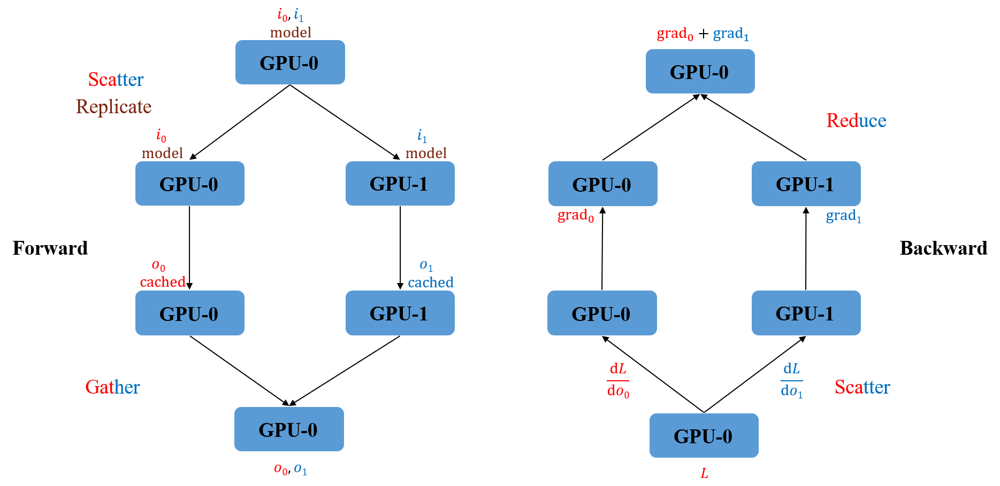
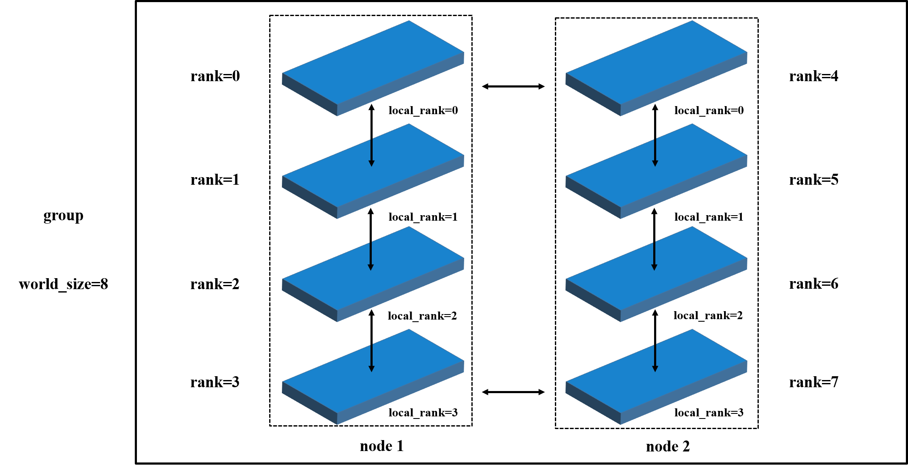
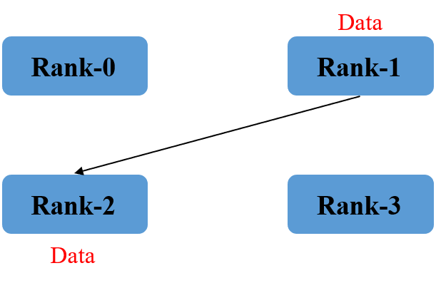
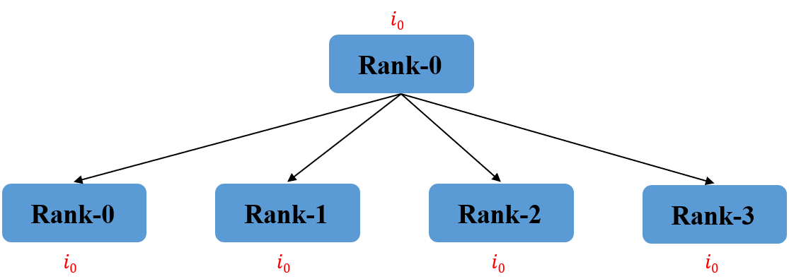
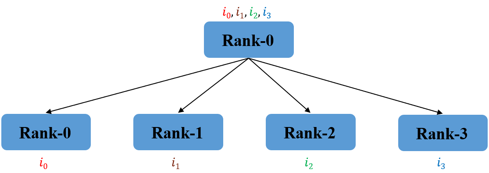
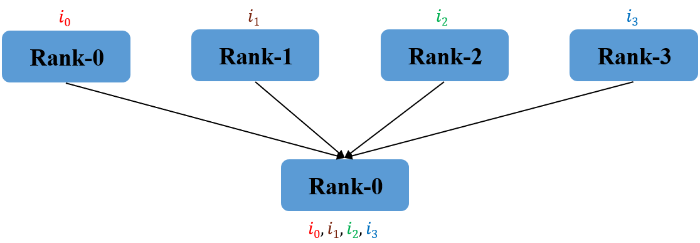
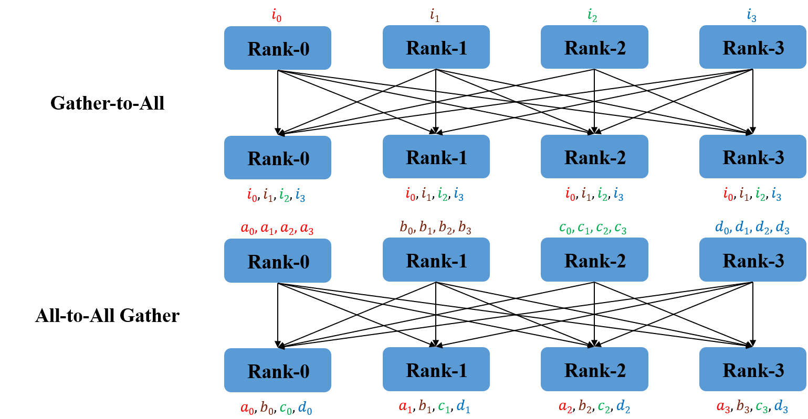
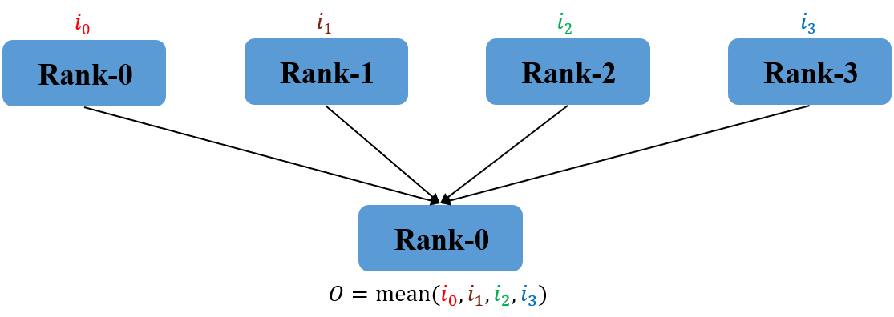
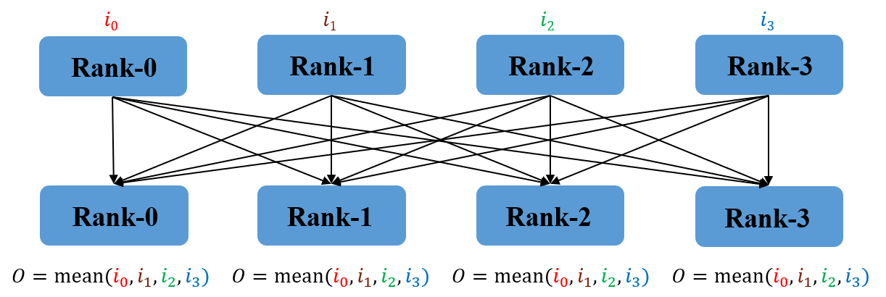
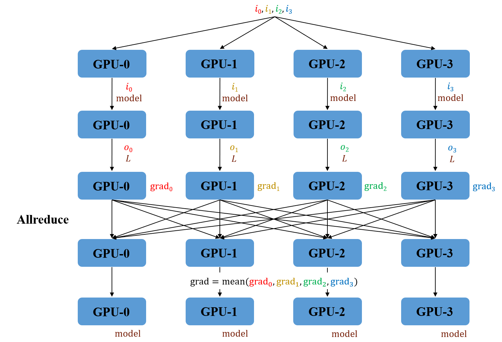

# 第7章 PyTorch与Multi-GPU 

在第5章中提到，当拥有多块GPU时，可以利用分布式计算（Distributed Computation）与并行计算（Parallel Computation）的方式加速网络的训练过程。在这里，分布式是指有多个GPU在多台服务器上，并行指一台服务器上的多个GPU。在工作环境中，使用这两种方式加速模型训练是非常重要的技能。本章将介绍PyTorch中分布式与并行的常见方法，读者需要注意这二者的区别，并关注它们在使用时的注意事项。

## 7.1 单机多卡并行

首先介绍最简单的情况，也就是单机多卡的并行计算。在使用分布式方法训练模型之前，读者应该对分布式与并行的基本原理有所了解。本节用简单的语言帮助读者理解并行的基本概念。

### 7.1.1 并行原理介绍

并行，顾名思义就是许多指令同时进行，其具体实现是将计算的过程分解为许多小部分，以并发的方式进行计算过程的交互。并行可以分为以下两种。

- 模型并行：将模型分发至不同的GPU上。例如，将网络的前几层放在第一个GPU，后几层放在另外一个GPU。

- 数据并行：将数据分发至不同的GPU上。例如，将输入数据的一部分放在第一个GPU上进行计算，剩余数据放在另外一个GPU上。

本章主要介绍数据并行的使用方法。虽然数据并行不如模型并行那么强大，但是其胜在使用简单，而且效率更高。PyTorch中的`DataParallel`模块实现了简单的数据并行功能，本节将结合该模块对并行的原理进行介绍。

`DataParallel`的封装如下：

```python
torch.nn.DataParallel(module, device_ids=None, output_device=None, dim=0)
```

它主要有以下三个参数。

- `module`：待并行化的模块。
- `device_ids`：CUDA设备（默认是本机所有的CUDA设备，可指定）。
- `output_device`：指定的输出设备（默认为device_ids[0]）。

`DataParallel`使用**单进程**控制多卡，即将模型与数据加载至多块GPU上，使用该进程控制数据的流动，从而实现并行训练。其中，`output_device`指定了最终用于梯度汇总的GPU。图7-1展示了使用`DataParallel`时数据的流动过程以及网络参数的更新过程，下面将结合该图说明`DataParallel`的并行方式。



在前向传播过程中有如下操作。

（1）GPU-0（这里默认GPU-0为指定的输出设备）将数据（$i_0$, $i_1$）划分为多个mini-batch分发（Scatter）至各GPU上，同时将模型$\text{model}$复制（Replicate）至各GPU上。

（2）各GPU并行地进行前向传播，得到结果（$o_0$, $o_1$）后缓存，同时汇集（Gather）至GPU-0。

在反向传播过程中有如下操作。

（3）GPU-0计算损失函数$L$，以及对$o_0$, $o_1$ 的梯度（$\text{d}L\over \text{d}o_0$，$\text{d}L\over \text{d}o_1$），分发至各块GPU上。

（4）各块GPU根据损失值及缓存进行反向传播，最终将对模型参数的梯度归约（Reduce）至GPU-0上。

至此，网络完成了一次反向传播，网络参数仅在GPU-0上进行更新。在下次进行前向传播之前，GPU-0将更新后的网络参数广播至各块GPU上，以完成参数的同步。在上述流程中，只需要GPU-0将数据与模型加载至多块GPU上，各GPU就可以并行地进行前向传播与反向传播，也就是说并行中的一个epoch完成了单个GPU多个epoch的工作，从而加速了模型的训练。

**注意：上述所有并行过程仅由一个进程控制**，该进程存在于指定的输出设备GPU-0上，这样的设计存在以下两个问题。

- 负载不均衡：由于每次网络参数的更新均需由其他GPU计算完成后归约至GPU-0，所以GPU-0需要更多的显存以执行额外的工作。这就导致了负载不均衡，在模型较为复杂或数据量较大时很容易显存溢出。

- 并行速率较慢：`DataParallel`基于单进程、多线程的工作方式，其速率会受到Python全局解释器锁（Global Interpreter Lock, GIL）的限制；同时，每次网络参数更新后均需由GPU-0进行广播，不同GPU之间的通信速率会大大限制整体并行计算的速率。单进程的工作方式也决定了`DataParallel`仅支持单机多卡，即要求所有GPU都存在于一台设备上，当用户具有多台设备时无法使用该模块进行并行训练。

虽然`DataParallel`的设计并不完美，但在实际使用中它的效率也不低，而且使用简单。`DataParallel`已经成为了单机多卡最常见的方法之一。

### 7.1.2 DataParallel使用示例

`DataParallel`的使用十分简单，仅需要一行代码就可以开始数据并行的单机多卡训练：

```python
model = nn.DataParallel(model.cuda(), device_ids=gpus, output_device=gpus[0])
```

下面举例说明使用`DataParallel`时，模型与数据的加载过程，读者可以在理解下述代码后构建使用`DataParallel`并行训练网络的模板：

```python
import torch
import torch.nn as nn

device = torch.device("cuda:0" if torch.cuda.is_available() else "cpu")

#定义一个toy model，用来说明并行
class Model(nn.Module):
    def __init__(self):
        super().__init__()
    def forward(self, input):
        print ("In Model:", input[0].shape, input[1].shape)
        return input

#创建模型，并将数据与模型加载至GPU上
model = Model()
if torch.cuda.device_count() > 1:
    print("You have", torch.cuda.device_count(), "GPUs!")
    model = nn.DataParallel(model)
model.to(device)

#创建数据
tensorA = torch.Tensor(17, 2).to(device)
tensorB = torch.Tensor(15, 3).to(device)
input = [tensorA, tensorB]
print("Outside:", input[0].shape, input[1].shape)
#将数据并行化输入网络
output = model(input)
```

在具有2块GPU的节点上执行上述代码，读者可以看到如下所示的结果：

```bash
You have 2 GPUs!
Outside: torch.Size([17, 2]) torch.Size([15, 3])
In Model: torch.Size([9, 2]) torch.Size([8, 3])
In Model: torch.Size([8, 2]) torch.Size([7, 3])
```

上述示例只是使用了一个简单的输入说明了数据并行划分的结果。如果使用到较为复杂的嵌套结构，那么结果可能会比较复杂，读者应该视情况进行进一步分析与处理。

总结：尽管受到单进程的限制，`DataParallel`不是利用多卡的最优选项，但是它简单易用，仍然很受欢迎。

本小节对并行的基本原理进行了介绍，并结合PyTorch的`DataParallel`模块对单机多卡并行操作进行详细说明。读者应着重理解并行计算的过程，而非如何调用API进行计算。`DataParallel`是单进程的设计模式，现在已经不被PyTorch官方推荐使用。PyTorch官方推荐更加推荐使用`DistributedDataParallel`模块，也就是分布式训练，这部分内容会在7.3节详细介绍。

## 7.2 分布式计算系统

分布式计算系统指一组设备通过网络通信彼此协同，以此完成相同任务而形成的系统。分布式系统相较于并行而言没有了单机的限制，可以在众多可通信的设备上共同协作，也就是常说的多机多卡。需要注意的是，在分布式系统中，每次启动多个进程，每一个进程都会执行`python main.py`，或者是调用某个函数`f(x)`。因为分布式系统不受Python的GIL限制，程序的运行速率会有明显提高，所以笔者更加推荐使用分布式系统训练网络。

本节的目的不是讲解如何使用PyTorch的分布式接口，而是介绍一些分布式的架构设计和消息接口。只有了解了底层原理，读者在编写分布式代码时才能够更加准确、自然与简洁。**注意：这里介绍的分布式计算系统主要是针对PyTorch的深度学习系统而言，并不是一般的分布式系统。**本节的内容分为以下两个部分。

- 系统架构：多机多卡是如何进行抽象的。

- 通信接口：多卡之间是如何进行通信的。

### 7.2.1 分布式系统架构

首先介绍一些分布式系统的基本概念，这些概念会贯穿分布式系统的整个过程。假设有两个节点，每个节点有4张显卡，可以将它抽象为如图7-2所示。



在图7-2中主要出现了以下几个基本概念。

- group：group of processes，也就是一组进程。在分布式初始化时默认只有一个组，这一概念在集群通信中广泛使用，用户一般无需在代码中配置group。
- rank：进程的唯一标识号，可用于进程间的通信，它说明了进程的优先级。其中，rank=0的进程一般为主进程。
- world_size：进程的总个数，主进程可以通过该参数知道目前共有多少进程可以使用。
- local_rank：每一台服务器内进程的标识号。例如，现在有两个节点，每个节点有4块GPU，共8块GPU，对应8个进程。这8个进程的rank取值为0\~7，在第一个节点内部，每个进程的local_rank取值为0\~3；同样，在第二个节点内部，每个进程的local_rank取值也是0~3。可以看出，rank是进程全局的唯一标识，local_rank是单台服务器内进程的唯一标识。                                                                                                                                                                                                                                                                                                                                                                                                                                                                                                                                                                                                                                                                                                                                                                                                                                                                                                                                                                                                                                                                                                                                                                                                                                                                                                                                                                                                                                                                                                                                                                                                                                                                                                                                                                                                                                                                                                                                                                                                                                                                                                                                                                                                                                                                                                                                                                                                                                                                                                                                                                                                                                                                                                                                                                                                                                                                                                                                                                                                                                                                                                                                                                                                                                                                                                                                                                                                                                                                                                                                                                                                                                                                                                                                                                                                                                                                                                                                                                                                                 

有了上述几个概念，每一个进程就知道自己在系统中的定位，在程序中可以根据每个进程的属性，给它们分配不同的工作。这些基本概念均是为分布式系统中不同进程之间的通信做准备的，下面将讲解不同进程之间是如何进行通信、协调的。

### 7.2.2 分布式消息传递接口

在分布式系统中，不同进程间需要进行通信，例如要将每个GPU计算得到的梯度进行同步。在PyTorch中，常用的通信接口/后端包括Gloo, NCCL和MPI，这三种接口的底层设计不一样，但使用十分相似。为了方便说明原理，这里主要介绍一下消息传递接口（Message Passing Interface, MPI）。MPI是一种用于并行计算机编程的通信接口，尤其适用于高性能计算中进程间的数据传递。例如，主进程可以将任务分配消息发送至其他进程，以此实现多个进程的调度分配，从而实现高性能计算。

MPI支持进程间的点对点通信（Point-to-Point Communication）和集群通信（Collective Communication）两种通信方式，目前MPI已经成为分布式系统中进程间数据交互约定俗成的标准。在学习MPI的基本操作之前，需要先安装MPI for Python（mpi4py），它提供了面向对象的接口。下面通过mpi4py来讲解MPI的原理。读者可以通过以下命令安装mpi4py：

```bash
apt install libopenmpi-dev openmpi-bin
pip install mpi4py
```

**注意：如果读者使用的是Windows系统，在使用该包前需要安装微软提供的Microsoft MPI。**

下面介绍mpi4py的一些基本操作，用于说明分布式系统中的通信接口，它并不是PyTorch使用的接口，主要是为了说明原理。 

#### 初始化

首先看下面一段代码：

```python
# Hello.py
from mpi4py import MPI
comm = MPI.COMM_WORLD 
rank = comm.Get_rank()
print("Hello world from process", rank)
```

其中`comm`称之为交流者（Communicator），它定义了进程所在组group，通过`Get_rank()`函数可以获取当前进程的标识号rank。读者可以通过`mpiexec -n 4 python Hello.py `执行上述代码。 `mpiexec` 相当于启动了4个Python进程，即代码被执行了4遍，但是每个进程会被分配不同的进程号，运行结果如下：

```
Hello world from process 1
Hello world from process 0
Hello world from process 3
Hello world from process 2
```

**注意：读者需要区分`mpiexec -n 4 python Hello.py`和`python Hello.py`的区别。**如果代码不是用`mpiexec`执行的，那么默认`rank=0, world_size=1`，即只有一个进程。

#### 点对点通信

在分布式系统中有常见的两种通信方式：点对点通信和集群通信。



点对点通信是指一个进程向另外一个进程发送数据，如图7-3所示，这是分布式系统中最基本的通信功能。在点对点通信中又可分为阻塞通信（Blocking Communications）与非阻塞通信（Nonblocking Communications）。

阻塞通信是指，当Rank-1向Rank-2发送数据时，Rank-1必须等待数据发送成功，或者送入系统缓存后才能进行下一步操作；Rank-2必须等待数据接收成功后才能进行下一步操作。用户可以通过`MPI.Comm.Send/send()`和`MPI.Comm.Recv/recv()`进行数据的阻塞式收发。

非阻塞通信是指，当Rank-1向Rank-2发送数据时，Rank-1、Rank-2均无需等待就可以进行下一步操作。非阻塞通信可以将进程本身的计算时间与进程间的通信时间重叠起来，即在完成计算的同时，交由特定的通信模块完成通信部分。非阻塞通信相比于阻塞通信而言能够大大提高整个分布式系统的运行效率。用户可以通过`MPI.Comm.Isend/isend()`和`MPI.Comm.Irecv/irecv()`进行数据的非阻塞式收发。

#### 集群通信

集群通信允许组内多个进程之间**同时**进行数据交互，相较于点对点通信而言，PyTorch中主要用到的是集群通信。常用的集群通信操作有以下几种。

- 所有组间的进程进行屏障同步（Barrier Synchronization），即保证所有进程完成先前的所有操作，再执行后续操作。

- 组间进程进行全局通信，常见包括以下三种：一个进程向组内所有进程进行数据广播；所有进程向一个进程进行数据汇集；一个进程向组内所有进程进行数据分发。
  
- 组间进程进行全局归约，具体可能包括求和（Sum）、最大值（Maximum）、最小值（Minimum）等。

下面详细介绍这些常用的集群通信操作。

- 广播：某一进程将数据复制到该进程组内的所有进程，如图7-4所示。在mpi4py中可以通过`MPI.Comm.Bcast/bcast()`进行广播操作。



- 分发：某一进程将数据进行切片，并复制到该进程组内的不同进程，如图7-5所示，读者需要注意其与广播操作的不同。在mpi4py中可以通过`MPI.Comm.Scatter/scatter()`进行分发操作。



- 汇集：每一进程将数据复制到进程组的某一个进程中，如图7-6所示，该过程是分发过程的逆过程。在mpi4py中可以通过`MPI.Comm.Gather/gather()`进行汇集操作。



与汇集类似的操作还有汇集到全局（Gather-to-All）以及全局到全局的汇集（All-to-All Gather）等，在此不再赘述，读者可参考图7-7理解它们的数据流动过程。



- 归约：对进程组内所有进程的数据进行处理，具体处理可能包括求和、求均值等，如图7-8所示。在mpi4py中可以通过`MPI.Comm.Reduce/reduce()`进行归约操作。



归约的一种变形操作是Allreduce，它与Reduce操作的主要不同在于进程组内的每一个进程都会进行相同的归约操作，如图7-9所示。



关于集群操作的更多内容可以参考mpi4py的官方文档以及MPI的相关约定，读者在掌握这些基本操作的同时应该思考如何灵活运用这些操作来搭建一个实际的分布式系统。

本小节对分布式的系统结构、通信方式及基本操作进行了简要介绍。虽然这部分内容可能略显枯燥，但是对理解分布式训练至关重要。下一小节将实际使用这些概念搭建一个简单的分布式系统，读者可以结合这些示例加深对分布式基本概念的理解。

### 7.2.3 小试牛刀：分布式计算实操演练

本小节将使用MPI对一个较大规模的数组进行以下两种操作。

- 计算每一个元素的平方。

- 计算所有元素的和。

在数组规模较大的情况下，这两种操作都较为费事，通过分布式计算可以极大地节省所需要的时间。

具体流程为，将数组进行分片，分发至每一个进程中完成计算；待计算完成后，对每一个进程的计算结果进行汇集或归约操作，得到最终结果。具体代码如下：

```python
# Matrix.py
import mpi4py.MPI as MPI
import numpy as np

# 初始化环境
comm = MPI.COMM_WORLD
rank = comm.Get_rank()
size = comm.Get_size()  # world_size

# 在rank-0初始化数据
if rank == 0:
    print(f"当前的world_size为：{size}")
    array = np.arange(8)
    splits = np.split(array, size)  # 将数据分为N份
    print(f"原始数据为：\n {array}")
else:
    splits = None

# 将数据从rank-0切片并传到其他进程
local_data = comm.scatter(splits, root=0)
print(f"rank-{rank} 拿到的数据为：\n {local_data}")

# 在每一进程求和，并将结果进行allreduce
local_sum = local_data.sum()
all_sum = comm.allreduce(local_sum, op=MPI.SUM)

# 在每个进程计算平方，并将结果allgather
local_square = local_data ** 2
result = comm.allgather(local_square)
result = np.vstack(result)

# 只在某一个进程打印结果
if rank == 1:
    print("元素和为：", all_sum)
    print("按元素平方后的结果为：\n", result)
```

读者可以通过`mpiexec -n 2 python Matrix.py`执行上述代码，结果如下：

```
当前的world_size为： 2
原始数据为：
 [0 1 2 3 4 5 6 7]
rank-0 拿到的数据为：
 [0 1 2 3]
rank-1 拿到的数据为：
 [4 5 6 7]
元素和为： 28
按元素平方后的结果为：
 [[ 0  1  4  9]
 [16 25 36 49]]
```

这个例子应用了数据的分发、汇集、归约等操作完成了一个简单的计算，读者应该重点加强对分布式常见操作的理解，并体会分布式系统“分而治之”操作的精彩之处。不难发现，在MPI的帮助下，不同进程之间的通信是比较容易的，因此读者应该侧重于理解分布式计算的思想，并将该思想应用在实际的程序设计当中。

## 7.3 PyTorch分布式训练

本节将详细介绍如何进行神经网络的分布式训练。其中7.3.1节将结合MPI介绍分布式训练的基本流程，7.3.2与7.3.3节将分别介绍如何使用`torch.distributed`以及Horovod进行神经网络的分布式训练。

### 7.3.1 使用MPI进行分布式训练

下面讲解如何利用MPI进行PyTorch的分布式训练。 这里主要介绍的是数据并行的分布式方法：每一块GPU都有同一个模型的副本，仅加载不同的数据进行训练。例如，使用两个节点，共8块GPU进行基于数据并行的分布式训练，每块GPU实际处理的batch_size为4。在前向传播完成后，每块GPU进行梯度的同步，实现参数的更新，在效果上近似于输入网络的batch_size为32。

分布式训练与之前介绍的并行训练（`DataParallel`）最大的区别在于：分布式训练同时运行多个Python程序，并行训练则是从一个Python程序中运行多个进程。在数据并行的分布式训练中，网络参数的更新遵循以下流程。

（1）在初始化时，确保每个进程的模型参数一致，每个进程维护自己的模型副本，用于进行后续的前向传播与反向传播。

（2）将数据集根据进程数划分成*N*（*N*=world_size）个互斥的子集，每一个进程在数据集副本中取得自身对应的子集（对应一个batch）进行前向传播，得到梯度。

（3）将所有进程前向传播得到的梯度进行汇总，并计算它们的平均值（进行Allreduce操作）。

（4）每一个进程独立地使用该平均值进行网络参数的更新。

（5）读取下一个batch的数据，重复上述步骤进行训练。

上述流程可以结合图7-10进行理解：不同GPU维护同一模型（$\text{model}$）的不同副本，对不同的数据（$i_o,i_1,i_2,i_3$）进行前向传播（$o_0,o_1,o_2,o_3$）与反向传播（$\text{grad}_0,\text{grad}_1,\text{grad}_2,\text{grad}_3$）。在更新参数时，所有GPU之间进行通信，求得不同数据下梯度的平均值$\text{mean}(\text{grad}_0,\text{grad}_1,\text{grad}_2,\text{grad}_3)$，从而完成模型参数的更新。



以上就是分布式训练的基本原理与流程。在分布式训练中，最重要、最核心的内容是保持不同进程中模型的一致性：首先，在初始化时，通过广播的方式进行模型的拷贝，保证网络初始参数的一致性。然后，每一个进程对不同的数据独立地进行前向传播，通过Allreduce操作归约得到不同进程梯度的平均值，以此更新网络参数。如果不同进程中的模型参数有所差异，那么每次更新参数时梯度也会有所差异，最终可能会导致模型训练的发散。

下面结合mpi4py说明PyTorch的分布式训练流程，读者需要重点掌握以下四点。

- **分解**：将数据划分成多个片段，实现数据并行。

- **同步**：不同进程之间的模型同步参数。

- **聚合**：梯度聚合，用于更新网络参数。

- **控制**：在不同的rank执行不同的操作。

```python
# MPI_PyTorch.py
import torch
import torchvision as tv
import mpi4py.MPI as MPI
import torch.nn as nn

## 第一步：环境初始化
comm = MPI.COMM_WORLD
rank = comm.Get_rank()
size = comm.Get_size()

# 这样tensor.cuda()会默认使用第rank个gpu
torch.cuda.set_device(rank)

## 第二步：准备数据
dataset = tv.datasets.CIFAR10(root="./", download=True, transform=tv.transforms.ToTensor())
# 为每一个进程划分不同的data
# X[rank::size]的意思是：从第<rank>个元素开始，每隔<size>个元素取一个
dataset.data = dataset.data[rank::size]
dataset.targets = dataset.targets[rank::size]
dataloader = torch.utils.data.DataLoader(dataset, batch_size=512)

## 第三步：构建模型
model = tv.models.resnet18(pretrained=False).cuda()
# 将随机初始化的参数同步，确保每一个进程都有与rank0相同的模型参数
for name, param in model.named_parameters():
    param_from_rank_0 = comm.bcast(param.detach(), root=0)
    param.data.copy_(param_from_rank_0)

lr = 0.001
loss_fn = torch.nn.CrossEntropyLoss().cuda()

## 第四步：训练
for ii, (data, target) in enumerate(dataloader):
    data = data.cuda()
    output = model(data)
    print("data",data.shape)
    print("output",output.shape)
    print("target",target.shape)
    loss = loss_fn(output, target.cuda())
    # 反向传播，每个进程都会各自计算梯度
    loss.backward()
    # 重点：计算所有进程的平均梯度，更新模型参数
    for name, param in model.named_parameters():
        grad_sum = comm.allreduce(param.grad.detach().cpu(), op=MPI.SUM)
        grad_mean = grad_sum / (grad_sum * size)
        param.data -= lr * grad_mean.cuda()  # 梯度下降-更新模型参数

# 只在rank-0打印和保存模型参数
if rank == 0:
    print('training finished, saving data')
    torch.save(model.state_dict(), "./000.ckpt")
```

读者可以通过`mpiexec -n 4 python MPI_PyTorch.py`执行上述代码，这里的代码更多是为了举例说明PyTorch分布式训练的基本原理，在实际进行分布式训练时应该考虑使用即将介绍的两种框架：`torch.distributed`以及Horovod。

### 7.3.2 使用torch.distributed进行分布式训练

PyTorch自身提供了`torch.distributed()`接口，以便用户进行网络的分布式训练。`torch.distributed`的底层操作使用MPI风格，在此基础上封装了一些高层接口（如`DistributedDataParallel`），本节将使用该接口构建分布式训练代码。

#### 构建

`torch.distributed()`支持Gloo、MPI以及NCCL三种通信后端，同时支持共享文件或TCP网络通信方式进行进程组的初始化。读者可以对比下面的代码和7.3.1节中基于MPI构建的例子，看看有何不同。

```python
# distributed_PyTorch.py
import torch
import torch.distributed as dist
import torchvision as tv

## 第一步：初始化
dist.init_process_group(backend='nccl')
local_rank = dist.get_rank()
# 这样tensor.cuda()会默认使用第local_rank个gpu
torch.cuda.set_device(local_rank)

## 第二步：构建数据
dataset = tv.datasets.CIFAR10(root="./", download=True, transform=tv.transforms.ToTensor())
# 为每一个进程分别划分不同的data
# DistributedSampler可以实现为每个进程分配不同的数据
sampler = torch.utils.data.DistributedSampler(dataset)
dataloader = torch.utils.data.DataLoader(dataset, batch_size=512, sampler=sampler)

## 第三步：构建模型
model = tv.models.resnet18(pretrained=False).cuda()
# 使用DistributedDataParallel封装模型，实现分布式训练
model = torch.nn.parallel.DistributedDataParallel(model, device_ids=[local_rank])
loss_fn = torch.nn.CrossEntropyLoss().cuda()

## 第四步：训练
optimizer = torch.optim.Adam(model.parameters(), lr=0.001)
for ii, (data, target) in enumerate(dataloader):
    # 确保将数据打乱（DistributedSampler使用epoch作为随机种子）
    sampler.set_epoch(ii)
    optimizer.zero_grad()
    output = model(data.cuda())
    loss = loss_fn(output, target.cuda())
    # 反向传播，每个进程都会各自计算梯度
    loss.backward()
    # 计算所有进程的平均梯度，并更新模型参数
    optimizer.step()
    
# 只在rank-0打印和保存模型参数
if local_rank == 0:
    print("training finished, saving data")
    torch.save(model.state_dict(), "./000.ckpt")
```

`DistributedDataParallel`主要实现了各个进程之间模型的同步，其大致流程如下：

```python
class DistributedDataParallel(nn.Module):
    def __init__(self, model):
        self.model = model
  
    def forward(self, input):
        # 前向传播不涉及同步操作
        return self.model(output)
    
    def backward(self, loss):
        loss.backward()
        # 在反向传播的时候多了一步梯度同步
        # 所有进程执行到这一步时，会把自己梯度同步到所有进程
        for name,param in self.model.named_parameters():
            allreduce(name, param)
      	return
```

#### 运行

使用`torch.distributed`进行启动分布式训练有以下两种方法。

- 使用`torch.distributed.launch`，例如，读者可以通过以下命令运行上面的示例：

```bash
python -m torch.distributed.launch --nproc_per_node=2  distributed_PyTorch.py
```

其中`nproc_per_node`为每个节点启动的进程数，一般设置为节点中的GPU数量。

对于多机多卡的情况（以两个节点，每个节点4块GPU，共8块GPU为例），读者可以通过以下命令启动分布式训练：

```bash
python -m torch.distributed.launch \
--nproc_per_node=4 --nnodes=2 --node_rank=0 \
--master_addr="serverA" distributed_PyTorch.py
```

其中`nnodes`为节点个数，`node_rank`为节点的唯一标识号，`master_addr`为主进程的地址。

- 使用`torch.multiprocessing`，在源代码中通过`multiprocessing.spawn`启动多个进程，感兴趣的读者可以查阅相关资料。

### 7.3.3 使用Horovod进行分布式训练

Horovod是由Uber开源的一个第三方框架，它支持TensorFlow、PyTorch以及MXNet等主流深度学习框架，可以轻松地实现高性能的分布式训练。本节将简要介绍Horovod的安装步骤，并详细介绍如何使用Horovod进行分布式训练。

#### 安装

使用Horovod最大的问题在于安装比较麻烦，但考虑到它极简的设计和优异的性能，笔者推荐使用Horovod进行分布式训练。

1. 安装CUDA和NCCL

系统很可能已经安装了CUDA和NCCL，但尚未添加至环境变量`PATH`当中。读者可以执行`locate -i nccl` 或者 `find /usr/|grep -i nccl` 获取NCCL的安装路径。 如果该命令返回为空，那么读者需要查阅相关资料进行安装，**需要注意的是CUDA的版本必须与`torch.version.cuda`一致。**

2. 安装Horovod

在完成上述配置后，可以正式开始Horovod的安装了，命令如下：

```bash
HOROVOD_NCCL_HOME=/usr/local/nccl-2 HOROVOD_CUDA_HOME=/usr/local/cuda HOROVOD_GPU_OPERATIONS=NCCL pip install --no-cache-dir horovod
```

重要的是要确保  `<HOROVOD_CUDA_HOME>/bin/nvcc` 和`<HOROVOD_NCCL_HOME>/lib/` 这两个路径存在。

安装完成后，读者可以在Python环境下测试是否已经成功安装Horovod：

```python
import horovod.torch as hvd
hvd.init()
```


关于Horovod安装的更多问题，读者可以参考官方的GitHub （Horovod on GPU），也可以根据官方提供的conda方式安装Horovod，这样可以有效避免许多问题。

#### 构建

下面将使用Horovod+NCCL构建分布式训练代码。 NCCL可以看成GPU版本的更强大的MPI，而Horovod可以看作PyTorch版本的mpi4py。读者可以对照下面的代码和7.3.1节中基于MPI构建的例子，看看有何不同。

```python
# Horovod_PyTorch.py
import horovod.torch as hvd
import torch
import torchvision as tv

## 第一步：初始化
hvd.init()
size = hvd.size()
rank = hvd.rank()
local_rank = hvd.local_rank()
# 这样tensor.cuda()会默认使用第local_rank个gpu
torch.cuda.set_device(local_rank)

## 第二步：构建数据
dataset = tv.datasets.CIFAR10(root="./", download=True, transform=tv.transforms.ToTensor())
# 为每一个进程分别划分不同的data
# DistributedSampler可以实现为每个进程分配不同的数据
sampler = torch.utils.data.DistributedSampler(dataset, num_replicas=size, rank=rank)
dataloader = torch.utils.data.DataLoader(dataset, batch_size=512, sampler=sampler)

## 第三步：构建模型
model = tv.models.resnet18(pretrained=False).cuda()
# 将初始化的参数同步，确保每一个进程都有与rank0相同的模型参数
hvd.broadcast_parameters(model.state_dict(), root_rank=0)

loss_fn = torch.nn.CrossEntropyLoss().cuda()

## 第四步：训练
optimizer = torch.optim.Adam(model.parameters(), lr=0.001)
optimizer = hvd.DistributedOptimizer(optimizer, named_parameters=model.named_parameters())
for ii, (data, target) in enumerate(dataloader):
    # 确保将数据打乱（DistributedSampler使用epoch作为随机种子）
    sampler.set_epoch(ii)
    optimizer.zero_grad()
    output = model(data.cuda())
    loss = loss_fn(output, target.cuda())
    # 反向传播，每隔进程都会各自计算梯度
    loss.backward()
    # 计算所有进程的平均梯度，并更新模型参数
    optimizer.step()

# 只在rank0打印和保存模型参数
if rank == 0:
    print("training finished, saving data")
    torch.save(model.state_dict(), "./000.ckpt")
```

`DistributedOptimizer`主要实现了以下两个功能。

- 对于需要求导的参数，注册钩子函数，这些参数在计算完梯度后马上进行非阻塞通信，以同步梯度。

- 在执行梯度下降更新参数之前，确保所有的梯度同步都已经完成。

其大致流程如下：

```python
class DistributedOptimizer(Optimizer):
    def __init__(self, optimizer, params):
        self.optimizer = optimizer
        
        # 注册钩子函数，这样在反向传播的时候，会自动同步梯度
        for param in params:
            param.register_backward_hook(lambda tensor: hvd.allreduce(tensor))

    def step(self):
        wait_for_all_reduce_done()
        self.optimizer.step()
```

#### 运行

Horovod对mpirun接口进行了封装，也就是`horovodrun`，用于实现多个进程之间的通信。使用`horovodrun`启动分布式训练的代码如下。

- 单节点，共4块GPU：

  ```bash
  horovodrun -np 4 python main.py
  ```

  例如，读者可以通过以下命令运行上面的示例：

  ```bash
  horovodrun -np 2 python Horovod_PyTorch.py
  ```

- 两个节点，每个节点4块GPU，共8块GPU：

  ```bash
  horovod -np 8 -H serverA:4,serverB:4 python main.py
  ```

  其中通过`-H`指明了两个节点的地址，以及分别可用的GPU数量。

无论是`torch.distributed()`还是Horovod，它们都是MPI世界下针对分布式训练封装的框架，二者均提供了分布式训练中的基本操作，至于选择使用哪个框架是一个见仁见智的问题。读者应该重点掌握分布式训练的基本流程，灵活使用分布式方法加速神经网络的训练。

## 7.4 分布式训练中的注意事项

本章前3节介绍了分布式系统的基本概念，并详细介绍了如何将分布式计算应用到神经网络的训练中，读者在阅读上述内容后应该可以对分布式计算建立一个基本的认识。然而，在实际进行网络的分布式训练时，读者可能遇到各式各样的问题，本节将对其中经典的问题进行概括，并给出一些解决这些问题的提示。

### 7.4.1 保持同步

分布式系统的核心思想是分而治之，即通过增加计算进程的个数，多个进程共同协作，彼此通信，以此提高程序整体的计算速率。具体到分布式训练中，每一个进程上均会加载同一个模型，读取不同数据进行前向传播与反向传播。在参数更新时，需要对每一进程的梯度求均值，从而学习到不同数据中的信息，这需要不同进程之间进行通信。上述流程成功执行的关键是不同进程之间保持严格的同步，具体而言读者需要注意以下两个方面。

- 各个进程的模型是否完全相同。在最常见的数据并行模式下，每一个进程上会加载完全相同的模型，每一个进程仅是对不同的数据进行处理而已。若分布式训练的性能相较于单卡出现了明显差异，读者应仔细检查每一个进程上是否加载了相同的模型。

- 各个进程的参数是否完全相同。在分布式训练中，首先会对模型参数与优化器参数进行广播，并保证所有进程之间的严格同步。因此，若读者在训练过程中手动对一些参数进行了修改、替换甚至新增或删除了一些参数，应记得手动对其进行广播，否则模型的训练将会出错。

以上两个方面虽然十分基础，但是保证了分布式训练的正常进行。简而言之，分布式系统最为核心的理念是共同协作以加快整体的工作效率，其核心也是进程间的协调与同步，只有在多个进程保证同步的情况下才能真正实现分布式计算。

### 7.4.2 进程协作

多个进程之间的协调与同步是分布式计算的核心。在分布式计算中，同样的代码会在不同的进程中执行。如果需要所有进程进行参数的同步（例如，使用Allreduce操作对不同GPU上的梯度进行平均等），那么相关代码需要在全部进程上运行，否则程序会陷入无限的等待中，不会报错，难以调试。下面对进程间协作中最常见的两种情况进行说明。

- 相关操作仅在某一个进程中执行。该种情况在模型可视化、持久化时最为常见。

```python
# 调用Tensorboard进行Acc与Loss的可视化，关于Tensorboard的使用请参考本书第5章
if rank == 0:
    logger = SummaryWriter('train')
    logger.add_scalar('Loss/train', train_loss, epoch+1)
    logger.add_scalar('Acc/train', train_acc, epoch+1)
```

- 在rank-0中首先执行某操作，其他进程需等待该操作执行完成后再执行其他操作。

```python
# 错误代码
if rank == 0:
    # 创建一个文件夹
    os.makedirs('/path/to/logdir')

# 每个进程都把当前的输入写入log
logger = Logger(f'/path/to/logdir/{rank}.log')
```

上述代码可能会报错，这是因为文件夹可能还没有创建好，其他rank就执行到了创建logger这一步，导致IO出错。因此，如果希望在rank-0创建完文件夹后，其他进程再写入文件，可以通过下述代码实现：

```python
if rank == 0:
    os.makedirs('/path/to/logdir')

# 所有的进程要在此同步一次，因此会等待rank-0完成上一步
_ = hvd.allreduce(torch.Tensor(), name='barrier')

logger = Logger(f'/path/to/logdir/{rank}.log')
```

在上述两种情况中，读者可以灵活地进行进程间的协作。然而，在进程协作中，读者可能还会遇到很多问题，下面再举两个例子进行说明：

```python
# 错误，某些进程可能会因为if判断跳过backward，导致其他进程一直等待，不会报错
for data in dataloader:
    if data is None:
        # 可能有些数据有问题，跳过这次forward
        continue

    loss = forward()
    loss.backward()
    optimizer.step()
```

```Python
# 只在rank-0初始化，然后同步到其他进程
if rank==0:
    b = load_checkpoint()
# 错误，在其他进程中, 变量b未定义，会报错
b = broadcast(b, root=0)
```

在这两个例子中，出错的原因均是因为在编写代码或者进行计算时，不同进程之间未能保持同步，导致整个程序不能正常工作。这类问题可能很难发现，这里只是列举了部分情况，在实际遇到时读者需要根据实际情况具体分析。

### 7.4.3 常用调试技巧

在编写分布式训练代码时，不仅需要调试单个进程上独立的操作（例如，每个进程独立地进行前向传播等），还需要调试进程间同步与协作的代码（例如，多个进程之间同步梯度），这样才可以保证分布式训练的正常运行。

对于单个进程上独立的操作，读者可以先在单机单卡上运行代码，确保没有问题，具体如下。

- 对于`torch.distributed`而言，可以通过`CUDA_VISIBLE_DEVICES=0 python -m torch.distributed.launch --nproc_per_node=1 main.py`在单机单卡上执行代码，并使用`ipdb`进行调试。
- 对于Horovod而言，可以直接通过`python main.py`在单机单卡上执行代码，并使用`ipdb`进行调试。

在确保每个进程执行的操作没有问题后，可以尝试先在较小的集群上（例如，单个节点启动两个进程，两个节点启动两个进程等）启动分布式训练，以此验证进程间的同步与协作是否出错，这样的操作可以降低复现错误、调试程序的成本。在确保进程间可以正常协作后，再在较大规模的集群上启动分布式训练。

至此，本节对分布式系统的一些注意事项进行了简要介绍。这些内容或许不能覆盖到读者遇到的所有问题，但读者可以结合这部分内容进一步加深对分布式系统的理解。读者只有对分布式系统建立了足够的认识，才能灵活解决分布式系统中可能遇到的各种问题。

### 7.4.4 进阶扩展

上文对分布式训练的基本概念以及使用方法进行了介绍，读者应重点掌握分布式训练的基本原理，并尝试在实际工程中应用分布式计算加速训练。下面对分布式训练中的一些进阶扩展进行简要介绍，读者可以根据这些提示查找相关资料，进行深入学习。

- 跨卡批标准化。批标准化（Batch Normalization）是一种常见且有效的模型训练技巧，它使得模型不再过度依赖于初始化，同时提供了有效的正则项防止过拟合。分布式训练等价于增大了一次训练的batch_size，传统的批标准化仅是对一个batch上的数据进行操作，在分布式训练中不同进程对不同的数据进行操作，相当于每一个进程的BN层处理的batch\_size明显变小。如果在分布式训练中直接使用BN层，那么很难取得与单卡近似的结果，因此，需要跨卡批标准化操作对不同进程处理的数据进行通信，这一操作在`torch.distributed`与Horovod中均已封装。

- 如何合理设置batch_size与学习率。在分布式训练中，当使用的GPU数目变多时，训练可能更难收敛，同时模型的性能相较于单机单卡也有一定下降。这是因为分布式训练相当于增大了训练的batch_size，在一个epoch中参数更新的次数会变少。如果直接增大学习率，那么不同进程得到的梯度可能差异较大，这不利于模型的收敛。因此，有学者研究出了Adasum算法用于解决这一问题，这一操作在Horovod中已经封装。

- 进程的不正常工作。在分布式训练中，不同进程之间需要通信来完成参数的汇总更新，因此进程间的同步是至关重要的。如果某些进程发生故障，那么整个分布式训练将无法进行，因为所有进程都在等待故障进程的响应以保持同步。`torch.distributed`与Elastic Horovod均针对这一情况进行了考虑，一旦某些进程发生了故障，或者可用进程数发生了改变，程序会自动、动态地进行调整。

- 使用Apex进一步加速分布式训练。Apex是NVIDIA开源的一个用于混合精度训练的分布式框架，它针对GPU底层通信的NCCL通信后端进行了优化。用户可以在`torch.distributed`以及Horovod的基础上使用Apex进一步加速分布式训练。

关于分布式训练还有许多扩展与技巧，读者可以在本章内容的基础上进一步思考，从而更好地应用分布式训练这一工具。

##  7.5 小结

本章对PyTorch中的多卡训练方式：分布式与并行进行了详细介绍。读者首先应明确并行与分布式的区别：对于并行而言，一般使用单进程控制多卡；在分布式中，每一块GPU都对应一个进程。其次，本章对消息传递接口MPI的基本概念进行了介绍，并介绍了基于此风格的两种常用分布式训练工具：`torch.distributed()`和Horovod。最后，本章总结了分布式训练中一些常见的注意事项与进阶扩展。


