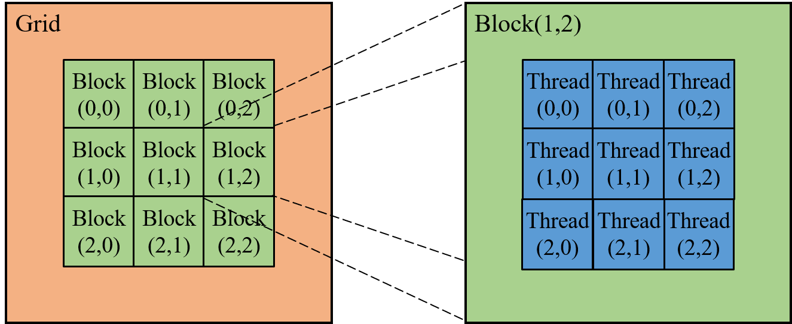
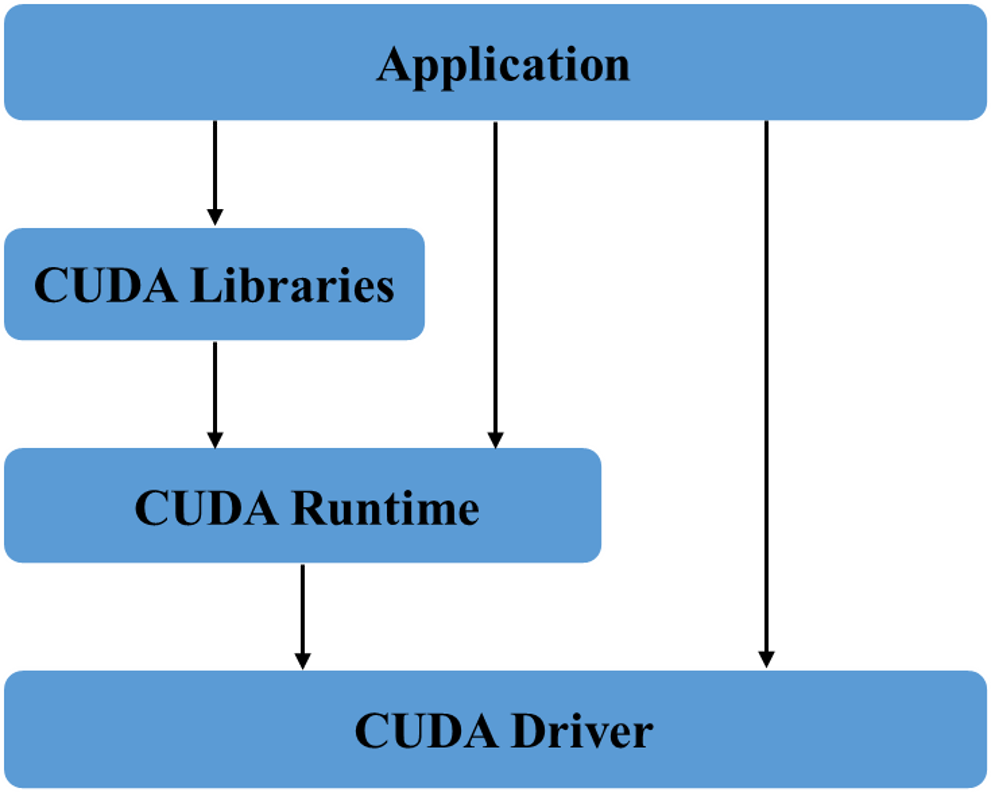

# 第8章 CUDA扩展与编译

第5章介绍了如何使用GPU对PyTorch中的操作进行加速，如果需要自己实现一个较为复杂的操作，但无法直接使用GPU进行加速，这时应该怎么办呢？答案是使用本章介绍的C++扩展和CUDA扩展。本章将用一个示例讲解C++扩展和CUDA扩展的具体流程操作，并在Python中调用该扩展，测试其正确性和性能。同时，本章介绍了CUDA运行版本和编译版本之间的关系以及cuDNN的使用方法。

## 8.1 PyTorch C++ Extension 简介

目前，PyTorch已经实现了很多的函数功能，在某些场景下仍然需要使用C++或CUDA自定义一些操作，这些场景主要包括以下两种。

- PyTorch尚未支持的操作。

- PyTorch对该操作的实现还不够高效。例如，该功能可以通过循环调用PyTorch函数实现，这样的实现方式在反向传播时效率较低。

对于这些场景，可以通过编写C++扩展或CUDA扩展的方式实现特定的功能，从而达到更加高效的计算效率，加速网络的训练。

### 8.1.1 C++ 扩展

C/C++在开销上相比Python而言具有天然的优势，因此，对于一些复杂的操作而言，可以将这些操作通过C/C++实现，再通过Python调用。同时，在实现C++扩展时，用户可以自定义反向传播函数，而不是使用PyTorch的autograd自动生成，这种做法效率更高。下面将举例说明如何编写PyTorch的C++扩展，并对比它们在反向传播中的差距。本小节的示例函数是Sigmoid函数的变形$f(x)=\frac{\text{e}^{-x}}{1+\text{e}^{-x}}$，这里会实现它的前向传播和反向传播过程，并比较它们的性能。本小节的例子不涉及CUDA代码，主要为了讲解如何使用PyTorch的C++接口。

实现C++扩展可以分为以下三步。

（1）定义并实现C++函数，使用pybind11生成函数的CPython接口。

（2）使用`setuptools`编译安装。

（3）自定义`autograd.Function`调用该函数的CPython接口，后续可在`nn.Module`中使用该Function。

整个工程的文件目录如下：

```
|__ CppExtension
	|—— src
		|—— MySigmoid.h
		|__ MySigmoid.cpp
	|__ setup.py
```

首先，编写C++的头文件`MySigmoid.h`，定义前向传播和反向传播函数。这里使用了`torch/torch.h`头文件，它是一个一站式头文件，其中包含了张量计算接口库`ATen`、绑定C++和Python的`pybind11`方法（使用前需在Python环境下通过命令`pip install pybind11`进行配置）以及管理`ATen`和`pybind11`的其他文件。

```c++
// ./src/MySigmoid.h
#include<torch/torch.h>

// 前向传播 过程中用到了参数x
// 定义f(x)=e^-x/1+e^-x
at::Tensor MySigmoidForward(const at::Tensor& x);
// 反向传播 过程中用到了回传梯度和f(x)的结果
at::Tensor MySigmoidBackward(const at::Tensor& fx, const at::Tensor& grad_out);
```

接着，需要将前向传播和反向传播的整个过程实例化为C++代码，并使用`pybind11`将C++创建的函数绑定在Python上。其中，`PYBIND11_MODULE`中的宏`TORCH_EXTENSION_NAME`会被定义为`setup.py`脚本中的扩展名。这里保证输入是二维数据，计算过程中不直接使用相应的函数，而是用for循环去实现（注释中的非for循环形式代码为优化后的计算过程），用于验证C++扩展对于计算图的优化。C++部分的代码如下：

```C++
// ./src/MySigmoid.cpp
#include "MySigmoid.h" // 导入头文件
#include <math.h>

// 前向传播函数，注意Tensor的shape要一致
at::Tensor MySigmoidForward(const at::Tensor& x){
    at::Tensor fx = at::zeros(x.sizes());
    for(int i=0; i < fx.size(0); i++){
        for(int j=0; j < fx.size(1); j++){
            fx[i][j] = exp(-x[i][j]) / (1 + exp(-x[i][j]));
        }
    }
//    非for循环形式，直接替换上面for循环即可
//    fx = exp(-x) / (1 + exp(-x)); 
    return fx;
}

// 反向传播函数，grad_out是上一级梯度回传的值，根据链式法则需要乘上去
at::Tensor MySigmoidBackward(const at::Tensor& fx, const at::Tensor& grad_out){
    at::Tensor grad_x = at::ones(grad_out.sizes());
    for(int i=0; i < grad_x.size(0); i++){
        for(int j=0; j < grad_x.size(1); j++){
            grad_x[i][j] = fx[i][j] * (fx[i][j] - 1) * grad_out[i][j];
        }
    }
//    非for循环形式，直接替换上面for循环即可
//    grad_x = fx * (fx - 1) * grad_out * at::ones(grad_out.sizes());
    return grad_x;
}

// 绑定C++函数到python上，TORCH_EXTENSION_NAME即为setup.py中setup定义的name
PYBIND11_MODULE(TORCH_EXTENSION_NAME, m) {
  m.def("forward",  &MySigmoidForward,  "mysigmoid forward" );
  m.def("backward", &MySigmoidBackward, "mysigmoid backward");
}
```

最后，利用`setuptools`中的`setup`工具完成对C++代码的编译和C++扩展的构建。当构建完成后，C++的扩展将被命名为`mysigmoid`，以后在Python中就能直接调用这个模块了。

```python
# ./setup.py
from setuptools import setup
import os
from torch.utils.cpp_extension import BuildExtension, CppExtension

# 头文件目录
include_dirs = "./src"
# 源代码目录
source = ["./src/MySigmoid.cpp"]

setup(
    name='mysigmoid',  # 模块名称，宏TORCH_EXTENSION_NAME的值
    version="0.1",
    ext_modules=[CppExtension('mysigmoid', sources=source, include_dirs=[include_dirs]),],
    cmdclass={'build_ext': BuildExtension}
)
```

读者可以在`setup.py`的目录下运行`python setup.py install`命令，即可完成这个C++模块的编译构建。该模块最后会安装在对应Python环境下的site-packages中，读者若看到如下输出则表示该模块构建成功：

```
Installed /home/admin/.conda/envs/torch1.8/lib/python3.6/site-packages/mysigmoid-0.1-py3.6-linux-x86_64.egg
Processing dependencies for mysigmoid==0.1
Finished processing dependencies for mysigmoid==0.1
```

在这里官方文档强调了编译时的版本问题：用于构建C++扩展的编译器必须与ABI兼容，同时这里的编译器必须与构建PyTorch时采用的编译器一样，即必须在Linux上使用4.9及更高版本的GCC。

下面编写一个测试函数，来验证刚刚构建的C++扩展以及它的性能。**注意：在调用自定义C++扩展模块之前需要先导入PyTorch包（`import torch`），否则会报错。**

```python
import torch # 提前导入PyTorch包
from torch.autograd import Function
from torch.nn import Module
import mysigmoid  # 导入编写的扩展
import time

# 将扩展的前向传播和反向传播封装为一个Function对象
class MySigmoid(Function):
    @staticmethod
    def forward(ctx, x):
        fx = mysigmoid.forward(x)
        vars = [fx] # 保存中间变量
        ctx.save_for_backward(*vars)
        # 必须使用*vars的形式，不能使用ctx.save_for_backward(fx)
        return fx

    @staticmethod
    def backward(ctx, grad_out):
        grad_x = mysigmoid.backward(*ctx.saved_tensors, grad_out)
        # 必须将mysigmoid.backward返回值解耦后单独返回，不然是一个对象
        return grad_x

# 构建用于测试的示例类Test
class Test(Module):
    def __init__(self):
        super().__init__()

    def forward(self, x):
        # apply方法直接调用
        return MySigmoid.apply(x)

# 测试C++扩展输出是否正确
def checkResult():
    # 调用model时必须保证是二维数据
    x1 = torch.arange(2, 12).view(2, 5).float().requires_grad_()
    model = Test()
    fx1 = model(x1)
    fx1.sum().backward()

    x2 = torch.arange(2, 12).view(2, 5).float().requires_grad_()
    fx2 = torch.exp(-x2) / (1. + torch.exp(-x2))
    fx2.sum().backward()

    assert fx1.equal(fx2)
    assert x1.grad.allclose(x2.grad)
```

运行测试函数`checkResult()`的时候，如果没有抛出异常，那么表示自定义的C++扩展与直接使用PyTorch反向传播的结果一致。在配套代码`Chapter8/CppExtension/test.py`文件中，运行测试函数`compare_pytorch_with_cpp()`，可以比较C++扩展与使用for循环进行反向传播的性能差异。使用autograd计算梯度的公式如式(8-1)所示：

$$
f^{\prime}(x)=\frac{\left(1+\text{e}^{-x}\right)\left(\frac{\text{d}}{\text{d}x}\left(\text{e}^{-x}\right)\right)-\text{e}^{-x}\left(\frac{\text{d}}{\text{d} x}\left(1+\text{e}^{-x}\right)\right)}{\left(1+\text{e}^{-x}\right)^{2}}\tag{8-1}
$$
使用autograd直接生成计算图的计算公式是不会化简的，计算时会按照式(8-1)的形式逐步进行计算。使用C++扩展可以手动优化该计算过程，优化后的梯度计算公式如式(8-2)所示：
$$
f^{\prime}(x)=f(x)\times (f(x)-1)\tag{8-2}
$$
测试函数`compare_pytorch_with_cpp()`的性能比较结果如下所示：

```
cpp extension forward time: 61.44543814659119
cpp extension backward time: 55.58434247970581
PyTorch for_loop forward time: 195.94377946853638
PyTorch for_loop backward time: 1201.0588443279266
pytorch forward time: 0.007752418518066406
pytorch backward time: 0.013411998748779297
```

由此可见，使用C++扩展可以对计算图进行优化，大大降低反向传播中计算梯度时的计算量，提高模型的性能。相比于PyTorch的循环而言，C++扩展的性能更优，尤其体现在反向传播过程中。**需要注意的是，C++扩展中仍然使用for循环处理前向传播和反向传播的计算过程，相较于直接使用PyTorch向量化运算的结果，性能远逊于后者。**

### 8.1.2 CUDA扩展

8.1.1节主要介绍了PyTorch的C++扩展方式，当扩展中包含大量的逐点运算和矩阵运算时，C++扩展的性能依旧有限。在这种情况下可以使用CUDA扩展的方式，对CUDA内核进行自定义，像C++扩展一样自行编写前向传播和反向传播部分的代码，将逐点运算和矩阵运算放进CUDA内核中进行融合和并行化，进一步提升程序的性能。

编写CUDA扩展的流程和C++扩展类似，首先需要编写一个C++文件用于定义Python中会调用的函数，使用`pybind11`将这些函数绑定在Python上。同时，在CUDA文件中定义的函数也会在该C++文件中进行声明，然后将调用转发给CUDA函数。最后，编写一个CUDA（以`.cu`为后缀结尾）文件自定义实际的CUDA内核，这里面将使用一些CUDA语法，稍后会简要介绍。下面将使用CUDA扩展重写C++扩展的示例。

首先使用C++编写Python调用的函数：

```c++
// ./src/MySigmoidCUDA.cpp
#include <torch/torch.h>

// 定义检查输入数据的宏
#define CHECK_CUDA(x) AT_ASSERTM(x.type().is_cuda(), #x "must be a CUDA tensor")
#define CHECK_CONTIGUOUS(x) AT_ASSERTM(x.is_contiguous(), #x "must be contiguous")
#define CHECK_INPUT(x) CHECK_CUDA(x); CHECK_CONTIGUOUS(x)

// CUDA接口函数
at::Tensor sigmoid_cuda_forward(at::Tensor& x);
at::Tensor sigmoid_cuda_backward(at::Tensor& fx, at::Tensor& grad_out);

at::Tensor sigmoid_forward(at::Tensor& x){
    CHECK_INPUT(x);
    return sigmoid_cuda_forward(x);
}

at::Tensor sigmoid_backward(at::Tensor& fx, at::Tensor& grad_out){
    CHECK_INPUT(fx);
    CHECK_INPUT(grad_out);
    return sigmoid_cuda_backward(fx, grad_out);
}

// 绑定C++函数到python上
PYBIND11_MODULE(TORCH_EXTENSION_NAME, m) {
  m.def("forward", &sigmoid_forward, "sigmoid forward(CUDA)");
  m.def("backward", &sigmoid_backward, "sigmoid backward(CUDA)");
}
```

接下来是CUDA扩展的核心部分，即编写CUDA内核。在编写相关代码前，先简要介绍一些CUDA内核的组成。因为CUDA中有很多的核心在多线程执行运算，所以在调用函数时需要指明使用哪些线程。CUDA将一个kernel分为三级：Grid，Block和Thread。如图8-1所示，这里的Grid和Block暂时考虑为二维情况（大部分使用的时候都是二维的），它们都是`dim3`类型的变量。`dim3`类型可以看做一个无符号的整数三元组`(x,y,z)`组成，初始化时将其部分定义为1就可以轻松的实现`1-dim`，`2-dim`以及`3-dim`结构。



完成Grid和Block的定义后，每一个线程的全局ID可以通过一组坐标来进行唯一的标识：`(blockIdx, threadIdx)`，基于这一组唯一标识可以为不同的核心分配相对应的输入，并在线程中完成计算后输出到对应的位置。其中`blockIdx`表明了Block在Grid中的位置，`threadIdx`表明了线程在Block中的位置，例如图8-1中Block(1,2)里的Thread(2,1)就可以表示为：

```
threadIdx.x = 2
threadIdx.y = 1
blockIdx.x = 1
blockIdx.y = 2
```

同时，通常还需要把一个线程在Block中的全局ID从多维的Tensor转换为一维的形式。该操作类似于计算一个reshape后的Tensor在某一个位置的元素对应于底层Storage的偏移量，在这里对于一个二维的Block，形如`(blockDim.x, blockDim.y)`，线程`(x,y)`的ID值可以表示为`x+y×blockDim.x`。

此外，CUDA的多线程计算在逻辑层和物理层上还有一些区别。当一个kernel启动多个线程的时候，所有的线程就称为一个Grid，再把这个Grid分成多个线程块（Block），这些线程在逻辑上是并行的，但是在物理层上却不一定。GPU硬件的核心组件是流式多处理器（SM），它包含着一些CUDA核心、共享内存和寄存器。当一个kernel在执行的时候，Grid中的线程块会被分配到SM上（一个SM可以调度多个线程块，但是一个线程块只能由一个SM调度），由于SM同时处理的线程数量是有限的，所以一个kernel下的所有线程在物理层上不一定是同时并发的。因此，在编写核函数的时候，需要有效利用线程的序列号来分配计算任务，尽量平均的将计算量分给各个线程进行计算。如果程序的计算量超过了线程的数量，系统将循环地将任务分配给线程，完成最终的计算任务。kernel凭借这种线程的组织结构，在矩阵运算上十分高效。

在CUDA中还有几种特殊的声明方式。

- \_\_global\_\_：异步模式，在CPU中调用，在GPU上执行，CPU不会等待kernel执行完就服执行下一步。
- \_\_device\_\_：从GPU调用函数，然后在GPU中执行，不可与\_\_global\_\_同时使用。
- \_\_host\_\_：同步模式， 从CPU上调用在CPU中执行，一般可以省略不写。

大致了解完CUDA编程后，下面继续完成CUDA内核部分代码编写：

```c++
// ./src/MySigmoidKernel.cu （注意后缀名是.cu）
#include <ATen/ATen.h>
#include <cuda.h>
#include <cuda_runtime.h>
#include <vector>
#include <stdio.h>

#define THREADS 1024

// scalar_t是一个宏，特化的时候会传入具体的类型，下面调用的时候会实例化为at::Tensor
// 定义前向传播的cuda内核
template <typename scalar_t>
__global__ void sigmoid_cuda_forward_kernel(scalar_t* x, scalar_t* fx, const int state_size) {
    const uint32_t index = threadIdx.x + blockDim.x * blockIdx.x;
    if(index < state_size){
        // f(x)=e^-x/1+e^-x
        fx[index] = expf(-x[index]) / (1. + expf(-x[index]));
    }
}

// 定义反向传播的cuda内核
template <typename scalar_t>
__global__ void sigmoid_cuda_backward_kernel(scalar_t* fx, scalar_t* grad_fx, scalar_t* grad_x, const int state_size) {
    const uint32_t index = threadIdx.x + blockDim.x * blockIdx.x;
    if(index < state_size){
        // f'(x)=f(x)(f(x)-1)
        grad_x[index] = fx[index] * (fx[index] - 1) * grad_fx[index];
    }
}

// 前向传播函数，返回值是前向计算的结果
__host__ at::Tensor sigmoid_cuda_forward(at::Tensor& x) {
    auto fx = x.clone();
    const int state_size = x.numel();
    const int nblocks = (state_size + THREADS - 1) / THREADS;
    // forward kernel调用，使用参数按照引用传递的匿名函数
    AT_DISPATCH_FLOATING_TYPES(x.type(), "sigmoid_forward_cuda", ([&] {
        sigmoid_cuda_forward_kernel<scalar_t><<<nblocks, THREADS>>>(
            x.data<scalar_t>(),
            fx.data<scalar_t>(),
            state_size);
  }));

  return fx;
}

// 反向传播函数，返回值是回传梯度
__host__ at::Tensor sigmoid_cuda_backward(at::Tensor& fx, at::Tensor& grad_fx) {
    auto grad_x = grad_fx.clone();
    const int state_size = fx.numel();
    int nblocks = (state_size + THREADS - 1) / THREADS;
    // backward kernel调用  使用参数按照引用传递的匿名函数
    AT_DISPATCH_FLOATING_TYPES(grad_fx.type(), "sigmoid_backward_cuda", ([&] {
        sigmoid_cuda_backward_kernel<scalar_t><<<nblocks, THREADS>>>(
            fx.data<scalar_t>(),
            grad_fx.data<scalar_t>(),
            grad_x.data<scalar_t>(),
            state_size);
  }));

  return grad_x;
}
```

在完成C++绑定Python函数以及CUDA内核编写过后，接下来需要利用setuptools（构建扩展时还可以采用JIT进行实时扩展，在这里依然采用setuptools的方式进行）完成对C++和CUDA代码的编译以及CUDA扩展的构建。与C++扩展不同，CUDA扩展使用`CUDAExtension`进行扩展。

```python
# ./setup.py
from setuptools import setup
from torch.utils.cpp_extension import BuildExtension, CUDAExtension

setup(
    name='mysigmoid2', # 模块名称，用于import调用
    ext_modules=[
        CUDAExtension('mysigmoid2', [
            './src/MySigmoidKernel.cu',
            './src/MySigmoidCUDA.cpp',
        ]),
    ],
    cmdclass={
        'build_ext': BuildExtension
    })
```

现在，整个工程的目录如下所示：

```
|__ CUDAExtension
	|—— src
		|—— MySigmoidKernel.cu
		|__ MySigmoidCUDA.cpp
	|__ setup.py
```

与C++扩展一样，在`setup.py`的目录下运行`python setup.py install`，即可完成这个CUDA扩展的构建，最后会安装在Python的site-packages中，看到如下代码表示构建成功：

```
Installed /home/admin/.conda/envs/torch1.8/lib/python3.6/site-packages/mysigmoid2-0.0.0-py3.6-linux-x86_64.egg
Processing dependencies for mysigmoid2==0.0.0
Finished processing dependencies for mysigmoid2==0.0.0
```

同样地，在当前目录下编写一个`test.py`文件，验证刚刚构建的CUDA扩展是否成功，这部分测试代码与C++扩展中的类似。

```python
# ./test.py
import torch
from torch.autograd import Function
from torch.nn import Module
import mysigmoid2  # 导入编写的扩展
import time

# 将扩展的前向传播和反向传播封装为一个Function对象
class MySigmoid(Function):
    @staticmethod
    def forward(ctx, x):
        fx = mysigmoid2.forward(x)
        vars = [fx] # 保存中间变量
        ctx.save_for_backward(*vars)
        return fx

    @staticmethod
    def backward(ctx, grad_out):
        grad_out = grad_out.contiguous()
        grad_x = mysigmoid2.backward(*ctx.saved_tensors, grad_out)
        return grad_x

# 定义测试模型
class Test(Module):
    def __init__(self):
        super().__init__()

    def forward(self, x):
        return MySigmoid.apply(x)

def main():
    x2 = torch.randn(4).requires_grad_()
    x1 = x2.clone().detach().cuda().requires_grad_()
    model = Test().cuda()
    fx1 = model(x1)
    fx1.sum().backward()

    fx2 = torch.exp(-x2) / (1. + torch.exp(-x2))
    fx2.sum().backward()
	
    # 测试前向传播的值是否相同
    assert fx1.data.cpu().allclose(fx2)
    # 测试反向传播后梯度值是否相同
    assert x1.grad.data.cpu().allclose(x2.grad)

if __name__ == '__main__':
    main()
```

运行测试文件的时候没有抛出异常，表示自定义的CUDA扩展与直接使用PyTorch反向传播的结果一致。在配套代码`Chapter8/CUDAExtension/test.py`文件中，运行测试函数`compare_pytorch_with_cuda()`，可以得到CUDA扩展与使用PyTorch向量化计算的性能比较结果。CUDA扩展不仅将每步运算放进了不同线程中并行计算，而且优化了反向传播函数，因此CUDA扩展在性能上更加优异。

```
CUDA extension forward time: 0.0003597736358642578
CUDA extension backward time: 0.0029163360595703125
pytorch forward time: 0.008926630020141602
pytorch backward time: 0.01158595085144043
```

## 8.2 CUDA/NVIDIA-driver/cuDNN/Python 之间的关系

在利用PyTorch框架进行深度学习的过程中，因为PyTorch和CUDA更新迭代的速度很快，所以读者经常会遇到CUDA运行版本、编译版本与框架代码不匹配等问题，本小节将对这些问题进行总结。

NVIDIA-driver是针对于英伟达GPU显卡的驱动程序，在安装PyTorch、CUDA等之前需保证已经成功安装。NVIDIA-driver是向下兼容的，即系统的NVIDIA-driver版本决定着系统可以支持什么版本下的CUDA和cudatoolkit。因此，NVIDIA-driver的版本不需要刻意与CUDA版本对齐，只需要保持一个较高的版本就行。下面是部分CUDA Toolkit和NVIDIA-driver版本的对应信息。

:CUDA Toolkit和NVIDIA-driver版本对应信息

|   CUDA Toolkit    | Linux x86_64 Driver Version | Windows x86_64 Driver Version |
| :---------------: | :-------------------------: | :---------------------------: |
|  CUDA 11.4.0 GA   |         >=470.42.01         |           >=471.11            |
|  CUDA 11.2.0 GA   |         >=460.27.03         |           >=460.82            |
|  CUDA 11.0.1 RC   |        >= 450.36.06         |           >= 451.22           |
|   CUDA 10.0.130   |          >= 410.48          |           >= 411.31           |
| CUDA 8.0 (8.0.44) |          >= 367.48          |           >= 369.30           |

实际上，读者可以通过Anaconda完成PyTorch和CUDA的安装。在第2章中已经详细介绍了PyTorch的安装方法，如果读者选择安装支持GPU计算的PyTorch，那么在Anaconda的安装目录下可以发现它已经安装了cudatoolkit。这个cudatoolkit与官方提供的CUDA Toolkit存在一些差距。首先，官方提供的CUDA Toolkit是一个完整的工具安装包，包含了CUDA-C、CUDA-C++以及nvcc（NVIDIA Cuda compiler driver，英伟达CUDA编译器）。由于CUDA程序有两种代码，一种是运行在CPU上的host代码，另一种是运行在GPU上的device代码，nvcc编译器保证了两部分代码的编译结果能够在不同机器上运行。在Linux下可以通过命令`nvcc --version`或`nvcc -V`查看。

```
nvcc: NVIDIA (R) Cuda compiler driver
Copyright (c) 2005-2017 NVIDIA Corporation
Built on Fri_Nov__3_21:07:56_CDT_2017
Cuda compilation tools, release 9.1, V9.1.85
```

除此之外，CUDA Toolkit还包含了进行 CUDA 开发的编译、调试等相关组件。这个对于PyTorch框架而言不是那么重要，因为PyTorch在使用GPU时，大多数情况下只是调用了CUDA的动态链接库来支持程序的运行，PyTorch部分和CUDA部分的代码是预先编译好的，这个过程不需要重新编译，直接在依赖的动态链接库中执行即可。利用Anaconda安装PyTorch时会自动安装cudatoolkit，这里面包含了应用程序在使用CUDA功能时的动态链接库，此时无需安装官方的CUDA Toolkit工具包。但是，如果需要给PyTorch框架添加一些CUDA扩展，并对编写的CUDA相关程序进行编译操作时，此时就需要安装官方提供的完整的CUDA Toolkit工具包。

在NVIDIA-driver的支持下，利用`nvidia-smi`可以查看相关版本信息，也可以管理和监控GPU设备。

```
Tue Dec  8 10:45:19 2020       
+-----------------------------------------------------------------------------+
| NVIDIA-SMI 430.26       Driver Version: 430.26       CUDA Version: 10.2     |
|-------------------------------+----------------------+----------------------+
| GPU  Name        Persistence-M| Bus-Id        Disp.A | Volatile Uncorr. ECC |
| Fan  Temp  Perf  Pwr:Usage/Cap|         Memory-Usage | GPU-Util  Compute M. |
|===============================+======================+======================|
|   0  GeForce GTX 108...  Off  | 00000000:02:00.0 Off |                  N/A |
|  0%   60C    P5    27W / 280W |      0MiB / 11177MiB |      0%      Default |
+-------------------------------+----------------------+----------------------+
                                                                               
+-----------------------------------------------------------------------------+
| Processes:                                                       GPU Memory |
|  GPU       PID   Type   Process name                             Usage      |
|=============================================================================|
|  No running processes found                                                 |
+-----------------------------------------------------------------------------+
```

从两个版本信息查看结果中可以发现，`nvcc --version`中的CUDA版本是9.1，而`nvidia-smi`中的CUDA版本是10.2，为什么这两个版本号不同，但是代码还能正常运行呢？这是因为CUDA中有两个API，一个是runtime API，另一个是driver API，它们都有对应的版本号。用于支持driver API的CUDA是通过GPU驱动安装的，`nvidia-smi`就属于这个；用于支持runtime API的CUDA是通过CUDA Toolkit安装的，CUDA Toolkit Installer有时可能会集成了GPU driver Installer。nvcc是同CUDA Toolkit一起安装的，它只会反映出CUDA的runtime API版本，因此这两个版本号不一定是一致的。CUDA中API之间的关系如图8-2所示。



一个应用只能使用其中一个API，相比之下Runtime API拥有高层级的封装，运行时可以编译并将CUDA内核链接到可执行文件中，通过隐式初始化、上下文管理和模块管理简化设备代码管理。相比之下，Driver API更加接近底层，编程实现更加困难，但是能够查询到更加详细的设备信息。

最后是cuDNN，这是一个专门为深度学习设计的软件库。cuDNN提供了深度神经网络GPU加速库，里面包含了大量封装好的计算函数，例如卷积、池化等操作，目的是保障性能、可用性以及提供更低的内存开销。同时，英伟达的cuDNN还可以集成到一些高级的机器学习框架中，如PyTorch、TensorFlow等。cuDNN通过简单的插入式操作便能使用，从而在GPU上实现高性能的并行计算，用户无需浪费时间在GPU性能的调优上。所谓插入式操作是指，只需要将cuDNN的文件复制到CUDA对应的文件夹里，即完成了CUDA的扩展，不会对CUDA本身造成其他的影响。

此外，稍作修改cuDNN中的`torch.backends.cudnn.benchmark`属性，可以提升大部分固定结构的卷积神经网络的训练速度。在使用GPU加速时，PyTorch会默认调用cuDNN进行加速，此时cuDNN会将`torch.backends.cudnn.benchmark`的模式设置成`False`。读者可以在训练代码的开头手动将其设置为`True`，PyTorch在一开始会为整个神经网络的每个卷积层搜索最适合它的卷积实现算法，进而实现网络的加速。

## 8.3 小结

本章主要对PyTorch的C++扩展和CUDA扩展进行了介绍，并用一个简单的示例对两种扩展方法进行了测试，分析了它们的性能差距。同时，本章还讲解了CUDA运行版本、编译版本与代码不匹配的问题，读者需要在实际使用时保持一个较高的NVIDIA-driver版本。最后，本章简要介绍了cuDNN的一些概念和使用。总之，CUDA扩展可以利用高度并行化的操作优化底层运算，获得大量的加速，在自行设计的模块中有强大的作用。
