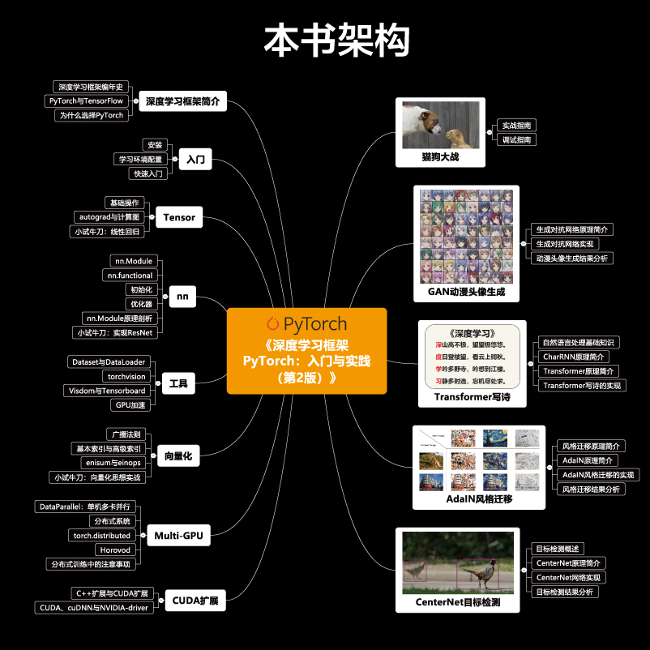
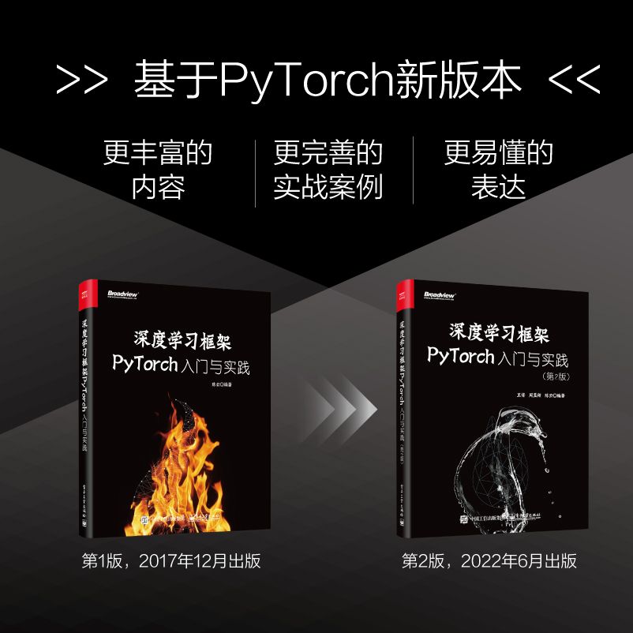

这是书籍《深度学习框架PyTorch：入门与实践（第2版）》的对应代码，但是也可以作为一个独立的PyTorch入门指南和教程。

## 全新升级
本书第2版基于第1版进行了全新升级，全书代码基于PyTorch 1.8版本进行编写，结合第一版广大读者的意见进行了全面更新，包含了基本使用、高级扩展以及实战应用三大模块。

## 内容

该书（教程/仓库）的内容如图所示：


可以看出本教程可以分为三部分：

**基本使用**（第2～5章）讲解PyTorch内容，这部份介绍了PyTorch中主要的的模块，和深度学习中常用的一些工具。对于这部分内容，这里利用Jupyter Notebook作为教学工具，读者可以结合notebook修改运行，反复实验。

- 第2章介绍PyTorch的安装以及相关学习环境的配置。同时，本章以概要的方式介绍PyTorch的主要内容，帮助读者初步了解PyTorch。
- 第3章介绍PyTorch中多维数组Tensor以及自动微分系统autograd的使用，举例说明如何使用Tensor和autograd实现线性回归，并对比它们的不同点。本章对Tensor的基本结构以及autograd的原理进行了分析，帮助读者更加全面地了解PyTorch的底层模块。
- 第4章介绍PyTorch中神经网络模块nn的基本用法，讲解了神经网络中的层、激活函数、损失函数以及优化器等，在本章的最后带领读者使用不到50行代码实现经典的网络结构ResNet。
- 第5章介绍PyTorch中的数据加载、预训练模型、可视化工具以及GPU加速等工具，合理地使用这些工具可以提高用户的编程效率。

**高级扩展**（第6～8章）讲解PyTorch中的一些高级扩展，学习这部分内容可以帮助读者编写更加高效的程序。

- 第6章介绍PyTorch中的向量化思想，主要包括广播法则、基本索引、高级索引以及爱因斯坦操作。在本章的最后带领读者使用向量化思想实现深度学习中的卷积操作、交并比、RoI Align以及反向Unique操作。
- 第7章介绍PyTorch中的分布式操作。分布式计算和并行计算可以加速网络的训练过程，本章详细介绍了并行计算和分布式计算的基本原理，同时介绍了如何使用torch.distributed以及Horovod进行PyTorch的分布式训练。
- 第8章介绍PyTorch中的CUDA扩展，带领读者使用CUDA实现Sigmoid函数。同时，本章对CUDA、NVIDIA-driver、cuDNN以及Python之间的关系进行了总结。

**实战应用**（第9~13章）利用PyTorch实现了几个酷炫有趣的应用，对于这部分的内容，本仓库给出完整的实现代码，并提供预训练好的模型作为demo，供读者测试。

- 第9章是承上启下的一章，目标不是教会读者新函数、新知识，而实结合Kaggle中的一个经典比赛，实现深度学习中最为简单的图像二分类问题。在实现的过程中，将带领读者复习前5章的知识，并帮助读者合理地组织程序和代码，使程序更加易读且更好维护。同时，本章介绍了如何在PyTorch中调试。
- 第10章介绍生成对抗网络的基本原理，带领读者从零开始实现一个动漫头像生成器，能够利用生成对抗网络生成风格多变的动漫头像。
- 第11章介绍自然语言处理的一些基本知识，详细介绍了CharRNN以及Transformer的基本原理。本章带领读者使用Transformer实现自动写诗，该程序可以模仿古人进行诗词的续写以及藏头诗的生成。
- 第12章介绍风格迁移的基本原理，带领读者实现支持任意风格迁移的神经网络。通过该网络，读者可以将任意图片转换为名画的风格。
- 第13章介绍目标检测的基本原理，带领读者实现单阶段、无锚框、无非极大值抑制的目标检测算法CenterNet。CenterNet的设计思路可以迁移到三维图像的目标检测、人体姿态估计以及目标追踪等经典的计算机视觉问题中。


 **Notebook中的文字描述内容及部分Markdown内容属于本书的初稿，可能存在有描述不通顺之处，还请谅解，后续作者会逐渐校正**。这部分内容与书籍保证了80%的一致性，但可能有部分语病语法问题，由于时间关系暂未完全校正，后续作者会逐渐更新。

## 是否需要买书

书**不是必要的**，这个仓库包含书中60%以上的文字内容，90%以上的代码，尤其是前几章入门内容，几乎是完全保留了书中的讲解内容。读者即使不买书也能正常使用本教程。

如果你觉得你更喜欢纸质版的阅读体验，并想留下一本印刷精美、完全彩印的书籍方便翻阅，不妨小破费一笔，支持一下作者近一年以来的工作～

## 代码说明

代码主要在python3+PyTorch1.6~1.8下测试得到最终结果，python2暂未测试，更新版本的PyTorch暂未测试。

如果有任何不当，或者有待改进的地方，欢迎开issue讨论，或者提交pull request。

## 环境配置

1. 安装[PyTorch](http://pytorch.org)，请从官网选择指定的版本安装即可，一键安装。更多的安装方式请参阅书中说明。

2. 克隆仓库

   ```python
   git clone https://github.com/chenyuntc/PyTorch-book.git
   ```

## ^_^

有任何bug，解释不清楚的地方或者是困惑，欢迎开issue

欢迎pull requests

Happy Coding!



- [京东购买链接](https://item.jd.com/13324115.html)
- [当当购买链接](http://product.dangdang.com/29429915.html)
