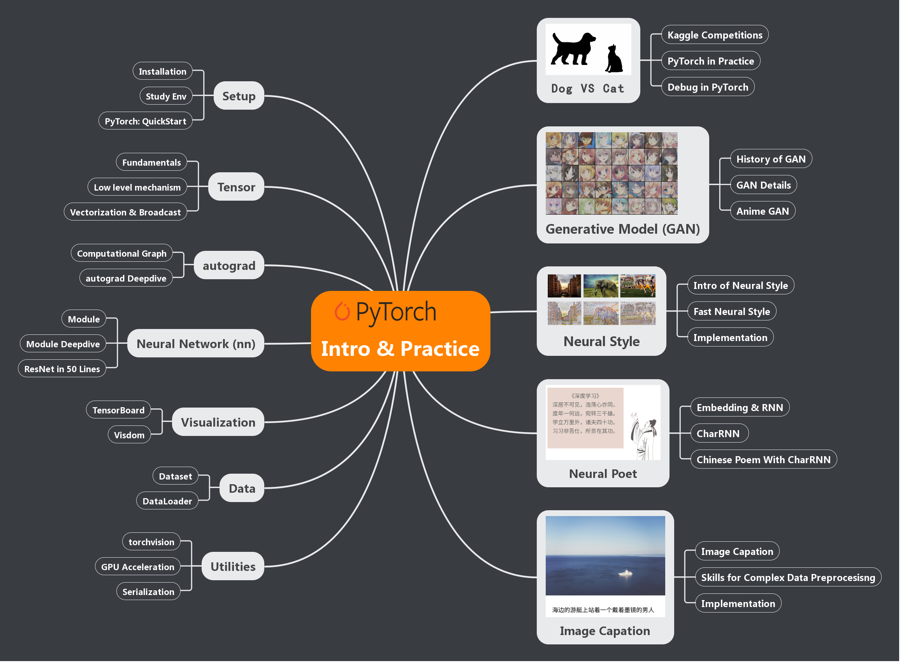

## [[中文]](README.md) · [[English]](README_EN.md)

**The English Version of this book is still under construction.**

This is the corresponding code of the book *PyTorch: Introduction and Practice*. It can be used as independent PyTorch tutorials without the book. It contains several interesting PyTorch Projects. The Code is currently on PyTorch 1.0, with both CPU/GPU and Python2/3 compatibility. 

## Content

The contents of the repo are shown in the figure:

It contains two parts:

**Introduction** (left of the mindmap). This part introduces the main modules of PyTorch and some tools commonly used in deep learning. Jupyter notebook is used as a teaching tool, you can modify and run the notebook interactively.

- [Chapter 2](chapter2-快速入门/): Learning environment setup and a quickstart tutorial. You may spend about 1 to 2 hours to quickly complete the quickstart, and then choose to read the following related chapters in depth according to the needs.

- [Chapter 3](chapter3-Tensor和autograd/): Introduction to the multidimensional array object (`Tensor`) and dynamic graph engine (`autograd`). Implement linear regression using Tensor and autograd respectively, and compare the differences between them. This chapter also makes a more in-depth analysis of the underlying design of tensor and autograd.

- [Chapter 4](chapter4-神经网络工具箱nn/): Introduction to `torch.nn`, and explanation of the common layers, loss function, optimizer and so on. 

- [Chapter 5](chapter5-常用工具/): introduction to the data loading, GPU acceleration, serialization and visualization tools.

**Practice** (Right of the mindmap). This part uses PyTorch along with other tools comprehensively to implement several cool and interesting projects. 

- [Chapter 6](chapter6-实战指南/): a connecting chapter to review PyTorch tools and apply it to a relatively easy task: image classification. In the process of implementation, guide the reader to review the knowledge of the first five chapters, and put forward the code specification to reasonably organizing the program and code so that the program is more readable and maintainable. This chapter also introduces how to debug in PyTorch.

- [Chapter 7](chapter7-GAN生成动漫头像/): popular GAN for the readers, and guides you to implement an animate image generator from scratch.

- [Chapter 8](chapter8-风格迁移(Neural%20Style)): the knowledge of style transfer and guide you to implement the fast neural style, turning your photos into masterpieces.

- [Chapter 9](chapter9-神经网络写诗\(CharRNN\)/): the knowledge of natural language processing and CharRNN. By collecting tens of thousands of Tang poems, you can train a small network that can write poems.

- [Chapter 10](chapter10-图像描述(Image%20Caption)/): Knowledge of image caption and takes the data of AI Challenger competition as an example to guide you to implement a small program that can carry out simple image description.

- [Chapter 11](chapter11-语音识别\(LSTM-CTC\)): (*new, experimental**) speech recognition mainly written by [diamondfan](https://github.com/diamondfan).

 
Licensed under MIT License.
## Happy Coding
 
