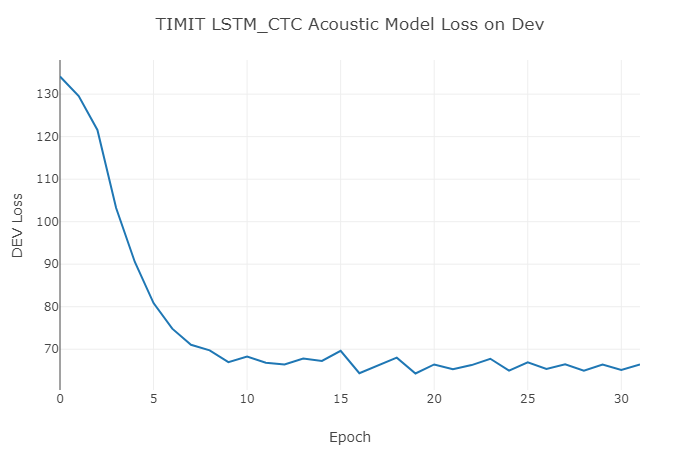

本章内容是通过pytorch搭建一个LSTM-CTC的语音识别声学模型。  

本次实验的数据为TIMIT数据集(可点击[academictorrents](http://academictorrents.com/details/34e2b78745138186976cbc27939b1b34d18bd5b3/tech) 或者 [luojie1987/TIMIT](http://luojie1987.com/index.php/post/110.html) 下载数据集)。 
 
还有很多其他公开的语音相关的数据库可以在这里下载[Open Speech and Language Resources](http://www.openslr.org/resources.php)

本项目的内容大多参考项目[https://github.com/Diamondfan/CTC_pytorch/](https://github.com/Diamondfan/CTC_pytorch/)

## 环境配置

- 安装[PyTorch](http://pytorch.org)
- 安装百度的Warp-CTC并于pytorch绑定，具体参见  
[https://github.com/SeanNaren/warp-ctc/tree/pytorch_bindings/pytorch_binding](https://github.com/SeanNaren/warp-ctc/tree/pytorch_bindings/pytorch_binding)
- 安装pytorch audio:
```Bash
sudo apt-get install sox libsox-dev libsox-fmt-all
git clone https://github.com/pytorch/audio.git
cd audio
pip install cffi
python setup.py install
```
- 安装第三方依赖
```Python
pip install -r requirements.txt
```
- 启动visdom
```
python -m visdom.serber
```

## 使用方法：
1、打开顶层脚本run.sh,修改相应的文件路径(TIMIT_dir, CONF_FILE)。  
2、打开conf目录下的ctc_model_setting.conf进行网络结构等各项设置。  
3、运行顶层脚本，后面带有一个参数stage，0表示从数据开始运行，1表示从训练开始，2表示直接测试
```
- bash run.sh 0     数据处理 + 训练 + 测试  
- bash run.sh 1     训练 + 测试
- bash run.sh 2     测试
```

## 说明
### TIMIT数据准备

conf目录下的test\_spk.list和dev\_spk.list是音素识别中的常用验证集和测试集,使用这两个文件选取数据集。  

执行数据处理脚本获取数据路径和转写标签:
```Bash
bash timit_data_prep.sh timit_dir
```
执行完成后，在datap_repare目录下会生成wav.scp文件和text文件分别为音频的路径和音频的转写即文本标签.
- train_wav.scp   train.text   >     3696 sentences
- dev_wav.scp     dev.text     >     400  sentences     
- test_wav.scp    test.text    >     192  snetences

### 关于rnn_type
ctc_model_setting.conf中的rnn_type可以选择的RNN类型为
- lstm :   nn.LSTM
- rnn  :   nn.RNN
- gru  :   nn.GRU

### 关于标签
本项目的输出建模单元选择的是字符，即"abcdefghijklmnopqrstuvwxyz'" + " ",空格space也当做一个输出标签。所以总共28 + 1 = 29类。 

加的1类为CTC中的空白类，表示该时刻的语音输出为噪声或者没有意义。在model.py中已经加了1，所以配置文件中填入正常的标签类别即可。  

选择字符作为标签在小数据集上并不能得到很好的结果，比如在timit上仅有62%左右的正确率。实验发现采用音素作为输出的建模单元更为有效。

### 关于学习率修改
默认修改8次学习率停止训练，每次学习率降低一半。可以根据需要修改train.py(line 274)

### log目录内容
- *.pkl:      保存的模型数据  在model.py(line 132)查看save_package函数
- train.log:  训练时打印的内容都存在train.log中 

### 实验结果
<p align="center">



</p>

将字符作为标签训练CTC的声学模型在TIMIT上测试集的识别率为:
- Greedy decoder:    61.4831%
- Beam decoder  :    62.1029%

本章内容只是构建了一个简单的声学模型，能够真正识别相差甚远，相比于kaldi中复杂的流程。项目内容还是能够对语音识别任务有一个初步的认识。

### 参考文献:
- [Connectionist Temporal Classification: Labelling Unsegmented Sequence Data with Recurrent Neural Networks](http://www.cs.toronto.edu/~graves/icml_2006.pdf)
- [Supervised Sequence Labelling with Recurrent Neural Networks](https://link.springer.com/book/10.1007/978-3-642-24797-2)
- [EESEN: END-TO-END SPEECH RECOGNITION USING DEEP RNN MODELS AND WFST-BASED DECODING](http://www.cs.cmu.edu/afs/cs/Web/People/fmetze/interACT/Publications_files/publications/eesenasru.pdf)


